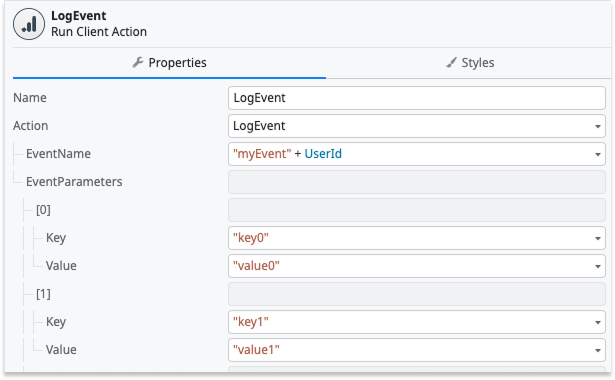

# Firebase plugins

<div class="info" markdown="1">

Applies only to mobile apps.

</div>

Firebase is a Google mobile development platform that speeds up the mobile app creation and design processes. You can use the Firebase services in the Mobile app through the following OutSystems Firebase-based plugins. On the [Forge](https://www.outsystems.com/forge/) portal, search for the following Firebase-based plugins compatible with ODC:

* Analytics Plugin (Firebase)
* Crash Reporting Plugin (Firebase)
* Performance Monitoring Plugin (Firebase)
* Cloud Messaging Plugin (Firebase)

## Prerequisites

To use the Firebase plugins, you must complete the following prerequisites:

* Set up a Firebase project in the [Google Firebase console](https://console.firebase.google.com/).

* [Add an Android and an iOS app in Firebase](https://support.google.com/firebase/answer/9326094?hl=en) and download the configuration files:

    * **GoogleService-Info.plist** for iOS
    * **google-services.json** for Android

## Demo app

Install the Firebase Mobile Sample App from the [Forge](https://www.outsystems.com/forge/) portal. Then, open the app in ODC Studio. The demo app contains logic for common use cases, which you can examine and recreate in your apps. If you want to build the app and run it, check the prerequisites on the Forge page.

## Adding and using a Firebase plugin

To add a Firebase plugin to your mobile app, complete the following steps:

1. Install the **Firebase** plugin and reference it in your mobile app. For detailed instructions, refer to [Installing a plugin and adding a public element to your app](../intro.md#installing-a-plugin-and-adding-a-public-element-to-your-app).

1. Add the [Google services configuration file](#adding-google-services-configuration-file) to your mobile app.

    <div class="info" markdown="1">

    You only need to add the Google services configuration file for the first Firebase plugin in your mobile app. The next Firebase plugin you add uses the same configuration files.

    </div>

1. Open ODC Studio.

1. Navigate to **Logic** > **Client Actions**, then select your Firebase plugin and use the actions in your logic.

    

<div class="info" markdown="1">

To learn how to use the Firebase Cloud Messaging plugin using server actions, refer to [Firebase Cloud Messaging Plugin](firebase-cloud-messaging-plugin-server-action.md).

</div>

## Adding Google services configuration file

You must provide the plugin configuration files as extensibility settings in the ODC Portal for an app using at lesat one of the Firebase Plugins. To add the Firebase configuration to your app, complete the following steps:

1. Open the ODC Portal.

1. From the left Navigation menu, select **Apps**. From the details page, select your app. Then, go to the **Mobile Distribution** tab and select **Extensibility settings**.

    Configure the two Firebase settings **GoogleServicesAndroid** and **GoogleServicesIos**.

    

1. Select the context menu associated with the GoogleServicesAndroid setting, then select **Edit** and upload the **google-services.json** file.

1. Select the context menu associated with the GoogleServicesIos setting, then select **Edit** and upload the **GoogleService-Info.plist** file.

<div class="info" markdown="1">

* Binary Data Settings have a 5KB size limit. If your Google Services configuration file exceeds this limit, consider creating a new Firebase Project or using one with fewer apps associated with it.

* Add the Google services configuration files only when adding the first Firebase plugin to your app. The next Firebase plugin you add uses the same configuration files.

* Even though these settings are optional and you may choose to generate a build for only one platform (Android or iOS), you must add both the Google services configuration files, one for each platform. This requirement is temporary.

</div>

Starting with iOS 14.5, apps on the App Store must request the user’s permission to collect tracking data through the AppTrackingTransparency framework. For more information, see [App Tracking Transparency](https://developer.apple.com/documentation/apptrackingtransparency).

To trigger the native AppTrackingTransparency framework, use the **RequestTrackingAuthorization** client action from the Firebase Analytics Plugin. Apple recommends triggering this prompt as soon as the app loads.

<div class="info" markdown="1">

This Client action is only available on iOS, since the AppTrackingTransparency framework is an iOS-only feature.

</div>

If you want to present an alert before the iOS tracking permission dialog, enable the parameter **ShowInformation** on the action. To provide more context to app users in the dialog, set a **Title** and **Message**.


By default, the **NSUserTrackingUsageDescription** field is set to `AppName needs your attention.`. Apple’s [App Tracking Transparency documentation](https://developer.apple.com/documentation/apptrackingtransparency) states that this property must contain "a message that informs the user why an app is requesting permission to use data for tracking the user or the device.". You can set your custom description by including an iOS-specific preference (`USER_TRACKING_DESCRIPTION_IOS`) in the Extensibility Configurations of the application, as follows:

(Recommended) Using the universal extensibility configurations schema:

```json
{
  "appConfigurations": {
    "cordova": {
      "preferences": {
        "ios": {
          "USER_TRACKING_DESCRIPTION_IOS": "This is an example of a description.",
        }
      }
    }
  }
}
```

Using the Cordova-based extensibiility configurations schema (for MABS versions lower than 12):

```json
{
  "preferences": {
    "ios": [{
      "name": "USER_TRACKING_DESCRIPTION_IOS",
      "value": "This is an example of a description."
    }]
  }
}
```

You can use the **RequestTrackingAuthorization** action multiple times in the same app because iOS remembers a user's choice. iOS only prompts users again after they uninstall and then reinstall the app on the device.

By default, an app using the Firebase Analytics plugin is able to trigger the native AppTrackingTransparency framework. It also contains the **NSUserTrackingUsageDescription** field in the app's **\*-Info.plist** file. If you don't want to trigger the framework and don't want to include the description field in the **.plist** file, you can disable this through the Extensibility Configurations as follows:

(Recommended) Using the universal extensibility configurations schema:

```json
{
  "appConfigurations": {
    "cordova": {
      "preferences": {
        "ios": {
          "EnableAppTrackingTransparencyPrompt": false,
        }
      }
    }
  }
}
```

Using the Cordova-based extensibiility configurations schema (for MABS versions lower than 12):

```json
{
  "preferences": {
    "ios": [{
      "name": "EnableAppTrackingTransparencyPrompt",
      "value": "false"
    }]
  }
}
```

<div class="info" markdown="1">

If your app collects user data for advertising purposes, also known as Attribution, within the Firebase Analytics context, it must prompt the AppTrackingTransparency framework.

</div>

### Additional information for Firebase Analytics

#### Custom events

Starting in version **1.4.0**, a new client action named `LogEvent` is available and should be used instead of the deprecated `DEPRECATED_LogEvent`.
This new version introduces support for passing event parameters as a list, providing better structure and flexibility when logging events.

Each event must include an `EventName` and can optionally include a list of key–value pairs via the `EventParameters` input. A maximum of 25 parameters is allowed per event. If more than 25 parameters are provided, only 25 are sent to Firebase Analytics and the rest are discarded. Note that since parameter order is not guaranteed, any of the extra parameters may be ignored.

To further illustrate this example, the following shows a typical usage of the `LogEvent` client action:



#### Ecommerce events

Starting with version **0.2.0**, Firebase Analytics plugin users can log ecommerce events, which are specifically tailored to collect information about your users' shopping behavior.

It's important to note that Google's e-commerce API enforces a set of constraints for each event. For example, the API ensures you include an `item_list_id` parameter when logging a `view_item_list` event.

The Firebase Analytics plugin performs validations when the `LogECommerceEvent` is invoked. For each event on the list below, you can find the validation details by clicking Google's documentation link.

To further illustrate this example, the following shows a typical usage of the `LogECommerceEvent client action`:


Currently, the Firebase Analytics plugin supports the following events:

* [add_payment_info](https://developers.google.com/analytics/devguides/collection/ga4/reference/events#add_payment_info)
* [add_shipping_info](https://developers.google.com/analytics/devguides/collection/ga4/reference/events#add_shipping_info)
* [add_to_cart](https://developers.google.com/analytics/devguides/collection/ga4/reference/events#add_to_cart)
* [add_to_wishlist](https://developers.google.com/analytics/devguides/collection/ga4/reference/events#add_to_wishlist)
* [begin_checkout](https://developers.google.com/analytics/devguides/collection/ga4/reference/events#begin_checkout)
* [purchase](https://developers.google.com/analytics/devguides/collection/ga4/reference/events#purchase)
* [refund](https://developers.google.com/analytics/devguides/collection/ga4/reference/events#refund)
* [remove_from_cart](https://developers.google.com/analytics/devguides/collection/ga4/reference/events#remove_from_cart)
* [select_item](https://developers.google.com/analytics/devguides/collection/ga4/reference/events#select_item)
* [select_promotion](https://developers.google.com/analytics/devguides/collection/ga4/reference/events#select_promotion)
* [view_cart](https://developers.google.com/analytics/devguides/collection/ga4/reference/events#view_cart)
* [view_item_list](https://developers.google.com/analytics/devguides/collection/ga4/reference/events#view_item_list)
* [view_item](https://developers.google.com/analytics/devguides/collection/ga4/reference/events#view_item)
* [view_promotion](https://developers.google.com/analytics/devguides/collection/ga4/reference/events#view_promotion)

From the provided entity, users can select the event type  `ECommerceEvent`.


You can also select the key for each parameter you want included in the event logging from the  `ECommerceEventParameterKey` entity.


For more information on which event requires which parameters, refer to [Google's documentation page regarding 'measure ecommerce'](https://developers.google.com/analytics/devguides/collection/ga4/ecommerce).

#### Enable/disable data collection

Starting in version **1.1.2**, the Firebase Analytics plugin can effectively enable and disable data collection. For the `SetEnabled` client action to properly work, the following needs to be added to your app's Extensibility Configurations:

(Recommended) Using the universal extensibility configurations schema:

```json
{
  "appConfigurations": {
    "cordova": {
      "preferences": {
        "ANALYTICS_COLLECTION_ENABLED": false
      }
    }
  }
}
```

Using the Cordova-based extensibiility configurations schema (for MABS versions lower than 12):

```json
{
  "preferences": {
    "global": [
      {
        "name": "ANALYTICS_COLLECTION_ENABLED",
        "value": "false"
      },
    ]
  }
}
```

<div class="info" markdown="1">

Keep in mind that:

* For `SetEnabled` to have any effect on the data collection, the preference needs to be included.
* The preference only needs to be added when you want to control the collection. If not provided or is used with another value (for example: `true`), the collection is enabled, and it isn't possible to change it.

</div>

#### Using the plugin in Capacitor apps

The plugin has three Extensibility Settings that you can set in the Mobile distribution tab of your application’s detail page on the ODC Portal - **AnalyticsCollectionEnabled**, **EnableAppTrackingTransparencyPrompt**”, and **UserTrackingUsageDescription**. Note that currently these settings are only used for Capacitor apps, not Cordova ones.

If you need to disable Analytics collection in your app, you can set the **AnalyticsCollectionEnabled** setting to **False**, since it is **True** by default. You can also enable Analytics collection in runtime using the **SetEnabled** client action.

If you do not want to show the App Tracking Transparency prompt on iOS, you can disable its usage by setting the **EnableAppTrackingTransparencyPrompt** setting to **False**, since it is **True** by default. This also means that the value set for **UserTrackingUsageDescription** isn't used, since the prompt isn't shown.

### Additional information for Firebase Crashlytics

#### Using the plugin in Capacitor apps

If you need to disable Crashlytics collection in your app, you can set the **CrashlyticsCollectionEnabled** extensibility setting to **False**, since it is **True** by default, in your app’s Mobile distribution tab in the ODC portal. You can also enable Crashlytics collection in runtime using the **SetEnabled** client action.
