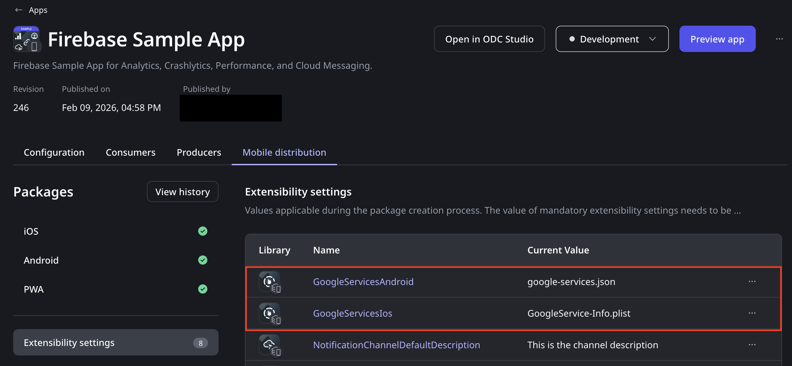
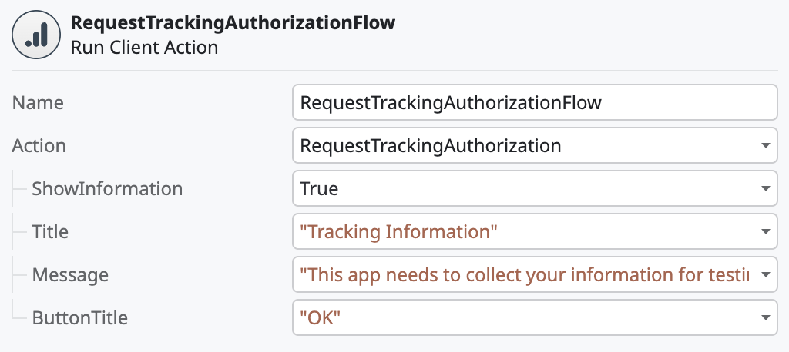

# Firebase Plugins

<div class="info" markdown="1">

Applies only to Mobile Apps.

</div>

Firebase is a Google mobile development platform that speeds up the mobile app creation and design processes. You can use the Firebase services in the Mobile app through the following OutSystems Firebase-based plugins. On the [Forge](https://www.outsystems.com/forge/) portal, search for the following Firebase-based plugins compatible with ODC:

* Analytics Plugin (Firebase)
* Crash Reporting Plugin (Firebase)
* Dynamic Links Plugin (Deprecated) (Firebase)
* Performance Monitoring Plugin (Firebase)
* Cloud Messaging Plugin (Firebase)


## Prerequisites

To use the Firebase plugins, you must complete the following prerequisites:

* Set up a Firebase project in the [Google Firebase console](https://console.firebase.google.com/).

* [Add an Android and an iOS app in Firebase](https://support.google.com/firebase/answer/9326094?hl=en) and download the configuration files:

    * **GoogleService-Info.plist** for iOS
    * **google-services.json** for Android

## Demo app

Install the **Firebase Mobile Sample App** from [Forge](https://www.outsystems.com/forge/) portal. Then open the app in ODC Studio. The demo app contains logic for common use cases, which you can examine and recreate in your apps. If you want to build the app and run it, check the prerequisites on the Forge page.

## Adding and using a Firebase plugin

To add a Firebase plugin to your mobile app, complete the following steps:

1. Install the **Firebase** plugin and reference it in your mobile app. For detailed instructions, refer to [Installing a plugin and adding a public element to your app](../intro.md#installing-a-plugin-and-adding-a-public-element-to-your-app).

1. Add the [Google services configuration file](#adding-google-services-configuration-file) to your mobile app.

    <div class="info" markdown="1">

    You only need to add the Google services configuration file for the first Firebase plugin in your mobile app. The next Firebase plugin you add uses the same configuration files.

    </div>

1. Open ODC Studio.

1. Navigate to **Logic** > **Client Actions**, then select your Firebase plugin and use the actions in your logic.

    

<div class="info" markdown="1">

To learn how to use the Firebase Cloud Messaging plugin using Clould Messaging Configurator REST APIs, refer to [Firebase Cloud Messaging Plugin](firebase-cloud-messaging-plugin-configurator-api.md).

To learn how to use the Firebase Cloud Messaging plugin using server actions, refer to [Firebase Cloud Messaging Plugin](firebase-cloud-messaging-plugin-server-action.md).

</div>

## Adding Google services configuration file

You must provide the plugin configuration file as settings in the ODC Portal for an app with a Firebase Plugin. To add the Firebase configuration to your app, complete the following steps:

1. Open the ODC Portal.

1. From the left Navigation menu, select **Apps** and from the details page, select your app. Then select **Settings**.

    Complete the two Firebase settings **GoogleServicesAndroid** and **GoogleServicesIos**.

    

1. Select the context menu associated with the GoogleServicesAndroid setting, then select **Edit** and upload the **google-services.json** file.

1. In the Firebase settings, select the context menu associated with the GoogleServicesIos setting, then select **Edit** and upload the **GoogleService-Info.plist** file.

<div class="info" markdown="1">

* Binary Data Settings have a 5KB size limit of 5KB. If your Google Services configuration file exceeds this limit, consider creating a new Firebase Project or using one with fewer apps associated with it.

* Add the Google services configuration files only for the first Firebase plugin in your app. The next Firebase plugin you add uses the same configuration files.

* Even though these settings are optional and you may choose to generate a build for only one platform (Android or iOS), you must add both the Google services configuration files, one for each platform. This requirement is temporary.

</div>

### Additional setup for the Dynamic Links plugin (Deprecated)

<div class="warning" markdown="1">

Firebase has announced the end of life for Firebase Dynamic Links, August 25, 2025 ([source](https://firebase.google.com/support/dynamic-links-faq#when_will_firebase_dynamic_links_stop_working)). This plugin should not be used for new projects and we recommend moving off of this plugin to a different service for application links.

</div>

The Firebase Dynamic Links Plugin requires the following additional setup steps to work correctly:

* Include a global preference in the Extensibility Configurations of the application using the plugin. Ensure that the value for this preference matches the URL prefix you set in the Dynamic Links page in the Firebase console. For example:

```JSON
{
     "preferences": {
         "global": [
            {
                "name": "FIREBASE_DOMAIN_URL_PREFIX",
                "value": "outsystemsfirebase.page.link"
            },
        ]
    }
}
```

* For iOS, use a provisioning profile from Apple that contains the Associated Domains capability. For more information, refer to [Configuring an Associated Domain](https://developer.apple.com/documentation/xcode/configuring-an-associated-domain) by Apple. Ensure that the app is compliant with Apple’s Data Use and Sharing guidelines.

Starting with iOS 14.5, apps on the App Store must request the user’s permission to collect tracking data through the AppTrackingTransparency framework. For more information, see [App Tracking Transparency](https://developer.apple.com/documentation/apptrackingtransparency).

To trigger the native AppTrackingTransparency framework, use the **RequestTrackingAuthorization** client action from the Firebase Analytics Plugin. Apple recommends triggering this prompt as soon as the app loads.
If you want to present an alert before the iOS tracking permission dialog, enable the parameter **ShowInformation** on the action. To provide more context to app users in the dialog, set a **Title** and **Message**.



By default, the **NSUserTrackingUsageDescription** field is set to `AppName needs your attention.`. As explained by Apple [here](https://developer.apple.com/documentation/apptrackingtransparency), this property must contain "a message that informs the user why an app is requesting permission to use data for tracking the user or the device.". You can set your custom description by including an iOS-specific preference (`USER_TRACKING_DESCRIPTION_IOS`) in the Extensibility Configurations of the application, as follows:

```JSON
{
    "preferences": {
        "ios": [{
            "name": "USER_TRACKING_DESCRIPTION_IOS",
            "value": "This is an example of a description."
        }]
    }
}
```

You can use the **RequestTrackingAuthorization** action multiple times in the same app because iOS remembers a user's choice. iOS only prompts users again after they uninstall and then reinstall the app on the device.

By default, an app using the Firebase Analytics plugin is able to trigger the native AppTrackingTransparency framework. It also contains the **NSUserTrackingUsageDescription** field in the app's **\*-Info.plist** file. If you don't want to trigger the framework and don't want to include the description field in the **.plist** file, you can disable this through the Extensibility Configurations as follows:

```JSON
{
    "preferences": {
        "ios": [{
            "name": "EnableAppTrackingTransparencyPrompt",
            "value": "false"
        }]
    }
}
```

<div class="info" markdown="1">

If your app collects user data for advertising purposes, also known as Attribution, within Firebase Analytics context, it must prompt the AppTrackingTransparency framework.

</div>

### Additional information for Firebase Analytics 

#### Ecommerce events

Starting in version **0.2.0**, Firebase Analytics plugin users can log ecommerce events, which are specifically tailored to collect information about your user's shopping behavior.

It's important to note that Google's ecommerce API enforces a set of constraints for each event. For example, the API ensures you include an `item_list_id` parameter when logging a `view_item_list` event.

The Firebase Analytics plugin performs validations when the `LogECommerceEvent` is invoked. You can find the validate details by clicking Google's documentation link, for each event on the list below.

To further illustrate this example, the following shows a typical usage of the `LogECommerceEvent client action`:


Currently, Firebase Analytics plugin supports the following events:

* [add_payment_info](https://developers.google.com/analytics/devguides/collection/ga4/reference/events#add_payment_info)
* [add_shipping_info](https://developers.google.com/analytics/devguides/collection/ga4/reference/events#add_shipping_info)
* [add_to_cart](https://developers.google.com/analytics/devguides/collection/ga4/reference/events#add_to_cart)
* [add_to_wishlist](https://developers.google.com/analytics/devguides/collection/ga4/reference/events#add_to_wishlist)
* [begin_checkout](https://developers.google.com/analytics/devguides/collection/ga4/reference/events#begin_checkout)
* [purchase](https://developers.google.com/analytics/devguides/collection/ga4/reference/events#purchase)
* [refund](https://developers.google.com/analytics/devguides/collection/ga4/reference/events#refund)
* [remove_from_cart](https://developers.google.com/analytics/devguides/collection/ga4/reference/events#remove_from_cart)
* [select_item](https://developers.google.com/analytics/devguides/collection/ga4/reference/events#select_item)
* [select_promotion](https://developers.google.com/analytics/devguides/collection/ga4/reference/events#select_promotion)
* [view_cart](https://developers.google.com/analytics/devguides/collection/ga4/reference/events#view_cart)
* [view_item_list](https://developers.google.com/analytics/devguides/collection/ga4/reference/events#view_item_list)
* [view_item](https://developers.google.com/analytics/devguides/collection/ga4/reference/events#view_item)
* [view_promotion](https://developers.google.com/analytics/devguides/collection/ga4/reference/events#view_promotion)

from the provided entity, users can select the event type  `ECommerceEvent`.


You can also select the key for each parameter you want included on the event logging from the  `ECommerceEventParameterKey` entity.


For more information on which event requires which parameters refer to [Google's documentation page regarding 'measure ecommerce'](https://developers.google.com/analytics/devguides/collection/ga4/ecommerce).

#### Enable/disable data collection

Starting in version **1.1.2**, the Firebase Analytics plugin can effectively enable and disable data collection. For the `SetEnabled` client action to properly work, the following needs to be added to your app's Extensibility Configurations:

```JSON
{
    "preferences": {
        ...
        "global": [
            ...,
            {
                "name": "ANALYTICS_COLLECTION_ENABLED",
                "value": "false"
            },
            ...
        ],
        ...
    }
}
```

<div class="info" markdown="1">

Keep in mind that:

* For `SetEnabled` to have any effect on the data collection, the preference needs to be included.
* The preference only needs to be added when you want to control the collection. If not provided or is used with another value (for example: `true`), the collection will be enabled and it won't be possible to change it.

</div>
