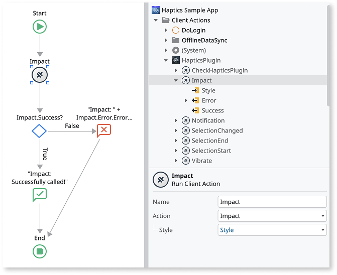
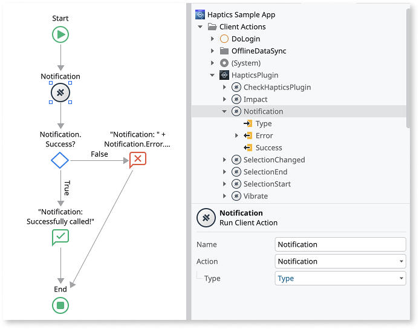
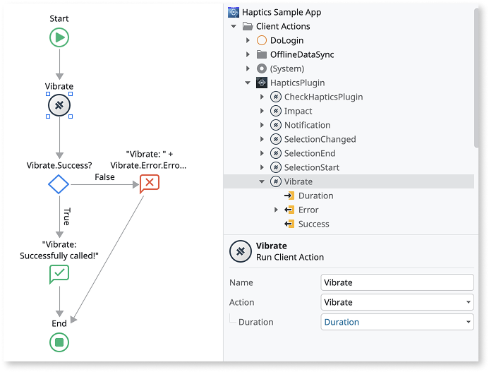
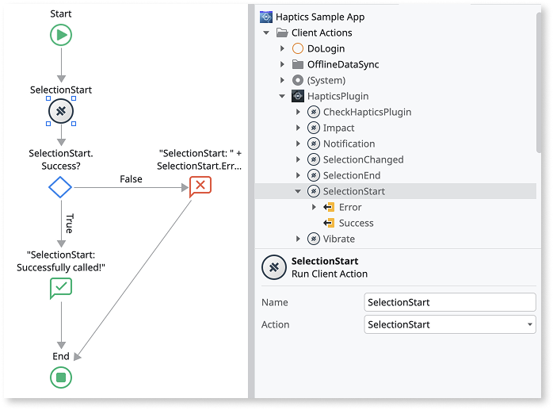
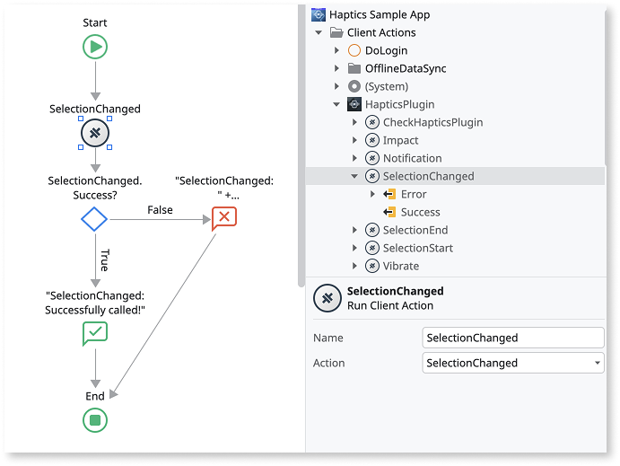
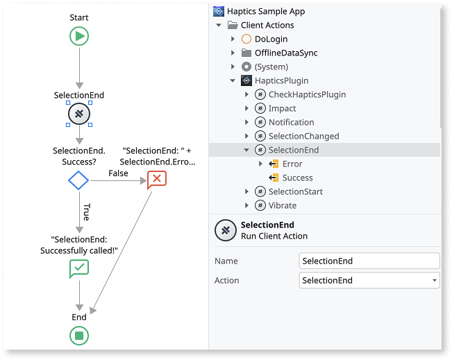

# Haptics Plugin

Applies only to Mobile Apps.

The Haptics Plugin available in the ODC Forge is currently only available for MABS 12 or higher, and Capacitor. It uses the [@capacitor/haptics](https://capacitorjs.com/docs/apis/haptics) plugin.

Use the Haptics plugin to provide physical feedback to your app users through touch and vibration.

As a best practice, always verify that the plugin is available in the app. Use the **Logic > Client Actions > HapticsPlugin > CheckHapticsPlugin** action to check for the plugin's availability before using other plugin actions. If the plugin isn't available to the app, display an error to your users.

For detailed information about how to install a plugin in your app, refer to  [Adding plugins](../intro.md).

## Trigger a haptics "impact" feedback

To create the logic to trigger a haptics "impact" feedback on the device, follow these steps:

1. From the ODC Studio, go to **Logic > Client Actions > HapticsPlugin** and drag the **Impact** action to your flow.

1. Set the **Style** input parameter to one of the values of **ImpactStyke**, which can be: **Light**, **Medium**, or **Heavy**.

1. As a best practice, you should handle the result of calling the action by checking the **Success** output parameter. If any errors occur, you can check them using the **Error** output parameters.

## Trigger a haptics "notification" feedback

To create the logic to trigger a haptics "notification" feedback on the device, follow these steps:

1. From the ODC Studio, go to **Logic > Client Actions > HapticsPlugin** and drag the **Notification** action to your flow.

1. Set the **Type** input parameter to one of the values of **NotificationStyke**, which can be: **Success**, **Warning**, or **Error**.

1. As a best practice, you should handle the result of calling the action by checking the **Success** output parameter. If any errors occur, you can check them using the **Error** output parameters.

## Vibrate the device

To create the logic to vibrate the device, follow these steps:

1. From the ODC Studio, go to **Logic > Client Actions > HapticsPlugin** and drag the **Vibrate** action to your flow.

1. Set the duration of the vibration, in milliseconds, using the **Duration** input parameter.

1. As a best practice, you should handle the result of calling the action by checking the **Success** output parameter. If any errors occur, you can check them using the **Error** output parameters.

## Selection haptics

### Trigger a selection started haptic hint

To create the logic to trigger a selection started haptic hint on the device, follow these steps:

1. From the ODC Studio, go to **Logic > Client Actions > HapticsPlugin** and drag the **SelectionStart** action to your flow.

1. As a best practice, you should handle the result of calling the action by checking the **Success** output parameter. If any errors occur, you can check them using the **Error** output parameters.

### Trigger a selection changed haptic hint

If a selection was started already, this will cause the device to provide haptic feedback.

To create the logic to trigger a selection changed haptic hint on the device, follow these steps:

1. From the ODC Studio, go to **Logic > Client Actions > HapticsPlugin** and drag the **SelectionChanged** action to your flow.

1. As a best practice, you should handle the result of calling the action by checking the **Success** output parameter. If any errors occur, you can check them using the **Error** output parameters.

### End the selection

If **SelectionStart** was called, this client action ends the selection. For example, call this when a user has lifted their finger from a control.

To create the logic to end a selection, follow these steps:

1. From the ODC Studio, go to **Logic > Client Actions > HapticsPlugin** and drag the **SelectionEnd** action to your flow.

1. As a best practice, you should handle the result of calling the action by checking the **Success** output parameter. If any errors occur, you can check them using the **Error** output parameters.

## Handling errors

The app with the Haptics plugin can run on various Android and iOS devices, featuring different hardware and configurations. To provide a good user experience and prevent the app from crashing, handle errors within the app.

For detailed information about each client action, refer to [Haptics Reference](haptics-ref.md).
