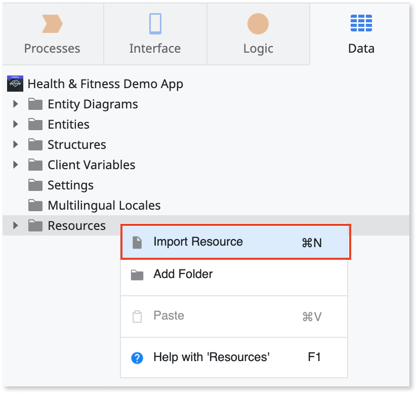
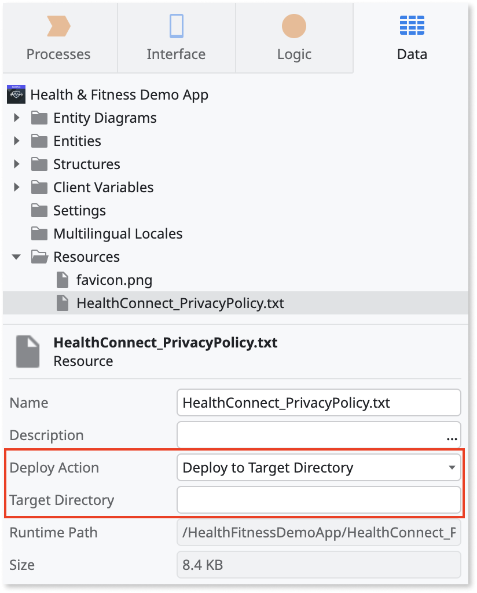
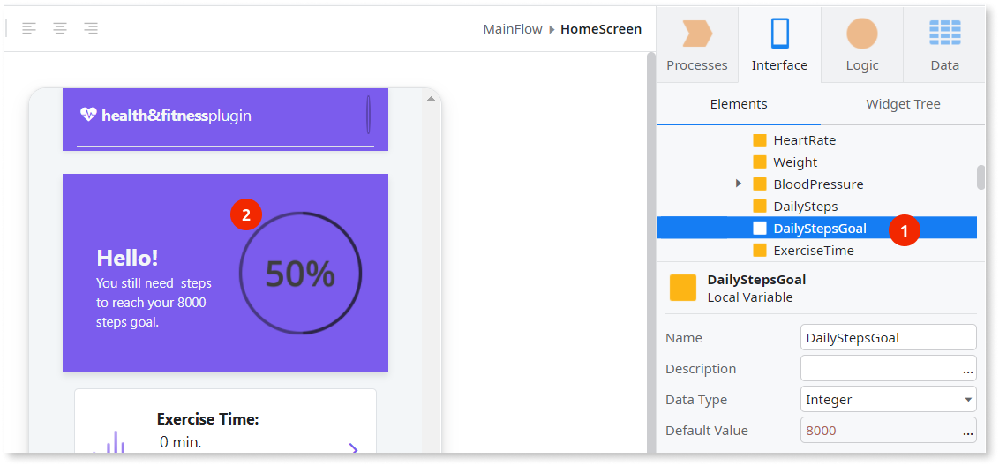
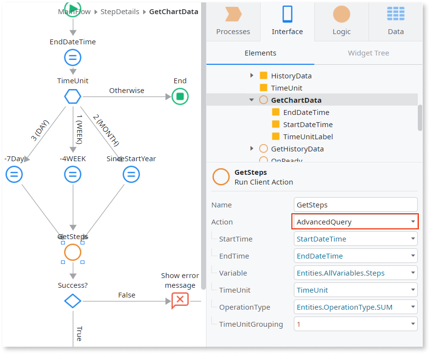
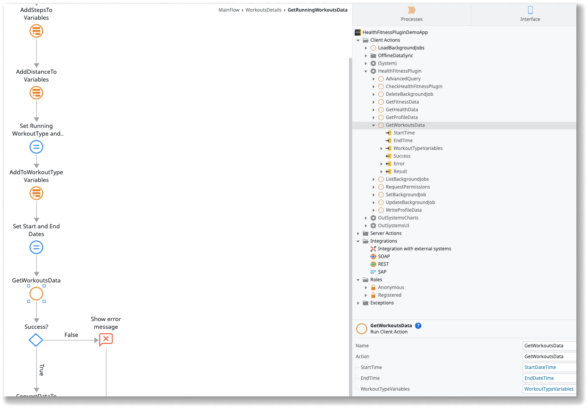

# Health and Fitness Plugin using HealthKit and Health Connect

<div class="info" markdown="1">

Applies only to Mobile Apps.

</div>

The Health & Fitness plugin enables you to access and use health and fitness data in a mobile app. The plugin provides access to Apple's HealthKit (iOS) and Google's Health Connect (Android) by letting you use data relevant to your health and fitness use cases.

The plugin is unaware of the provider you use for data, but you always need to request user permissions to access data. The plugin saves no health and fitness data in the device. In cases where your app writes data to the APIs, the package name is the identifier of the data source.

As a good practice, verify the plugin is available in the app and prevent the app from crashing. Use the **Logic** > **Client Actions** > **HealthFitnessPlugin** > **CheckHealthFitnessPlugin** action to check for the plugin availability. If the plugin isn't available to the app, display an error to your users.

<div class="info" markdown="1">

To learn how to install and reference a plugin in your **OutSystems** apps, see [Installing plugins](../intro.md).
<!-- Mention the version of the plugin for ODC -->
</div>

## Sample app

**OutSystems** provides a sample app that contains logic for common use cases. Install the Health & Fitness sample app from Forge and then open it in ODC Studio.

This sample app shows you how to do the following with the health and fitness data:

* Request permission to access.
* Do simple queries that return the last logged value.
* Do advanced queries for a specific period that return a list of values.
* Retrieve raw data related to workouts for a specific period (iOS only).
* Use the data in user interface, such as cards, tables, and graphs.


## Important note about Health Connect (Android only)

Starting on Android 14, [Health Connect](https://health.google/health-connect-android/) already comes pre-installed. For lower versions of Android, users must install the Health Connect app from the Google Play Store.

<div class="info" markdown="1">

Please note that before users can use your app, you must request access to Health Connect data types by filling out the Developer Declaration Form from Google. For more information, see ["Request access to Health Connect data types"](https://developer.android.com/health-and-fitness/guides/health-connect/publish/request-access).

</div>

### Navigating from your app to the Health Connect app page on the Play Store (Android only)

The following image shows how you can use the **RedirectToURL** Destination to navigate from your app to the Health Connect app page on the Google Play Store. his is especially important for users with Android 13 or lower devices that need to install the Health Connect app from the Play Store.


### Navigating from your app to the Health Connect app (Android only)

If users already have the Health Connect app installed on their device, you can use the **OpenHealthConnectApp** client action to navigate from your app to the Health Connect app. This is especially important when users deny permissions to access Health Connect data types enough times that the permission prompt isn't shown again, when using the **RequestPermissions** client action. When this happens, you can redirect users to the Health Connect app so they can grant the necessary permissions.

To navigate to the Health Connect app, simply call the **OpenHealthConnectApp** client action, as shown in the image below.


## Providing the Privacy Policy file (Android only)

<div class="info" markdown="1">

This setup is specific to Cordova. Refer to [the Capacitor section](#using-the-plugin-in-capacitor-apps) on how to configure this for Capacitor apps.

</div>

You must provide the privacy policy file through the Resources of your app. This file holds the content that your end-users see after clicking on the privacy policy link that appears in the permissions screen when calling the **RequestPermissions** client action. It should contain the rationale of the requested permissions, describing how your app uses and handles the user's data.

To add the privacy policy file to your mobile app, complete the following steps:

1. In ODC Studio, go to the **Data** tab.
1. Right-click the **Resources** folder, and select **Import Resource**. The **Import Resource** dialog opens.

    

1. Select your privacy policy file. Please note that it should be a text file (.txt) and it should named **HealthConnect_PrivacyPolicy.txt**.
1. In the **Deploy Action** list, select **Deploy to Target Directory**. Leave the **Target Directory** field empty.



## (Optional) Configuring which Health Connect data types you wish to access (Android only)

<div class="info" markdown="1">

This setup is specific to Cordova. Refer to [the Capacitor section](#using-the-plugin-in-capacitor-apps) on how to configure this for Capacitor apps.

</div>

By default, the Health and Fitness plugin configures your app to access every Health Connect data type with read and write access. To provide a custom configuration, use either extensibility settings or the app extensibility configurations.

From plugin version 1.7.0, use extensibility settings to set each Health Connect data type (for example, StepsAccess for Steps). Set these settings to one of the following values: **Read**, **Write**, **ReadWrite**, **None**. You can also use **AllVariablesAccess**, **HealthVariablesAccess**, **FitnessVariablesAccess**, and **ProfileVariablesAccess** settings.

For plugin versions earlier than 1.7.0, use the app extensibility configurations.

To configure the access type for a given Health Connect data type (variable), you simply define an Android preference in your app's Extensibility Configurations, as follows:

(Recommended) Using the universal extensibility configurations schema:

```json
{
  "appConfigurations": {
    "cordova": {
      "preferences": {
        "android": {
          "VARIABLE_NAME": "ACCESS_TYPE"
        }
      }
    }
  }
}
```

Using the Cordova-based extensibiility configurations schema (for MABS versions lower than 12):

```json
{
  "preferences": {
    "android": [
      {
        "name": "VARIABLE_NAME",
        "value": "ACCESS_TYPE"
      }
    ]
  }
}
```

For specific variables, the **name** of the preference should be the **Identifier** of the variable record in the **AllVariables** static entity of the plugin. For heart rate, for example, the **name** of the preference should be "HeartRate".

You can also define preferences for variable groups (e.g. fitness variables). More specifically, you can define preferences for the following variable groups: "AllVariables", "FitnessVariables", "HealthVariables", and "ProfileVariables".

The **value** of the preference should be the access type for the variable, which can be one of the following: "Read", "Write", or "ReadWrite".

Note that the most specific preference has precedence over less specific ones. For example, if the "Steps" variable is set to have write access, while the "FitnessVariables" group is set to have read access, every fitness variable is set to have read access, except for "Steps", which has write access instead.

Here's a concrete example of a configuration that sets write access to the "Steps" variable, read access to all fitness variables (except for "Steps"), write access to all health variables (e.g. "HeartRate"), and read and write access to all remaining variables ("AllVariables):

(Recommended) Using the universal extensibility configurations schema:

```json
{
  "appConfigurations": {
    "cordova": {
      "preferences": {
        "android": {
          "Steps": "Write",
          "FitnessVariables": "Read",
          "HealthVariables": "Write",
          "AllVariables": "ReadWrite",
        }
      }
    }
  }
}
```

Using the Cordova-based extensibiility configurations schema (for MABS versions lower than 12):

```json
{
  "preferences": {
    "android": [
      {
        "name": "Steps",
        "value": "Write"
      },
      {
        "name": "FitnessVariables",
        "value": "Read"
      },
      {
        "name": "HealthVariables",
        "value": "Write"
      },
      {
        "name": "AllVariables",
        "value": "ReadWrite"
      }
    ]
  }
}
```

## (Optional) Disable access to older history data (Android only)

<div class="info" markdown="1">

This setup is specific to Cordova. Refer to [the Capacitor section](#using-the-plugin-in-capacitor-apps) on how to configure this for Capacitor apps.

</div>

By default, your app can only access data from Health Connect starting 30 days prior to the first permission granted by a user. For example, if a user grants health permissions to the app on May 25, the plugin can get Health data from April 25 onward.

From version 1.4.0 of the plugin, you can access data older than that. A new permission is requested in the **RequestPermission** client action.

From plugin version 1.7.0, to disable access to older data and the permission request, set the **DisableReadHealthDataHistory** extensibility setting to **True**. Set this in your app's detail page in the ODC Portal, under the **Mobile distribution** tab.

For plugin versions earlier than 1.7.0, use the following configuration.

Set the **DisableReadHealthDataHistory** preference in the app extensibility configurations to **true**, as follows:

(Recommended) Using the universal extensibility configurations schema:

```json
{
  "appConfigurations": {
    "cordova": {
      "preferences": {
        "android": {
          "DisableReadHealthDataHistory": true
        }
      }
    }
  }
}
```

Using the Cordova-based extensibiility configurations schema (for MABS versions lower than 12):

```json
{
  "preferences": {
    "android": [
      {
        "name": "DisableReadHealthDataHistory",
        "value": true
      }
    ]
  }
}
```

## Enabling your users to track their health and fitness data

The following steps show how to design a use case that includes health and fitness data.

1. Create logic to request permission to access health and fitness data.
1. Create a user interface.
1. Create logic to access and store health and fitness data.
1. Create logic to access and use workout data (iOS only).
1. Optionally, create logic to write and store new health and fitness data.
1. Create logic to define a background job.

<div class="info" markdown="1">

Refer to the sample app for examples.

</div>

### Requesting access to health and fitness data

Before your app can access data, request permission from the users to access their health and fitness data. From ODC Studio, select the **Logic** > **Client Actions** > **HealthFitnessPlugin** and use the **RequestPermission** action.

You can define the variables and the following permissions access types:

* Read
* Write
* Read and write

In the screen logic, request the permissions from the app users, in an action that's triggered by **On Initialize** event.

The plugin comes with groups of permissions. Use the groups of permissions as accelerators to check for access when you request data.

The plugin has groups of default variables in **Data** > **Entities** > **HealthFitnessPlugin** that define the permission type for:

* HealthVariables
* FitnessVariables
* ProfileVariables
* WorkoutType


<div class="info" markdown="1">

Refer to the sample app for more examples.

</div>

### Creating a user interface

Start, for example, by defining a variable that corresponds to the type of output you want to show. Create a variable that holds the data so that you can access, store, and display the number of steps taken in a day (1).



To show the step count for the day, you can use an **Expression** and customize the look and feel of the parent widget (2).

## Retrieve record metadata

<div class="info" markdown="1">

The plugin returns the metadata provided by HealthKit (iOS) and Health Connect (Android).
No additional processing or decision logic is applied to determine how records were created or classified.

</div>

The plugin returns several client actions that return additional metadata about each health record, allowing you to understand how the data was recorded and where it came from.

* **RecordingMethod** - Indicates how the record is created.
    * `MANUAL`: The record is manually entered by the user.
    * `AUTOMATIC`: The record is automatically recorded by the system or device sensors.
    * `ACTIVELY_RECORDED`: (Android only) The record is actively recorded during an activity or workout.
    * `UNKNOWN`: (Android only) The recording method can't be determined.

* **Device** - Information about the device where the data was recorded.
    * **Model** - The device model or name (iPhone, Apple Watch, Pixel Watch).
    * **Manufacturer** - The device manufacturer.
* **OriginApp** - Identifies the app that wrote the record into HealthKit (iOS) or Health Connect (Android).
This corresponds to the app's bundle identifier (iOS) or package name (Android).

Note that the plugin can't guarantee with 100% certainty whether a record is manually entered by the user. The returned values represent the best information provided by HealthKit (iOS) and Health Connect (Android).

### Client actions that return RecordMetadata

The following client actions return record metadata:

* **AdvancedQuery**
* **GetWorkoutsData** (iOS only)
* **GetFitnessData**
* **GetHealthData**
* **GetProfileData**

The availability of RecordMetadata depends on the nature of the returned data.
For **AdvancedQuery**, it also depends on the selected operation type.

#### RecordMetadata in AdvancedQuery

The **AdvancedQuery** client action returns an additional `RecordMetadata List` output parameter. This list provides metadata about how each record is created.

The behavior of `RecordMetadata List` in AdvancedQuery depends on the selected `OperationType`:

* **RAW**
        * Returns one `RecordMetadata` entry for each health value.
    * The metadata list follows the same order as the values list.
    * This provides a 1:1 mapping between record values and their metadata.

    Example response for heart rate data:

    ```json
    {
      "values": [72, 85, 90, 78, 82, 88],
      "recordMetadataList": [
      { "recordingMethod": "AUTOMATIC", "device": "Apple Watch", "originApp": "com.apple.Health" },
      { "recordingMethod": "AUTOMATIC", "device": "iPhone", "originApp": "com.fitbit.app" },
      { "recordingMethod": "MANUAL", "device": "iPhone", "originApp": "com.apple.Health" },
      { "recordingMethod": "AUTOMATIC", "device": "Apple Watch", "originApp": "com.apple.Health" },
      { "recordingMethod": "AUTOMATIC", "device": "Apple Watch", "originApp": "com.strava.app" },
      { "recordingMethod": "MANUAL", "device": "iPhone", "originApp": "com.apple.Health" }
      ]
    }
    ```

    In this example, the first heart rate reading (72 bpm) was automatically recorded by an Apple Watch, while the third reading (90 bpm) was manually entered by the user on their iPhone.

* **MIN / MAX**
    * These operations return the minimum or maximum value for the selected period.
    * The returned `RecordMetadata` corresponds to the record that produces the selected value.
    * Only a single `RecordMetadata` entry is returned.

* **SUM / AVERAGE**
    * These operations return aggregated values.
    * Aggregated values don't correspond to a single underlying record.
    * `RecordMetadata` **isn't returned** for these operations.

#### RecordMetadata in GetWorkoutsData

For the **GetWorkoutsData** client action, `RecordMetadata` refers to the workout itself and not to the individual samples collected during the workout.

The metadata is derived from the `HKWorkout` object and follows the same structure and semantics as other `RecordMetadata` responses.

#### RecordMetadata when writing data

When writing health and fitness data using **WriteProfileData**, the plugin ensures that the record is correctly marked as manually entered.

* **RecordingMethod**
    * **MANUAL**: The record is explicitly marked as manually entered by the user.

* **OriginApp**: Automatically set by HealthKit to the bundle identifier (iOS) or package name (Android) of the app that writes the data.

* **Device**
    * Not set when writing data manually.
    * Device information is only associated with records that are automatically recorded by sensors or devices such as Apple Watch or Pixel Watch.

### Create logic to access and use health and fitness data

The plugin reads and writes the data using **AdvancedQuery** client action. In the **AdvancedQuery** action, set the values for the predefined variables.

The health or fitness query parameters might include:  

* period: start, end
* time unit: second, minute, hour, day, week, month, year
* operation type: sum, min, max, average, raw
  


<div class="info" markdown="1">

Verify that access and storage of health or fitness data on the device works. Check the value of **AdvancedQuery**. If **Success** is True, handle the data in **AdvancedQuery.** by assigning it to a variable of the same data type. Refer to the sample app for an example.

</div>

#### Notes about AdvancedQuery on Android

* The **TimeUnit** parameter can't be set to **MILLISECONDS** or **SECONDS**. By default, **TimeUnit** is set to **MINUTE**.
* The query result for **BloodPressure** is a list with structure **[systolic, diastolic, systolic, diastolic]**, where each element on the list is a pair of two readings. Example: [118, 76, 119, 77].
* The dates returned in the **Result** and **ResultDataPoints** output parameters are in the UTC timezone.

#### Notes about AdvancedQuery on iOS

* When querying the **Sleep** variable, the results correspond to the "IN BED INTERVALS" that are registered in the Health app from the system. Using different time units or operations won't alter the results returned.

### Create logic to access and use workout data (iOS only)

To enrich the data obtained from the **AdvancedQuery**, you can retrieve data related to workouts using the **GetWorkoutsData** client action. To do this, set the values for the following input parameters:

* Period: start and end
* Workout type and variable map: list of a structure that relates a Workout Type and a list of Variables to a query

For the Workout Type and Variable map structure, the plugin already provides the following default values:

* If there's no list or the list is empty, the plugin considers all workout types available and applies two variables to each: **Heart Rate** and **Active Energy Burned**.
* If the list contains an item that has a workout type set but has no variable list associated (or an empty one) with it, the plugin considers two variables: **Heart Rate** and **Active Energy Burned**.



<div class="info" markdown="1">

Verify that access and storage of health or fitness workout data on the device works. Check the value of **GetWorkoutsData**. If **Success** is True, handle the data in **GetWorkoutsData.** by assigning it to a variable of the same data type.

</div>

### Create logic to write health and fitness data

To write health and fitness data you can use the **WriteProfileData** action. Set the parameters for the type of health or fitness variable you want and the new value you want to store.

Note that **WriteProfileData** only supports some of the health and fitness variables. Not all variables exposed by the plugin can be written, and support depends on the platform.

To check that writing the health or fitness data on the device is working, verify the value of **WriteProfileData.Success** is **True**.

### Create logic to define a background job

To define a background job you can use the **SetBackgroundJob** action. Set the parameters for the type of health or fitness variable you want to keep evaluating, define the notification trigger condition and its frequency, and define the notification content.

Parametrization for two different use cases of a background job is shown below:

#### Setting up a daily steps goal

In the case of a daily steps goal evaluator, you probably want to issue a single notification per day if the daily steps goal is met. To achieve this you can use the following parametrization:


#### Setting up a heart rate monitoring alarm

In the case of a heart rate monitoring alarm, try to strike a balance between job frequency and notification frequency. For example, you may want to check your heart rate every ten seconds. However, you would probably find it intrusive to receive notifications every time your heart rate goes above, or drops below, a certain value.

Consider the following parametrization for a background job that notifies you if your heart rate is above 190 bpm, with a maximum notification frequency of one notification per minute:


After you have created your background job you can update it or delete it using the **UpdateBackgroundJob** action or the **DeleteBackgroundJob** action.

To verify that the background job was successfully created, check if the value of **SetBackgroundJob.Success** is **True**.

#### Setting a background job in Android

Starting in Android 15, when setting a background job for the first time, the Health Connect permission to read data in the background is requested.

<div class="info" markdown="1">

From Android 15 onwards, users can install an app in the [Private space](https://developer.android.com/about/versions/15/features#private-space). Users can lock their private space at any time. Once locked, all background jobs of the app inside the private space are stopped, and notifications are not shown until the user unlocks the private space.

It is not possible to detect if an app is installed in the private space. Therefore, if your app shows any critical notifications, inform your users to avoid installing the app in the private space.

For more information about the behavior changes of your app related to the private space, refer to [Android documentation](https://developer.android.com/about/versions/15/behavior-changes-all#private-space-changes).

</div>

Starting in Android 14, when setting a background job for the first time, for some variables, the permission to schedule exact alarms is requested. More specifically, this permission is requested when setting the first background job if the variable is one of the following: weight, height, sleep, blood glucose, or body fat percentage.

With that said, it is a best practice to present a message to the user explaining why these permissions are necessary (e.g. to get notifications about health and fitness data), before calling the **SetBackgroundJob** client action.

#### (Optional) Opt-out of permissions for background jobs (Android only)

<div class="info" markdown="1">

This setup is specific to Cordova. Refer to [the Capacitor section](#using-the-plugin-in-capacitor-apps) on how to configure this for Capacitor apps.

</div>

By default, all necessary background job Android permissions (e.g. "android.permission.ACTIVITY_RECOGNITION") are configured. To disable background job features and exclude these permissions from your app, remove them.

From plugin version 1.7.0, set the **DisableBackgroundJobs** extensibility setting to **True**. Set it in your app's detail page in the ODC Portal, under the **Mobile distribution** tab.

For plugin versions earlier than 1.7.0, use the following configuration.

Set the **DisableBackgroundJobs** preference in the extensibility configurations to **true**, as follows:

(Recommended) Using the universal extensibility configurations schema:

```json
{
  "appConfigurations": {
    "cordova": {
      "preferences": {
        "android": {
          "DisableBackgroundJobs": true
        }
      }
    }
  }
}
```

Using the Cordova-based extensibiility configurations schema (for MABS versions lower than 12):

```json
{
  "preferences": {
    "android": [
      {
        "name": "DisableBackgroundJobs",
        "value": true
      }
    ]
  }
}
```

#### Additional information about background jobs in Android

<div class="info" markdown="1">

This setup is specific to Cordova. Refer to [the Capacitor section](#using-the-plugin-in-capacitor-apps) on how to configure this for Capacitor apps.

</div>

When using the **SetBackgroundJob** client action, the **IMMEDIATE** option for the **JobFrequency** field of the **Variable** input parameter only applies to the following variables: steps, heart rate, calories burned, blood pressure, basal metabolic rate, walking speed, and distance. For the other variables (weight, height, sleep, blood glucose, body fat percentage, oxygen saturation and body temperature), the **IMMEDIATE** option runs every minute, as it is the minimum recommended frequency for alarms on Android.

Background jobs run using foreground services, which shows a temporary notification to the user. Usually, the notification isn't shown because the background job processing is fast. However, you can define the **title** and **description** of this notification, in case it is shown. Default values are provided, but you can define custom ones.

From plugin version 1.7.0, use the **BackgroundNotificationTitle** and **BackgroundNotificationDescription** extensibility settings. Set values for these in your app's detail page in the ODC Portal, under the **Mobile distribution** tab.

For plugin versions earlier than 1.7.0, use the following configuration:

(Recommended) Using the universal extensibility configurations schema:

```json
{
  "appConfigurations": {
    "cordova": {
      "preferences": {
        "android": {
          "BackgroundNotificationTitle": "Measuring your health and fitness data.",
          "BackgroundNotificationDescription": "Your health and fitness data is being measured in the background."
        }
      }
    }
  }
}
```

Using the Cordova-based extensibiility configurations schema (for MABS versions lower than 12):

```json
{
  "preferences": {
    "android": [
      {
        "name": "BackgroundNotificationTitle",
        "value": "Measuring your health and fitness data."
      },
      {
        "name": "BackgroundNotificationDescription",
        "value": "Your health and fitness data is being measured in the background."
      }
    ]
  }
}
```

### Create logic to disconnect your Android app from Health Connect

To disconnect your Android app from Health Connect, and consequently revoke all permissions, you can use the **DisableHealthConnect** action. To check that your app is no longer connected to Health Connect, verify the value of **DisableHealthConnect.Success** is **True**.

After calling this action, you can also verify that the app no longer has access to any data by calling **AdvancedQuery**, **GetFitnessData**, **GetHealthData**, or **GetProfileData**.

<div class="info" markdown="1">

Your app should be implemented so that when a user chooses to disconnect it from Health Connect, it does not try to fetch any data or request any permissions until the user changes their decision.

</div>

## Using the plugin in Capacitor apps

For Capacitor, the plugin has multiple extensibility settings that you can set to configure different things.

Change extensibility settings by opening your application in the ODC Portal and going to the **Mobile distribution** tab.

### Providing the Privacy Policy file in your Capacitor app (Android only)

For Capacitor, the plugin provides an optional extensibility setting for the **PrivacyPolicyURL**, which you can set to point to the URL with your privacy policy. Note that this URL should point to a **.txt** file with your privacy policy. If you're already [using a txt file in your resources](#providing-the-privacy-policy-file-android-only), you can keep using it in Capacitor and leave the extensibility setting empty.

### (Optional) Configuring which Health Connect data types you wish to access in your Capacitor app (Android only)

Similar to the preferences that can be set in the Extensibility Configurations [for Cordova apps](#optional-configuring-which-health-connect-data-types-you-wish-to-access-android-only), there is an extensibility setting for each Health Connect data type (e.g. StepsAccess) that can be set to the following values: **Read**, **Write**, **ReadWrite**, **None**. There are also settings for **AllVariablesAccess**, **HealthVariablesAccess**, **FitnessVariablesAccess**, and **ProfileVariablesAccess**, that can be set to the same values.

### (Optional) Disable access to older history data in your Capacitor app (Android only)

Similar to the preference that could be set in the Extensibility Configurations [for Cordova apps](#optional-disable-access-to-older-history-data-android-only), there is the **DisableReadHealthDataHistory** extensibility setting that can be set to **True** if you want to disable access to older history data.

### (Optional) Opt-out of permissions for background jobs in your Capacitor app (Android only)

Similar to the preference that could be set in the Extensibility Configurations [for Cordova apps](#optional-opt-out-of-permissions-for-background-jobs-android-only), there is the **DisableBackgroundJobs** extensibility setting that can be set to **True** if you're not planning on using background jobs and want don't want those permissions to be added to your app.

#### Additional information about background jobs in your Capacitor Android app

Similar to the preferences that could be set in the Extensibility Configurations [for Cordova apps](#additional-information-about-background-jobs-in-android), there are the **BackgroundNotificationTitle** and **BackgroundNotificationDescription** extensibility settings that you can use to set the title and description of the background notification that appears when a background job is running.

### (Optional) Set health descriptions (iOS only)

For iOS, use the **HealthShareDescription** and **HealthUpdateDescription** extensibility settings to set the **NSHealthShareUsageDescription** and **NSHealthUpdateUsageDescription** descriptions in your app's **Info.plist** file. Set these in your app's detail page in the ODC Portal, under the **Mobile distribution** tab.

## Handling errors

The app with the plugin can run on many Android or iOS devices, with different hardware and configurations. To ensure a good user experience and prevent the app from crashing, handle the errors within the app.

Following is a list of actions you can use to make sure there are no errors:

| Variable        | Action                   | Description                                                         |
| --------------- | ------------------------ | ------------------------------------------------------------------- |
| **IsAvailable** | CheckHealthFitnessPlugin | True if the plugin is available in the app.                         |
| **Success**     | RequestPermissions       | True if there aren't errors while requesting permissions.           |
| **Success**     | AdvancedQuery            | True if there aren't errors while accessing and storing data.       |
| **Success**     | GetWorkoutsData          | True if there aren't errors while accessing and storing data.       |
| **Success**     | GetFitnessData (*)       | True if there aren't errors while accessing and storing data.       |
| **Success**     | WriteProfileData         | True if there aren't errors while writing data.                     |
| **Success**     | SetBackgroundJob         | True if there aren't errors while creating a background job.        |
| **Success**     | DeleteBackgroundJob      | True if there aren't errors while deleting a background job.        |
| **Success**     | UpdateBackgroundJob      | True if there aren't errors while updating a background job.        |
| **Success**     | ListBackgroundJobs       | True if there aren't errors while listing the background jobs.      |
| **Success**     | OpenHealthConnectApp     | True if there aren't errors while opening the Health Connect app.   |
| **Success**     | DisableHealthConnect     | True if there aren't errors while disconnecting from Health Connect.|

(*) There are several actions in the Health & Fitness plugin that begin with **Get** and have a **Success** variable.

### Units of measurement

Following is the full list of health and fitness variables our plugin supports, and their units of measurement:

| Variable                 | Android                          | iOS                              |
| ------------------------ | -------------------------------- | -------------------------------- |
| **Heart Rate**           | Beats per minute (bpm)           | BPM (beats per minute)           |
| **Steps**                | Number of steps in sample        | Number of steps in sample        |
| **Weight**               | Kilograms (kg)                   | Kilograms (kg)                   |
| **Height**               | Centimetres (cm)                 | Centimetres (cm)                 |
| **Calories Burned**      | Kilocalories (kcal)              | Kilocalories (kcal)              |
| **Sleep**                | Duration of sleep                | Duration of sleep                |
| **Blood Pressure**       | Millimeters of mercury (mmHg)    | Millimeters of mercury (mmHg)    |
| **Blood Glucose**        | Millimoles per litter (mmol/L)   | Milligrams per deciliter (mg/dL) |
| **Body Fat Percentage**  | Percentage                       | Percentage                       |
| **Basal Metabolic Rate** | Kilocalories per day (kcal/day)  | Kilocalories per day (kcal/day)  |
| **Walking Speed**        | Meters per second (m/s)          | Meters per second (m/s)          |
| **Distance**             | Meters (m)                       | Meters (m)                       |
| **Oxygen Saturation**    | Percentage                       | Percentage                       |
| **Body Temperature**     | Celsius (ºC)                     | Celsius (ºC)                     |

Note that the **Workout** variable isn't on the list because it doesn't have a single unit for measure, as iOS supports different types of workouts. Also, this variable is currently not available on Android.
