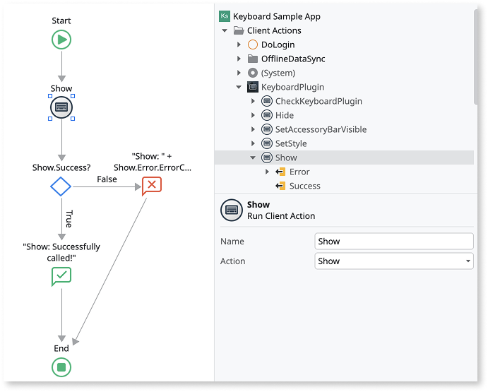
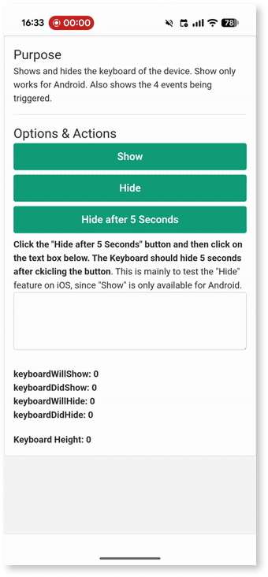
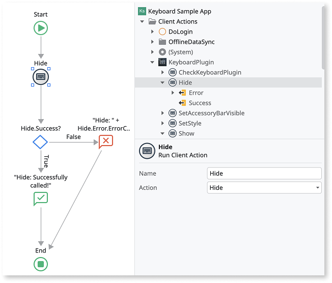
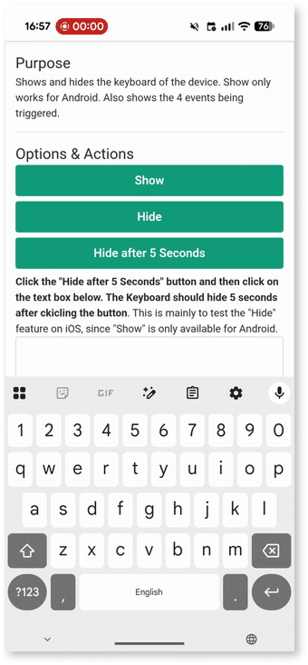
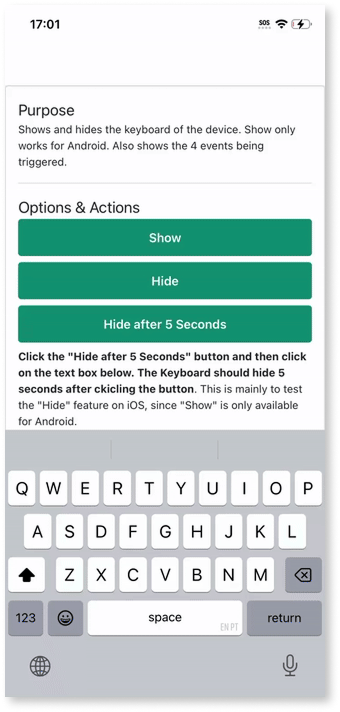
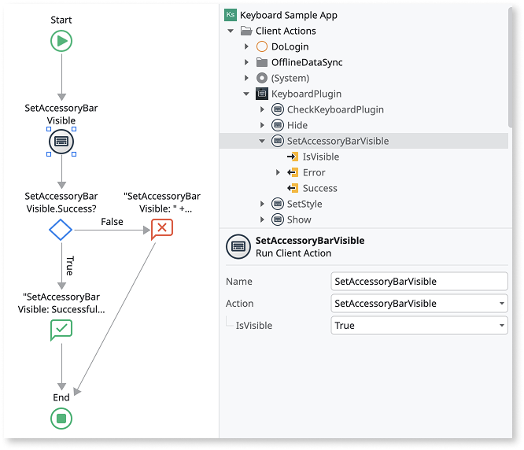
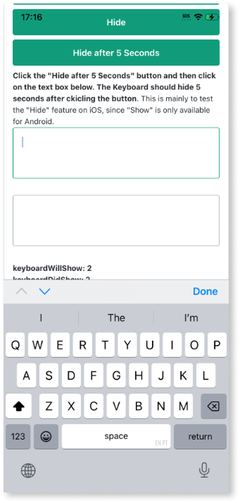
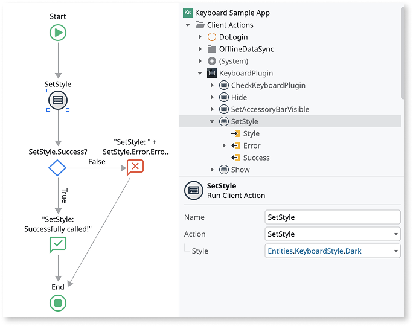
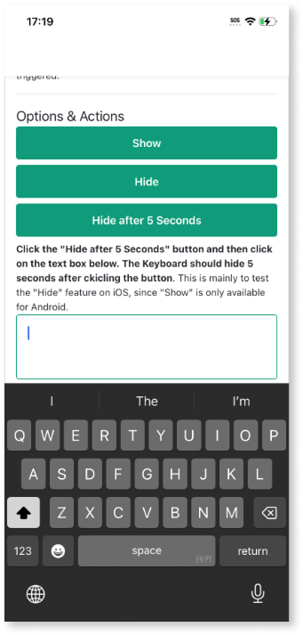

# Keyboard plugin

Applies only to Mobile Apps.

The Keyboard Plugin available in the ODC Forge is currently only available for MABS 12 or higher, and Capacitor. It uses the [@capacitor/keyboard](https://capacitorjs.com/docs/apis/keyboard) plugin.

Use the Keyboard plugin for more control over the device's keyboard within your app.

As a best practice, always verify that the plugin is available in the app. Use the **Logic > Client Actions > KeyboardPlugin > CheckKeyboardPlugin** action to check for the plugin's availability before using other plugin actions. If the plugin isn't available to the app, display an error to your users.

For detailed information about how to install a plugin in your app, refer to  [Adding plugins](../intro.md).

## Show the device's keyboard (Android only)

To create the logic to show the Android device's keyboard, follow these steps:

1. From the ODC Studio,  go to **Logic > Client Actions > KeyboardPlugin** and drag the **Show** action to your flow. The **Show** action has no input parameters.

1. As a best practice, you should handle the result of calling the action by checking the **Success** output parameter. If any errors occur, you can check them using the **Error** output parameters.

Here's the result of calling the **Show** client action on Android:

## Hide the device's keyboard

To create the logic to hide the device's keyboard on Android and iOS, follow these steps:

1. From the ODC Studio, go to **Logic > Client Actions > KeyboardPlugin** and drag the **Hide** action to your flow. The **Hide** action has no input parameters.

1. As a best practice, you should handle the result of calling the action by checking the **Success** output parameter. If any errors occur, you can check them using the **Error** output parameters.

Here's the result of calling the **Hide** client action on Android:

Here's the result of calling the **Hide** client action on iOS:

## Set the keyboard accessory bar visibility (iOS only)

To create the logic to set the keyboard accessory bar visibility on iOS, follow these steps:

1. From the ODC Studio, go to **Logic > Client Actions > KeyboardPlugin** and drag the **SetAccessoryBarVisible** action to your flow.

1. Set the **IsVisible** input parameter to **True** or **False**, depending if you want the accessory bar to be shown when the keyboard shows or not.

1. As a best practice, you should handle the result of calling the action by checking the **Success** output parameter. If any errors occur, you can check them using the **Error** output parameters.

Here's the result of calling setting the accessory bar as visible on iOS:

## Setting the keyboard style (iOS only)

To create the logic to set the keyboard style on iOS, follow these steps:

1. From the ODC Studio, go to **Logic > Client Actions > KeyboardPlugin** and drag the **SetStyle** action to your flow.

1. Set the **Style** input parameter to one of the values of **KeybordStyke**, which can be: **Light**, **Dark**, or **Default**. Use **Default** to use the default set for the device.

1. As a best practice, you should handle the result of calling the action by checking the **Success** output parameter. If any errors occur, you can check them using the **Error** output parameters.

Here's the result of calling the **SetStyle** client action with **KeyboardStyle.Dark** on iOS:

## Handle keyboard events

To handle events that are triggered when the keyboard is shown and hidden in your app, use the **KeyboardEvents** block.

The KeyboardEvents block allows you to handle the following events:

* **OnKeyboardWillShow**: An event triggered when the keyboard is about to be shown.
* **OnKeyboardDidShow**: An event triggered when the keyboard is shown.
* **OnKeyboardWillHide**: An event triggered when the keyboard is about to be hidden.
* **OnKeyboardDidHide**: An event triggered when the keyboard is hidden.

Add the **KeyboardEvents** block to every screen where you want these events to be handled. Then, create a handler client action for each event.

## Handling errors

The app with the Keyboard plugin can run on various Android and iOS devices, with different hardware and configurations. To provide a good user experience and prevent the app from crashing, you must handle errors within the app.

See [Keyboard Reference](keyboard-ref.md) for more information about each client action.

## Known issues

* On iOS, after calling the **Hide** client action and the keyboard hides, clicking anywhere on the screen can trigger the keyboard events one more time.
* On iOS, when the accessory bar is set to visible and the keyboard is hidden, the **OnKeyboardDidHide** event can be triggered twice instead of once.
* On iOS, when the accessory bar is set to visible and there is more the once input box, navigating between input boxes with the accessory bar buttons can trigger the **OnKeyboardDidShow** event.
