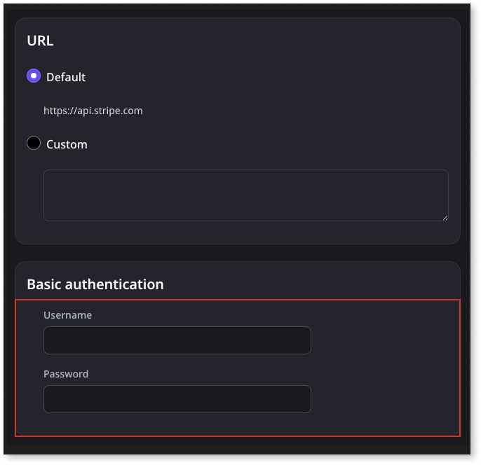
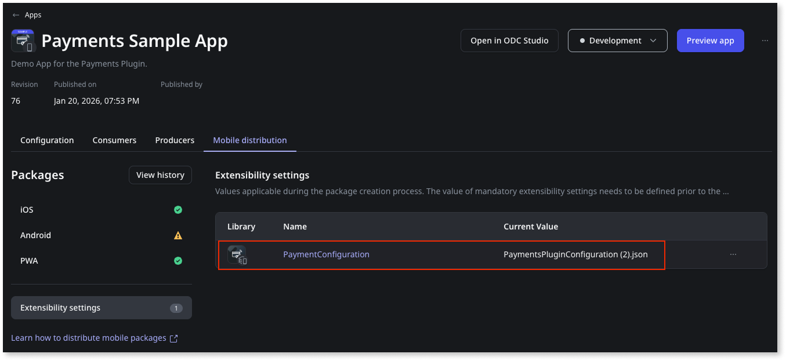
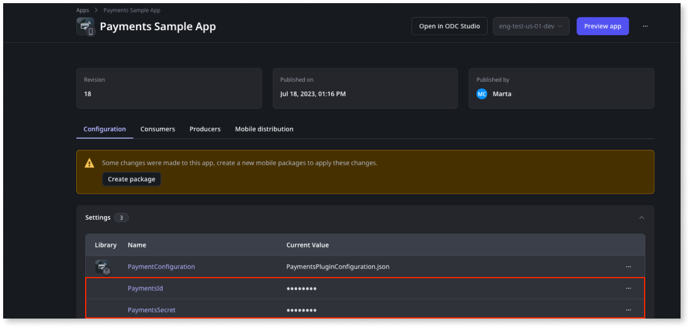
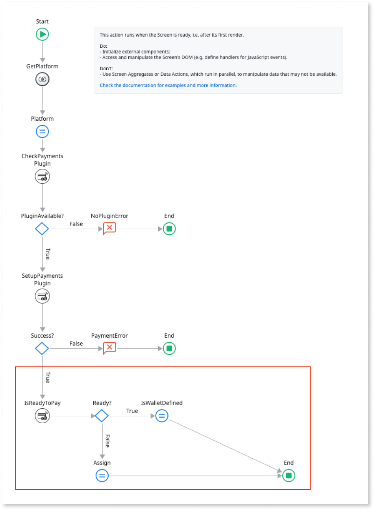
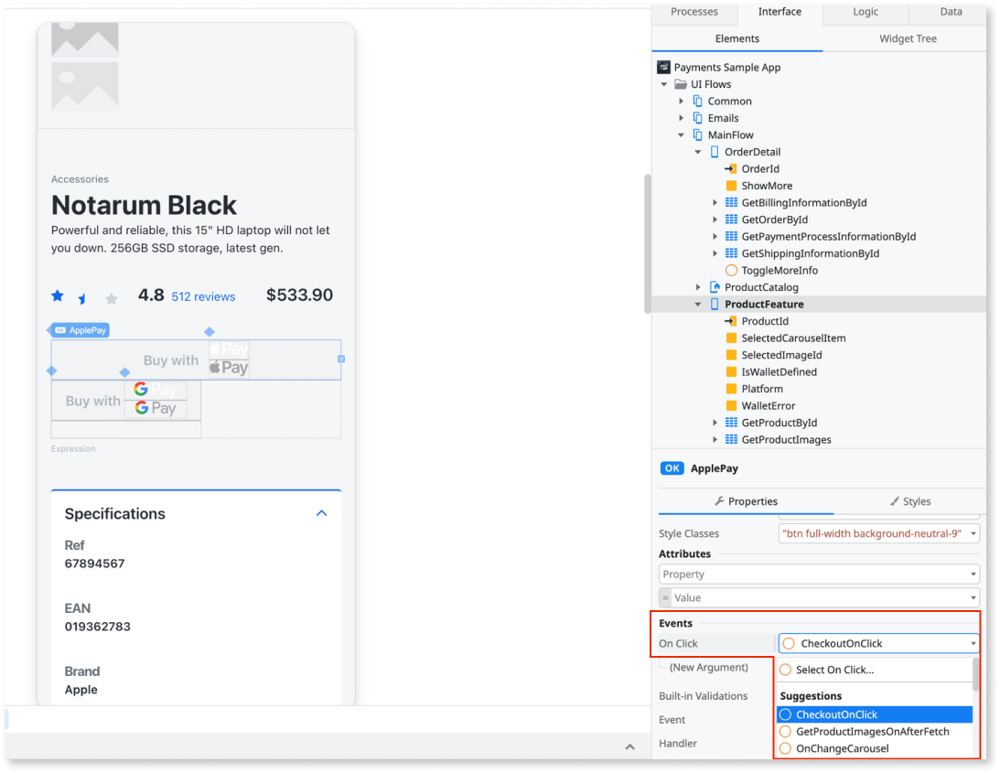

# Payments Plugin

Applies only to Mobile Apps.

Use the [Payments Plugin](https://www.outsystems.com/forge/) to enable users to complete payments using Apple Pay or Google Pay. This plugin lets users provide payment details, merchant information, the amount and currency of the transaction, and billing contacts.

The following is a high-level process describing how to add and configure the Payments Plugin to your mobile app:

1. Add the plugin to your mobile app.

1. Create the payment logic to verify the plugin availability using the **CheckPaymentsPlugin** action by accessing ODC Studio and selecting **Logic** > **Client Actions** > **PaymentsPlugin** > **CheckPaymentsPlugin**.

1. When the verification completes on your users' devices, your app is ready to take the required pre-defined actions while interacting with that user.

* To prevent your app from crashing, do not use a plugin that's unavailable at runtime.

* To learn how to install and reference a plugin in your OutSystems mobile apps and how to install a demo app, see [Installing a plugin and adding a public element to your app](../intro.md#installing-a-plugin-and-adding-a-public-element-to-your-app).

## Compatibility with operating systems

The mobile Payments Plugin is available for both iOS (Apple Pay) and Android (Google Pay).

## Sample app

OutSystems provides a sample app that contains logic for common use cases.
Install the Payments sample app from [Forge](https://www.outsystems.com/forge/) and then open it in ODC Studio.

This sample app shows you how to complete the following procedures:

* To set the configuration information for the plugin, from the Payments Plugin Configurator, get the Apple Pay or Google Pay configuration.

* To trigger the payment flow, add the logic to a button.

## Enable a frictionless payment experience in your app

The following is a high-level process describing how to enable your users to pay with Apple Pay or Google Pay:

1. If you want to use a Payment Service Provider (PSP) to process the payments, configure your payment account in the provider's dashboard.

1. In the Payments Plugin Configurator app, configure a mobile payment service for your app.

1. In your app, create the logic to set up the plugin and verify that the payment is possible.

1. In your app, create a button and a logic to trigger the payment.

### Configure your account in the provider's dashboard.

To configure your payment account in the Stripe dashboard, create a [Stripe](https://stripe.com/) account. From **Stripe Dashboard** > **Developers**, make a note of the **Publishable key** and **Secret key** field values. These fields are necessary to properly process payments using Stripe with the OutSystems Developer Cloud (ODC) Payments Plugin.

* Only some providers offer end-to-end payment processing in the Payments Plugin, for example, Stripe. If the Payments Plugin doesn't provide an end-to-end process for a provider (for example, Adyen or WorldPay), you can configure an account in your provider's dashboard. Then implement the payment process with the provider on your app.

* When using the built-in Stripe integration, enabling **PAN_ONLY** capabilities may increase card compatibility, but it's not guaranteed to work with every bank. This is due to the lack of 3DS support for this configuration.

### Configure a mobile payment service for your app

Before triggering a payment in an app, you need to configure a mobile payment method service (such as [Apple Pay](https://developer.apple.com/documentation/apple_pay_on_the_web/applepaypaymentrequest) and [Google Pay](https://developers.google.com/pay/api/android/reference/request-objects)’s base information) in the app using the Payments Plugin Configurator, a Reactive Web app.

Note that, to be able to access the Payments Configurator app, you should configure end-user access to it. See the "End-user roles" and "End-user groups" sections in [User Management > Roles](https://success.outsystems.com/documentation/outsystems_developer_cloud/user_management/roles/) to learn how to configure end-user access to your apps in the ODC Portal.

You need the following information:

* Access to the Payments Configurator at `https://<your-environment>/PaymentsConfigurator/`, where you should replace `<your-environment>` with your development environment address.

* Access to a configuration of Google Pay for Android and/or Apple Pay for iOS to use in your app.

* Access to a configuration of a Payment Service Provider (PSP), for example Stripe, that will be used to process payments.

At this point, you're ready to configure payments for your app in the Payments Configurator. Follow these steps:

1. Start in the home screen of the Payments Configurator, at `https://<your-environment>/PaymentsConfigurator/`.

1. To add a new configuration for your app, click the **Add new app** button and write the name of your app configuration. The description is optional.

1. After adding the app, locate it in the application list, and click the edit button to edit the configuration for your app. Now you can add your Google Pay and/or Apple Pay configuration.

1. For Apple Pay, you should fill the following fields:

    * Merchant ID: The merchant ID. **This field is only required for Apple Pay**. You can get this identifier from Apple Developer, where you configured the Apple Pay Payment Processing capability for your app.

    * Name: The merchant name.

    * Country: The merchant country.

    * Allowed networks: The networks that the merchant allows (VISA, MasterCard, Amex, etc).

    * Supported capabilities: The capabilities that the merchant supports (Debit, Credit, 3DS, etc).

    * Supported card countries: The supported card countries that the merchant supports. The default value is "All countries" but you can specify specific countries.
  
    * Required contacts for shipping: The shipping contact information that you require from the user to execute the payment (name, email, phone number and postal address).

    * Required contacts for billing: The billing contact information that you require from the user to execute the payment (name, email, phone number and postal address).

    * Payment Service Provider (PSP): The identification of the Payment Service Provider (PSP) that you are going to use to process the payment. For Stripe, you should insert the publishable key you get from your Stripe configuration. For Adyen, you should insert the merchant ID. You can also set a custom PSP by using the provider's ID and the merchant ID.

1. For Google Pay, you should fill the following fields:

    * Name: The merchant name.

    * Country: The merchant country.

    * Allowed networks: The networks that the merchant allows (VISA, MasterCard, Amex, etc).

    * Supported capabilities: The capabilities that the merchant supports (Debit, Credit, 3DS, etc).

    * Supported card countries: The supported card countries that the merchant supports. You can't change this field for Google Pay.

    * Allowed countries to ship: The supported countries the merchant ships to. The default value is "All countries" but you can specify specific countries.

    * Required contacts for shipping: The shipping contact information that you require from the user to execute the payment (name, email, phone number and postal address).

    * Required contacts for billing: The billing contact information that you require from the user to execute the payment (name, email, phone number and postal address).

    * Payment Service Provider (PSP): The identification of the Payment Service Provider (PSP) that you are going to use to process the payment. For Stripe, insert the publishable key you get from your Stripe configuration. For Adyen, you should insert the merchant ID. You can also set a custom PSP by using the provider's ID and the merchant ID.

The PSP in the Payments Configurator identifies the Payment Service Provider that you use in your app. If you want to integrate with a PSP other than Stripe then you need to integrate and configure the Payment Service Provider API to the ODC Studio. You must have a license for the PSP you wish to use for the plugin to work.

To process payments with Stripe using an OutSystems implementation, complete the following steps:

1. Open the ODC Portal.
  
1. Open the **Payments Plugin Configurator** app.

1. Navigate to **Apps** > **Payments Configurator** > **Consumed REST APIs** > **Stripe** to configure the authentication logic of the consumed REST API.

1. In the Basic authentication section, in the **Username** field, enter the **secret key** from your provider [Configure your account in the provider's dashboard](intro.md#configure-your-account-in-the-providers-dashboard). The **Password** field won't be used by Stripe, so if required, you can enter any value.

   

1. Go back to the **Payments Configurator**.

1. On your app configuration page (in the PSP dialog box), enter the **secret key** you obtained from the Stripe dashboard [Configure your account in the provider's dashboard](intro.md#configure-your-account-in-the-providers-dashboard), and select **Add**.

   Google Pay and Apple Pay configurations for your app are complete.

   

1. Navigate to **Apps** > **Payments Configurator** and edit the Payments app details such as Google Pay and Apple Pay.

1. Select **Download configurations** to download the JSON configuration file **PaymentsPluginConfiguration.json**.

   

1. In the ODC portal, in your Payments app, add the **PaymentsPluginConfiguration.json** file as a Resource of your app.

   

   Do not edit this JSON file.

   

   

   

   Repeat the above steps each time you change the Apple Pay and/or Google Pay configuration on the Payments Plugin Configurator app.

   

1. To guarantee the app’s authenticity for the Payments Plugin, complete the following steps:

   1. In your Payments app, create two secret settings PaymentsId and PaymentsSecret.

      

   1. Navigate to **Apps** > **Payments Configurator** and select **Application Secrets**. Your app’s Application ID and Application Secret details display. Make a note of these values and add in your app settings by navigating to  **ODC Portal** > **Settings**.

      

### Create logic to set up the plugin

Follow these steps, to verify the plugin’s availability, trigger the payment by adding an action, and then set up the plugin:

1. Verify the plugin’s availability and add an action to trigger the payment:

   From the **CheckPaymentsPlugin** client action, you can verify the plugin's availability. This step represents the action from the sample app. Follow these steps to verify the plugin availability and then to add an action that triggers the payment:

   1. From the ODC Studio, **Interface tab**, navigate to **UI Flows** > **Main Flow** > **ProductFeature** > **OnReady**.

   1. To know which mobile platform the app is running on, in the **OnReady** action of the screen, add the **GetPlatfrom** client action from Common Plugin. Save the result.

      In the OnReady screen, add the provider button to trigger the payment.

      

   1. To check if the Payments Plugin works correctly during the runtime, add the **CheckPaymentsPlugin** action after the Start node.

   1. To handle the response from the CheckPaymentsPlugin, after the CheckPaymentsPlugin node, add an **If** condition.

   1. To set the condition results and message, set the condition of the **If** node to CheckPaymentsPlugin.**IsAvailable**. Then in the False branch of the **If**, add a **Message**, set the message **Type** to **Error** and set a message for the user.

   1. Set up the plugin.

   To set up the plugin, use the **SetupPaymentsPlugin** client action.​​ This action gets the information inside the Payments Plugin Configurator app about the Apple Pay or Google Pay configuration. This illustration represents the second part of the action from the sample app.

   1. From the ODC Studio, **Interface tab**, navigate to **UI Flows** > **Main Flow** > **ShoppingCart** > **OnReady**.

   1. In the **OnReady** action, below the flow that you already defined, after checking the plugin's availability, add the **SetupPaymentsPlugin** action.

     

   1. For testing configuration, use a test stage for payments.

      * For **Android** (Google Pay), use the SetupPaymentsPlugin.**Environment** parameter to set the Test stage of your payments. During development, use the Test option. Remember to change this to Production when you are releasing your app to the store.

      * For **iOS** (Apple Pay), to learn more about sandbox testing, see [Sandbox Testing](https://developer.apple.com/apple-pay/sandbox-testing/).

   1. To handle the response from the SetupPaymentsPlugin, after the SetupPaymentsPlugin node, add an **If** condition and evaluate the success of this operation. In the False branch of the **If**, add a **Message**, set the message **Type** to **Error**, and set a message for end-users in case of failure to set up the Payments Plugin.

1. Verify if Apple Pay or Google Pay is available.

   As a best practice, OutSystems recommends that you verify if Apple Pay or Google Pay is available and configured on the device. If a valid card is available, use the call **IsReadyToPay** client action. To implement this verification, follow these steps:

   1. In ODC Studio, after setting up the plugin, add the **IsReadyToPay** action.

   1. To handle the response from the **IsReadyToPay** action, set the logic to apply conditions for your app based on whether the user has Apple Pay or Google Pay available or neither configured on the device, and if there’s any valid card to make the payment.
  
   1. To handle the response from the **IsReadyToPay** action, set the logic to apply conditions for your app. The logic must be based on the following conditions:

      * If the Apple Pay or Google Pay are available, or if neither are configured on the user's device.

      * If there’s any valid card added by the user on the device to make the payment.

    

    

    The sample app uses that response to enable/disable the **Pay** button and to handle error messages on the screen depending on each platform (Android or iOS).

    

### Create a button and logic to trigger the payment

Enable the plugin to execute the payment through the **TriggerPayment** client action.​​

To trigger the payment on your app's screen, complete the following steps:

1. Open ODC Studio.

1. In your app's login screen, add a **Button** for each payment method service you want to enable. Ensure you follow the provider's branding guidelines when creating each button ([Apple Pay](https://developer.apple.com/design/human-interface-guidelines/apple-pay/overview/introduction/) and [Google Pay](https://developers.google.com/pay/api/android/guides/ux-best-practices) guidelines).

1. For each button you add, enter an action to handle the **OnClick** event. In the properties of the **Payment** button, open the **Events** > **OnClick** dropdown and select the **New Client Action**.**OnClick** event.

   

1. For each action flow you create, verify the plugin is working properly during the runtime. After verifying the plugin’s availability, create a new server action **GetClientSecrets** to fetch the settings you configured in the ODC Portal.

1. After fetching the settings, add the **TriggerPayment** action.

   

1. To handle the response from TriggerPayment, after **TriggerPayment**, add an **If** node.

1. In the **False** branch of the **If** node, add a **Message** indicating that the payment process failed.

1. In the **True** branch of the **If** node, you can create a logic to redirect for a confirmation screen as shown in the sample app.

Notice that the **TriggerPayment** Client action has the optional parameters **PSP**, **ClientID**, and **ClientSecret**. If you want to process payments with Stripe using the Payments Plugin, you should set **PSP** to **Entities.PaymentServiceProvider.Stripe**. Obtain the **ClientID** and **ClientSecret** field values from the Payments Configurator dashboard by clicking the **Application Secrets** button inside your app's configuration. Don't pass the **ClientSecret** value directly to the **TriggerPayment** Client action. Instead, it's recommended you save this value securely by creating an Aggregate to obtain it and pass it to the Client action. It's suggested you save the **ClientSecret** in a Site Property. Find more info on Site Properties [here](https://success.outsystems.com/Documentation/11/Reference/OutSystems_Language/Data/Handling_Data/Site_Property). Note that if the **PSP** parameter of the **TriggerPayment** client action is set to **Entities.PaymentServiceProvider.None**, no PSP payment processing takes place.

