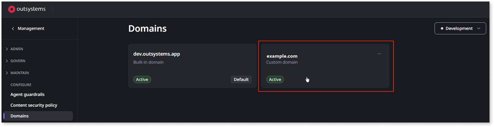
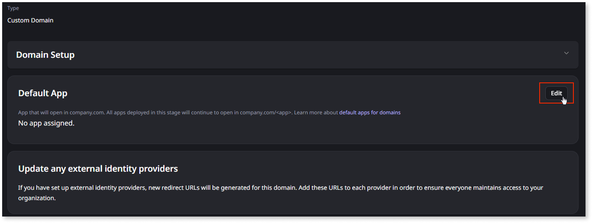
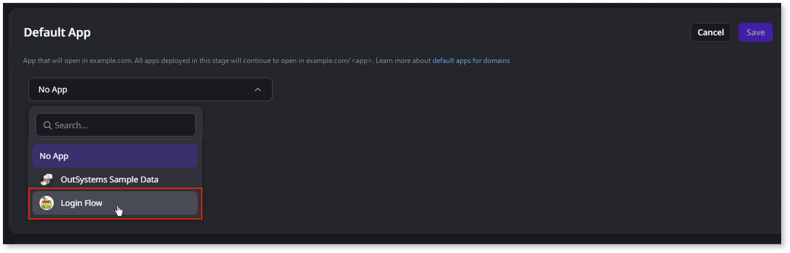
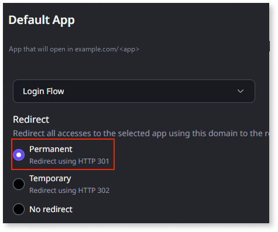

# Default app for a custom domain

When you set a **default app for a custom domain**, ODC loads that app at the root URL, for example `www.company.com`. Set a default app when one app serves as the primary entry point for a custom domain, such as a customer portal or marketing site.

You can only set a default app for reactive web apps on active custom domains. Built-in OutSystems domains and mobile apps (native or PWA) are not supported.

## Before you begin

To set a default app for a custom domain, you need:

* A custom domain with **Active** status added to the stage. Refer to [Configure custom domains for apps](custom-domains.md).

* The **Platform administrator** role.

## Set a default app for a custom domain

To set a default app, follow these steps:

1. From the ODC Portal, go to **Management** > **Configure** > **Domains**.

1. From the stage dropdown, select the stage where your domain is active.

1. Click the custom domain you want to configure.

    

1. In the **Default app** section, click **Edit**.

    

1. From the dropdown, select the app you want to set as the default app for the custom domain.

    

    Only reactive web apps deployed to the stage appear in the list.

1. In the **Redirect** section, choose the redirect behavior for users who access the app by its full path:

    

    * **Permanent (301)**: Redirects `www.company.com/AppName` to `www.company.com`. Recommended for production. This is the default setting.

    * **Temporary (302)**: Same redirect, but signals a temporary arrangement to browsers and search engines. Use for testing or short-term promotions.

    * **No redirect**: No redirect. The app loads at both the root URL and its full path.

1. Click **Save**.

1. Republish the app.

    The app must be rebuilt and redeployed before it can run from the root URL.

End-users can now access the app at the root URL.

The same app can be the default app for more than one custom domain.

## Change or remove the default app

To change the default app, follow the same steps and select a different app in step 5. To remove the default app, select **No App**. Republish the app again to apply the changes.

## Known limitations

### Screen name collision

If `MyApp` has a screen named `OtherApp` and you enable the redirect, accessing `www.company.com/MyApp/OtherApp` redirects to `www.company.com/OtherApp`. ODC loads the `OtherApp` app, not the `OtherApp` screen inside `MyApp`. To avoid this, do not give screens the same name as other apps deployed to the same stage when the redirect is enabled.

### Cross-app navigation

When the default app is loaded at the root URL, the client-side router cannot disambiguate between another app on the same domain and a screen inside the default app. Cross-app navigation using Navigation Nodes fails with a "Screen not found" error.

To navigate to another app within the same domain, bypass Navigation Nodes and use a JavaScript node with `window.location.assign(<url>)`.

### Open in browser and URL functions

When you open an app from ODC Studio or the ODC Portal by clicking **Open in browser**, ODC uses the stage's default domain, not the app domain.

Built-in functions such as `GetURLHost` and `GetRelativeURL` return the URL of the end-user's request.

### Deleting or undeploying the default app

If you delete or undeploy the default app for a domain, ODC displays a warning. If you confirm, ODC deletes or undeploys the app, the domain loses its default app. The root URL returns an error until you set a new default app.

## Related resources

For more information about custom domains and SEO configuration, refer to the following articles.

* [Configure custom domains for apps](custom-domains.md)
* [Generating sitemap and robots files](../building-apps/seo/generating-sitemap-robot-files.md)
* [Redirect domains](../building-apps/seo/redirect-domains.md)
