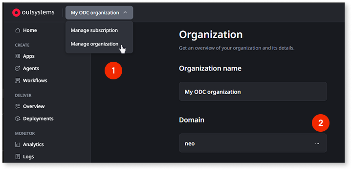
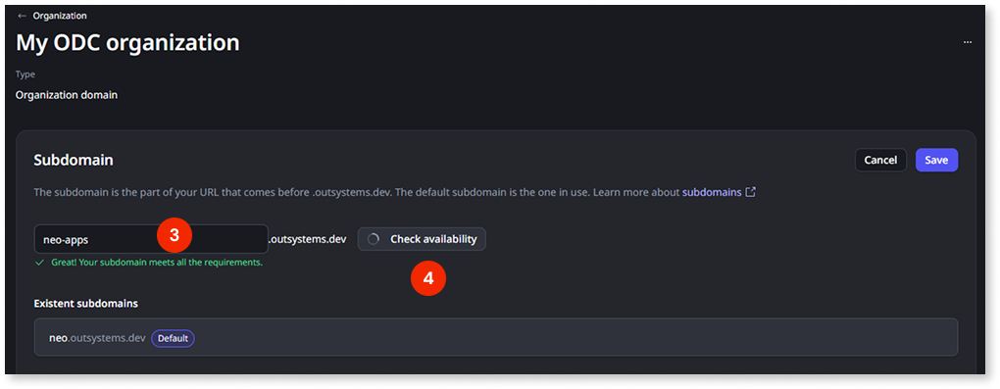
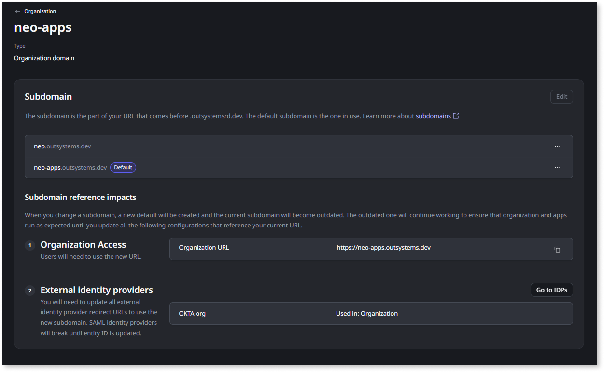
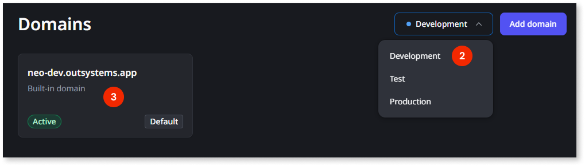
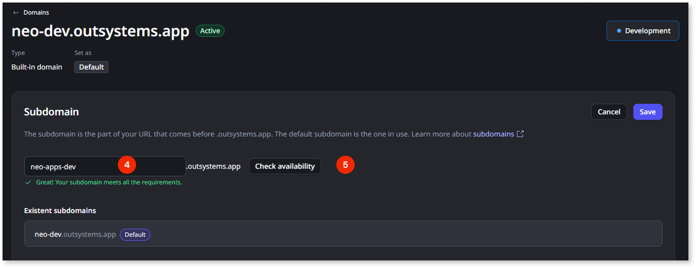
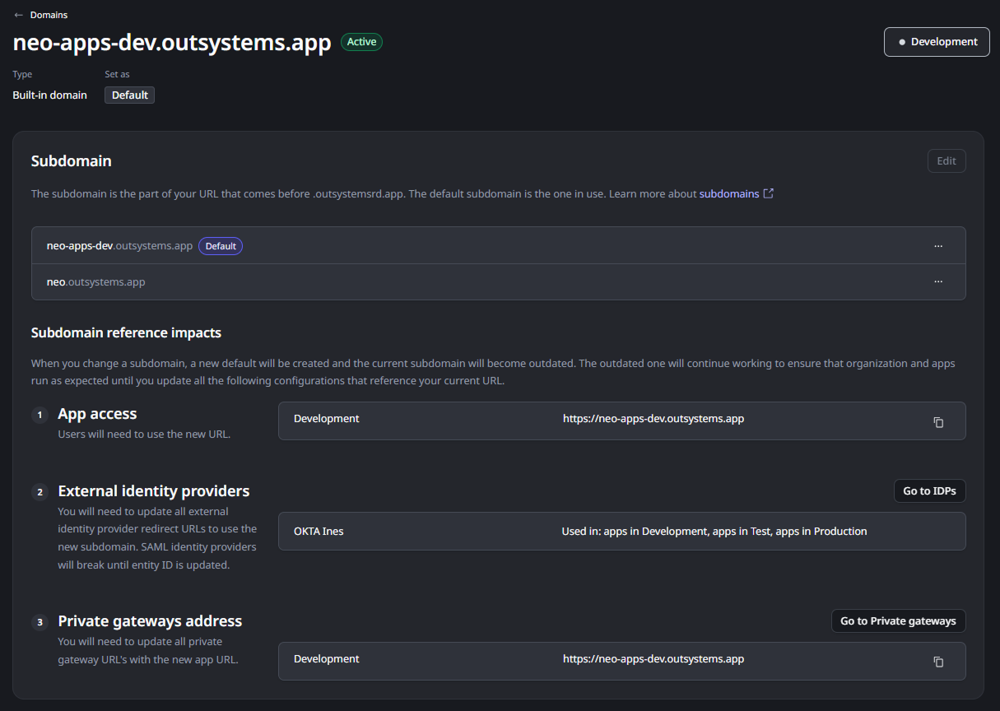
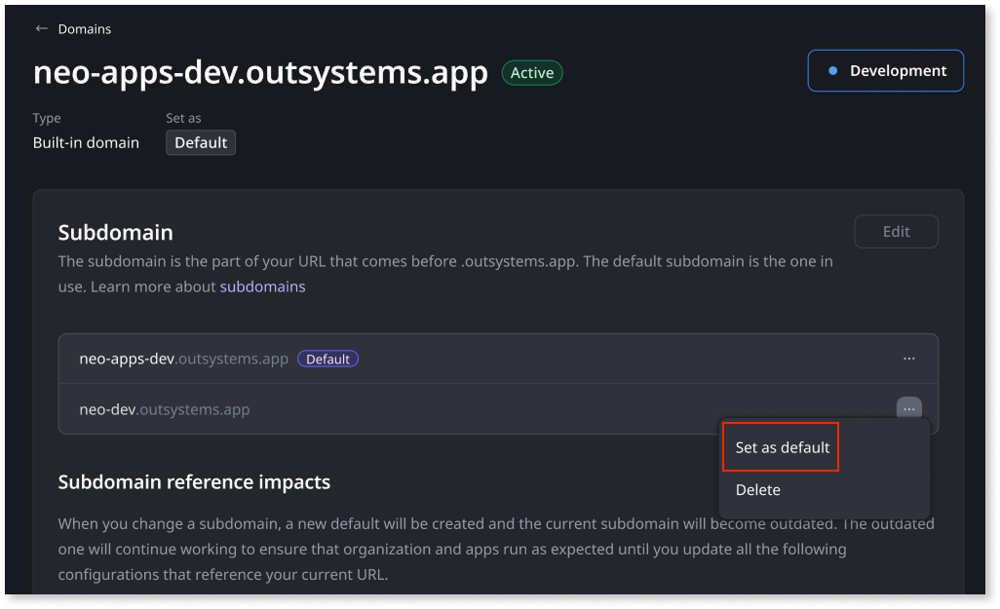
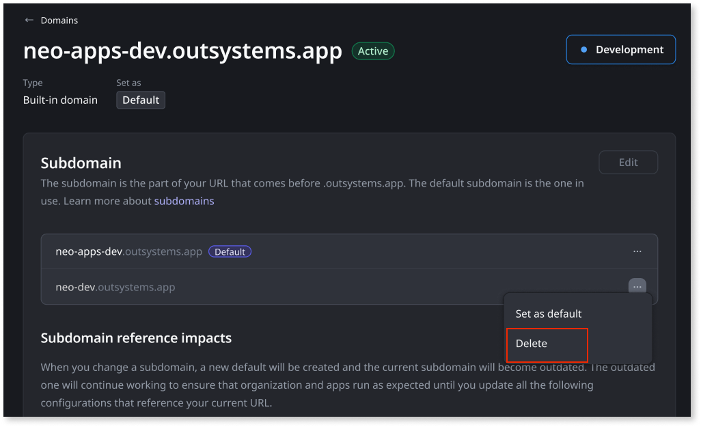
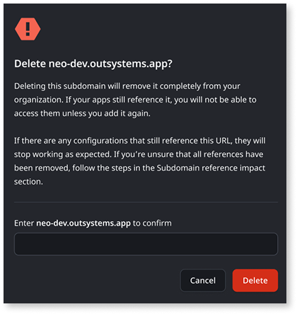

# Change your built-in organization or stage subdomain

You can change the subdomain of your built-in organization domain (`<subdomain>.outsystems.dev`) and of each stage's built-in domain (`<subdomain>.outsystems.app`) at any time from the ODC Portal. If you want to use your own custom domain instead, see [Configure custom domains for apps](custom-domains.md).

Changing the built-in subdomain is a process. You add the new subdomain, update the configurations that reference the previous address, set the new subdomain as default, and then delete the previous one. Only two subdomains, the new one and the previous one, can be active per organization or per stage at a time; refer to [Default domain](domains.md#default-domain) for details.

Before changing a subdomain, read [Planning domain changes](domain-planning.md) to understand the impact on identity providers, private gateways, native mobile builds, self-hosted configuration, and other dependent configurations.

Subdomains must meet the following naming rules:

* Start with a letter
* End with a letter or number
* Contain only letters, numbers, or hyphens
* Be between 3 and 60 characters for the stages subdomain, or between 3 and 40 characters for the organization subdomain

## Prerequisites {#prerequisites}

Before changing a subdomain, make sure you have the required permissions.

| Action | Permission required |
| --- | --- |
| Change the organization subdomain | Manage organization |
| Change a stage subdomain | Manage domains |

## Change the organization subdomain {#change-organization}

Change the organization subdomain when you need your ODC Portal and ODC Studio addresses to reflect a rebrand, a company name correction, or a shorter subdomain, for example.

In the images below, the organization subdomain is being changed from `neo` to `neo-apps`.

1. In the ODC Portal, in the top navigation bar, click the **Organization** dropdown > **Manage organization**.
1. In the **Organization domain** section, click the ellipsis `(...)` and select **Edit subdomain**.
    
1. Enter the new subdomain.
1. Click **Check availability** to confirm the subdomain is not already in use.
    
1. Click **Save**. Once you save, ODC creates the new organization subdomain. It isn't set as default automatically. This temporarily logs you and other members out of the ODC Portal and ODC Studio; log back in to continue.
1. The **Subdomain reference impacts** section lists everything affected by the change.

    

The new subdomain isn't the default yet. The organization keeps using the previous one as default until you explicitly [set the new subdomain as default](#set-default), so you have time to review and update the areas below first.

This is the right moment to note what needs to be updated and plan your transition. Both subdomains remain active after you save, giving you time to make these updates before switching the default.

Review the following areas and act on what applies to your setup. For more detail on how to manage each of these updates, see [Planning domain changes](domain-planning.md#org-subdomain-change). Once you've completed these updates, [set the new subdomain as default](#set-default).

## Change a stage subdomain {#change-stage}

Change a stage subdomain when the built-in address no longer matches your organization or stage name. This is common after a rebrand or when stage names change to reflect your SDLC process.

In the images below, the Development stage subdomain is being changed from `neo-dev` to `neo-apps-dev`.

1. In the ODC Portal, go to **Configure** > **Domains**.
1. In the stage dropdown, select the stage you want to change, for example **Development**.
1. Click the built-in domain card to open its detail page. The **Subdomain** section opens in edit mode.
    
1. Enter the new subdomain.
1. Click **Check availability** to confirm the subdomain is not already in use.
    
1. Click **Save**. Once you save, ODC creates the new stage subdomain. It isn't set as default automatically.
1. The **Subdomain reference impacts** section lists everything affected by the change.

    

The new subdomain isn't the default yet. The stage keeps using the previous one as default until you explicitly [set the new subdomain as default](#set-default), so you have time to review and update the areas below first.

Now is a good time to plan your updates. Both subdomains stay active after you save, so you can work through these at your own pace before switching the default.

Review the following areas and act on what applies to your setup. For more detail on how to manage each of these updates, see [Planning domain changes](domain-planning.md#stage-domain-change). Once you've completed these updates, [set the new subdomain as default](#set-default).

## Manage a subdomain {#manage-subdomain}

Setting a subdomain as default and deleting one both happen from the same subdomain detail page.

To get to the subdomain detail page:

| For the organization domain | For a stage domain |
| --- | --- |
| Go to **Management** > **Organization**. On the **Domain** card, click the ellipsis **(...)** and select **View subdomain**. | Go to **Management** > **Domains**. From the stage dropdown, select the stage you want to act on, for example **Development** or **Production**. Click the **Built-in domain** card. |

### Set a subdomain as default {#set-default}

Adding a subdomain doesn't automatically make it the default. Setting a subdomain as default is a separate, deliberate action, the same way you [set a custom domain as default](custom-domains.md#set-default-domain) after adding it.

Set the new subdomain as default once you've updated the dependent configurations described in [Planning domain changes](domain-planning.md). The switch takes effect immediately. Setting a built-in subdomain as default doesn't affect a custom domain already set as default for a stage. For more on how these interact, see [Default domain](domains.md#default-domain).

1. On the subdomain detail page, click the ellipsis `(...)` next to the subdomain you want to set as default and select **Set as default**.

    

The subdomain is set as default immediately. The **Subdomain reference impacts** section updates to show the URLs for the new default subdomain.

### Delete a subdomain {#delete-subdomain}

Once you've set the new subdomain as default and confirmed everything works correctly, you can delete the previous one. This is the point of no return: deleting a subdomain is immediate and permanent. Any traffic still using it stops working instantly, including your own access to the ODC Portal if you're accessing it through that subdomain. Any dependent configuration you haven't updated yet, per [Planning domain changes](domain-planning.md), breaks too.

You can only delete a subdomain that is not set as default. If you need to delete the current default, first [set the other subdomain as default](#set-default), then delete the previous one. If there is only one subdomain, delete is not available.

In this example, `neo-dev` is being deleted from the Development stage, after confirming that all configurations have been updated to use `neo-apps-dev` and everything is working as expected.

1. On the subdomain detail page, click the ellipsis `(...)` next to the subdomain you want to delete and select **Delete**.

    

1. A confirmation dialog appears. In the input field, type the full subdomain to confirm and click **Delete**.

    

The subdomain is removed immediately.

## Related articles {#related-articles}

* [Domains in ODC](domains.md)
* [Configure custom domains for apps](custom-domains.md)
* [Configuring authentication with external identity providers](../external-idps/intro.md)
