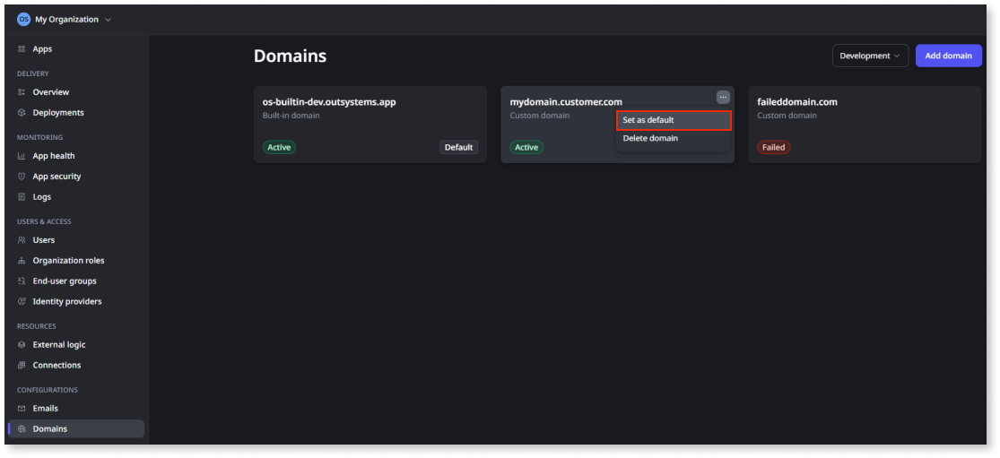

# Configure custom domains for apps

In addition to the built-in domain ODC provides for each stage, you can make your apps accessible through your organization's own domain. In a given stage, your apps can be available through one or more custom domains. Each custom domain must be unique to a customer and stage. In a multi-portfolio organization, you configure custom domains for stages in each portfolio. For more information, refer to [Configuration management with multiple portfolios](../portfolios/portfolios-configurations.md).

For an overview of domain types in ODC and what to plan for before making any domain change, see [Domains in ODC](domains.md).

If you plan to change a stage's domain, the change can affect identity providers, private gateways, native mobile builds, and end-user access. Read [Planning domain changes](domain-planning.md) before proceeding.

Once a custom domain is active, you can set an app to load at its root URL. Refer to [Default app for a custom domain](default-app-for-domain.md).

You can also manage custom domains programmatically, including adding and deleting domains and setting the default domain, using the [Environment Configurations API](../../reference/apis/env-config-v1.md).

## Prerequisites {#prerequisites}

To add, delete, or set a custom domain as the default domain, you must have the **Manage domains** permission.

## Add a custom domain {#add-custom-domain}

Some domain registrars may not allow creating CNAME records when existing DNS records exist for the same name. This typically applies to root domains (such as `example.com`) and subdomains (such as `dev.example.com`) that already have other records.

A **root domain** is the main part of a website's address. It is the **highest level of your website's identity** on the internet, and all subdomains are based on it.

You need to use a custom domain without linked DNS records if your domain registrar has restricted CNAME creation.

To add a custom domain, in the ODC Portal go to **Management** > **Domains** and then follow these steps.

1. From the stage dropdown, select the stage for which you want to add a domain.
1. Click **Add domain** to display the **Add a domain** dialog.
1. Enter the domain you want to add, then click **Add**. The **Set up your domain** screen displays with the **Pending validation** status next to the domain name.
1. Now, you must **Validate ownership of the domain** and **Point the domain to your apps**. You do this by adding the two provided CNAME records to the DNS records of your domain registrar. To add a **CNAME** record, follow the steps in the [box below](#add-cname-box).
1. ODC uses AWS Certificate Manager (ACM) to issue certificates. If your domain has Certification Authority Authorization (CAA) enabled, you must add a DNS record to specify that ACM is allowed to issue a certificate for your domain. The process of adding a DNS record is detailed in the [ACM documentation](https://docs.aws.amazon.com/acm/latest/userguide/setup-caa.html).

* You must complete these steps within **72 hours** or the CNAME records expire and you must restart the process.

Once ODC detects the provided CNAME records in the domain's DNS records, ownership is validated and traffic is routed from the domain to your apps. This may take up to 20 minutes, before which the domain may not be ready to use and an error displays if visiting an app through it. Once ownership is validated, the status of the domain changes to **Active** and it's ready to use.

If customers are routing traffic through a reverse proxy, they must configure it to preserve the original Host header so that ODC recognizes the access as being via the custom domain.

ODC generates a public X.509 certificate to enable TLS communication over the domain. The generated certificate is valid for 395 days. If the provided CNAME records remain in the domain's DNS records, ODC automatically renews the certificate before expiry.

### Add a CNAME record to your domain's DNS records  {#add-cname-box}

There may be a dedicated person or team at your organization responsible for administering the organization's domains. If so, you may want to contact them for help with the process.

To add the CNAME record to your domain registrar, complete the following steps. For more specific instructions, see your domain registrar's support documentation.

1. Go to your domain's DNS records.
1. Add a record to your DNS settings. Select CNAME as the record type.
1. In the ODC Portal screen, copy the contents of the Name field. Paste the content into the Name field of the DNS record.
1. In the ODC Portal screen, copy the contents of the Value field. Paste the content into the Value field of the DNS record.
1. For the Time To Live (TTL) either set it to 1 hour or leave the default setting.
1. Save the record.

## Setting your custom domain as the default domain {#set-default-domain}

Once your custom domain is active, you can set it as the default domain. For an overview of what the default domain controls, see [default domains](domains.md#default-domain).

Before setting a custom domain as the default domain, read [Planning domain changes](domain-planning.md) to understand the impact on identity providers, private gateways, native mobile builds, and end-user access.

To set a custom domain as the default domain, follow the [Add a custom domain](#add-custom-domain) steps. Once the domain is active, click the ellipsis menu, and select **Set as default**.

## Developing apps with custom domains {#developing-apps}

When your app generates the URL of a screen outside an HTTP request (for example, in a background process), OutSystems uses the built-in domain by default.

To use a custom domain in generated URLs, the custom domain must be **Active**. You only need to set a custom domain as the **default domain** if you want OutSystems-generated links and tooling to use that domain automatically.

To override the built-in domain in your own URL expressions, use one of the following approaches:

* **Default domain**: Set an **active** custom domain as the stage default, then use the [GetDefaultDomain](../../reference/system-actions/get-default-domain.md) server action when you build URLs.
* **Specific domain**: Use a specific **active** custom domain in your expression. For example, store the domain in an app setting (such as **App_Domain**) and use it when you build URLs. This approach is useful when you generate links for a domain that isn't the stage default.

## Delete a custom domain {#delete-custom-domain}

Before deleting a custom domain that is set as default, you must first set another domain as the default domain. If this is the only custom domain on the stage, set the built-in domain as default instead. Once you do this, the built-in domain becomes the effective default for the stage — links, emails, and tooling will use the built-in address.

Before making this change, read [Planning domain changes](domain-planning.md) to understand the impact on identity providers, private gateways, native mobile builds, and end-user access.

To delete a custom domain, in the ODC Portal go to **Management** > **Domains** and then follow these steps.

1. From the stage dropdown, select the stage for which you want to delete a domain.
1. Click the card of the custom domain you want to delete. The **Set up your domain** screen displays and you see the status next to the domain name.
1. Click the ellipsis **(...)** to the right of the domain status and select **Delete domain**.
1. Before confirming the deletion of the domain, review the information in the popup box. Then do one of the following:
    * To confirm, click the **Delete domain** button.
    * To cancel, click **Cancel** and exit.

The certificate ODC issued for the domain will automatically renew if the CNAME record that was added remains in the DNS records for your domain registrar. You can remove the DNS entry if you don't want the certificate to auto-renew. To delete records, see your domain registrar's support documentation for instructions.

