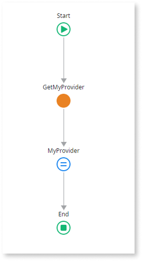

# Delete the built-in login screen and redirect to an external provider

For apps created with ODC Studio version 1.3.0 or later, the pre-built login screen automatically shows the Identity Providers (IdPs) assigned to the app’s stage (for example, Development). In those apps, you typically don’t need to change the login screen or flows to support external IdPs—just assign the IdPs you want to the appropriate stage in the ODC Portal.

This page is for advanced scenarios where you want to completely replace the built-in login experience and always redirect users to a single external identity provider, or for apps created before the built-in login logic was introduced.

Before you start, complete steps 1–3 (up to and including “Assign an IdP”) in [Configuring and using an external IdP](intro.md#configuring-using-idp).

## Delete the built-in login screen and redirect to external provider

For each app you want to modify, open it in ODC Studio and follow these steps:

1. [Modify the main user login flow](#modify-the-main-user-login-flow-idp-replaces-the-built-in-login).

1. [Modify the user info bar login flow](#modify-the-user-info-bar-login-flow-idp-replaces-the-built-in-login).

1. [Modify the user info bar logout flow](#modify-the-user-info-bar-logout-flow-idp-replaces-the-built-in-login).

### Modify the main user login flow {#modify-the-main-user-login-flow-idp-replaces-the-built-in-login}

If you choose the delete the built-in login screen scenario, to modify the main user login flow, follow these steps:

1. Create the `GetMyIdentityProvider` server action to fetch a setting with the IdP's name. This action lets you use a setting instead of hardcoding the provider name when you configure the **GetExternalLoginURL** action.

    1. In ODC Studio, create a new setting of the text data type, and name it `MyIdentityProvider`.

    1. Create a new server action, name it `GetMyIdentityProvider`, and set the **Function** property to **Yes**.

        Setting it as a function lets you get the output of the action in expressions, without exposing the server action publicly in a data action. Additionally, you can set the value of `MyIdentityProvider` in the ODC Portal, without needing to republish the app. For more information, refer to [View and edit default values of the app settings](../configure-app-settings.md#view-and-edit-default-values-of-the-app-settings).

        

        The name of the IdP is **case sensitive**. Make sure it matches the IdP's name in the Identity providers page in the ODC Portal.

        

    1. Add an output parameter, and name it `MyIdentityProvider`.

    1. Add an **Assign** element after the **Start** element.

    1. In the **Assign** properties, select **MyIdentityProvider** from the dropdown, and set its value to `Settings.MyIdentityProvider`.

    

1. Go to the **Interface** > **Elements** tab, expand **UI Flows** > **Common**, and double-click **OnException**.

1. To delete the built-in login screen, delete the **Common\Login** **Destination**  element from the logic flow.

    

1. Add the **GetMyIdentityProvider** server action you created after the **LastRequest** **Assign** element.

1. Add the **GetExternalLoginURL** [public element](../../building-apps/libraries/use-public-elements.md) after the **GetMyIdentityProvider** server action.

1. In the **GetExternalLoginURL** properties, set the **IdentityProvider** to `GetMyIdentityProvider.MyIdentityProvider`.

1. Add a **Destination** element to the end, and then select **RedirectToURL**.

    

1. In the **RedirectToURL** properties, set the **URL** to `GetExternalLoginURL.ExternalLoginURL`. The app redirects the user to this URL to perform the login.

### Modify the user info bar login flow {#modify-the-user-info-bar-login-flow-idp-replaces-the-built-in-login}

If you chose the delete the built-in login screen scenario, to modify the user info bar login flow, follow these steps:

1. Create the `GetMyIdentityProvider` wrapper client action so you can use the server action output in client logic without exposing a server action to unauthenticated access.

    1. In ODC Studio, create a new client action, and name it `GetMyIdentityProvider`.

    1. Add an output parameter, and name it `MyIdentityProvider`.

    1. Add the `GetMyIdentityProvider` server action you created after the **Start** element.

    1. Add an **Assign** element before the **End** element.

    1. In the **Assign** properties, select **MyIdentityProvider** from the dropdown, and set its value to `GetMyIdentityProvider.MyIdentityProvider`.

    

1. Go to the **Interface** tab, then expand **UI Flows** > **Common** and double-click **UserInfo**. Click the **Login** text, hover over the **Text** button, and then click the **Link** button.

1. In the **On Click** property, select **New Client Action** from the dropdown, and name it `LogInWith_MyIdentityProvider`.

1. Add the **GetMyIdentityProvider** wrapper client action you created after the **LastRequest** element.

1. Add the **GetExternalLoginURL** [public element](../../building-apps/libraries/use-public-elements.md) after the **GetMyIdentityProvider** run client action, and in its properties, set the **IdentityProvider** to `GetMyIdentityProvider.MyIdentityProvider`.

1. Drag a **Destination** element on top of the **End** element, select **RedirectToURL**, and set its **URL** property to `GetExternalLoginURL.ExternalLoginURL`.

    The app redirects the user to this URL to perform the login.

    

### Modify the user info bar logout flow {#modify-the-user-info-bar-logout-flow-idp-replaces-the-built-in-login}

If you chose the delete the built-in login screen scenario, to modify the user info bar logout flow, follow these steps:

1. Go to the **Interface** tab, then expand **UI Flows** > **Common** > **UserInfo**, and double-click **ClientLogout**.

1. To delete the built-in logout action, delete the **Logout** element from the logic flow.

    

1. Add the **GetExternalLogoutURL** [public element](../../building-apps/libraries/use-public-elements.md) after the **Start** element.

1. In the **RedirectToURL** **Destination** properties, set the **URL** to `GetExternalLogoutURL.ExternalLogoutURL`. The app redirects the user to this URL to perform the logout.

If you revert the provider for a stage back to the built-in provider, update the app's login flow to its original state. In the **RedirectToURL** **Destination** properties, set the **URL** to `GetOwnerURLPath()`.

## Related topics

* [Modify the built-in login screen for external provider login](apps.md)
