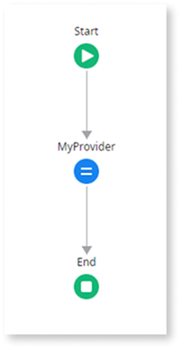
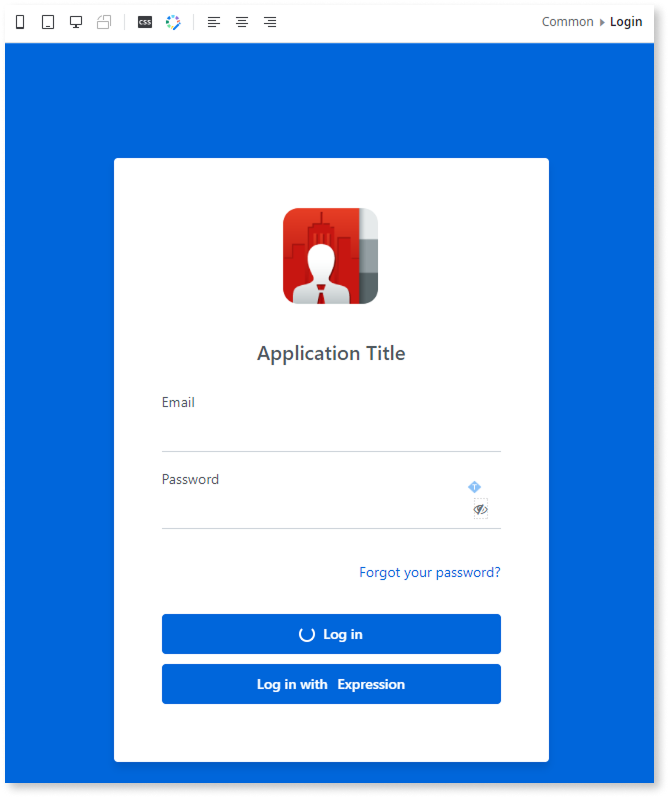
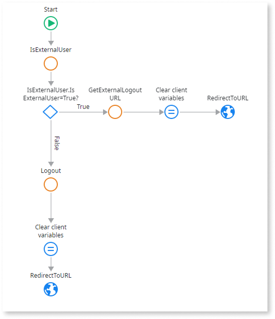

# Modify the built-in login screen for external provider login

For apps created with ODC Studio version 1.3.0 or later, the pre-built login screen automatically shows the Identity Providers (IdPs) assigned to the app's stage (for example, Development). In those apps, you typically don't need to change the login screen or flows to support external IdPs. You just need to assign the IdPs you want to the appropriate stage in the ODC Portal.

This page is for scenarios where you want to customize the built-in login screen, for example:

* Adding explicit buttons for specific external IdPs.
* Keeping the built-in provider while adding one or more external providers.
* Adapting apps that were created before the built-in login logic was introduced.

If you prefer to delete the built-in login screen and redirect users directly to a single external identity provider, refer to [Delete the built-in login screen and redirect to an external provider](apps-delete-login-screen.md).

## Prerequisites

Before you start, complete steps 1–3 (up to and including “Assign an IdP”) in [Configuring and using an external IdP](intro.md#configuring-using-idp).

## Modify the built-in login screen to add buttons for external provider login {#modify-to-add-button}

For each app you want to modify, open it in ODC Studio and follow these steps:

1. [Modify the login screen](#modify-the-login-screen-add-an-idp-button-alongside-the-built-in-login).

1. [Modify the user info bar login flow](#modify-the-user-info-bar-login-flow-idp-button-added-alongside-the-built-in-login).

1. [Modify the user info bar logout flow](#modify-the-user-info-bar-logout-flow-idp-button-added-alongside-the-built-in-login).

### Modify the login screen {#modify-the-login-screen-add-an-idp-button-alongside-the-built-in-login}

If you chose the modify the login screen scenario, to add a login button with an external provider to the built-in login screen, follow one of the three options below. To add multiple buttons, repeat the steps.

#### Option 1: Drag a button from the toolbox

To add a button from the toolbox, follow these steps:

   1. Create the `DataActionMyIdentityProvider` data action that loads the IdP name:

       1. Go to the **Interface** tab, expand **UI Flows** > **Common**, right-click the **Login** screen, and then select **Fetch Data from Other Sources**.

       1. Name the data action `DataActionMyIdentityProvider`.

       1. Add an output parameter of the **Text** data type, and name it `MyIdentityProvider`.

       1. Add an **Assign** after the **Start** element.

       1. In the **Assign** properties, select **MyIdentityProvider** from the dropdown, and set its value to `GetMyIdentityProvider()`.

       

   1. To load the login screen onto the canvas, go to the **Interface** tab, expand **UI Flows** > **Common**, and double-click **Login**.  

   1. Drag a **Button** element from the toolbox to the screen and place it next to or below the existing **Log in** button.  

   1. In the **Button** properties, set the **Text** to `Log in with`. You may also want to modify the **Text** property of the pre-existing **Log in** button.

   1. Drag an **Expression** element from the toolbox to the canvas, inside the previous button, and next to the **Text** element.

   1. In the **Expression** properties, set the **Value** to `DataActionMyIdentityProvider.MyIdentityProvider`.

       

   1. In the enclosing **Button** properties, Set the **On Click** property to **New Client Action**.

   1. Name it `LogInWith_ExternalIdP`. For example, `LogInWith_AzureAD`.

#### Option 2: Add a built-in social login button (only for Google, Facebook, and Apple)

To add a built-in social login button, follow these steps:

1. Add a [social login button](../sso.md#add-the-social-login-button-to-the-login-screen).  

1. In its Properties, select **New Client Action** from the **Handler** dropdown.

1. Name it `LogInWith_ExternalIdP`. For example, `LogInWith_AzureAD`.

#### Option 3: Use official login buttons for LinkedIn or Microsoft Entra ID

LinkedIn and Microsoft Entra ID aren't included in the list of Identity Providers available for the built-in **social login button**. To use their official login buttons, follow these steps:

1. Download the official button image from the provider's website: [LinkedIn](https://content.linkedin.com/content/dam/developer/branding/signin_with_linkedin-buttons.zip) or [Microsoft](https://learn.microsoft.com/en-us/entra/identity-platform/howto-add-branding-in-apps#referring-to-microsoft-entra-accounts-in-your-application).

1. In ODC Studio, go to the **Elements** tab, and import the button image.  

1. Drag an **Image** widget to the login screen canvas.  

1. In the **Image** properties, select the uploaded image from the **Image** dropdown.  

1. Set the **Event** property to `onclick` and the **Handler** to `New Client Action`.

1. Name it `LogInWith_ExternalIdP`. For example, `LogInWith_AzureAD`.

### Modify the user info bar login flow {#modify-the-user-info-bar-login-flow-idp-button-added-alongside-the-built-in-login}

If you chose the modify the login screen scenario, to modify the user info bar login flow, follow these steps:

1. Create the `GetMyIdentityProvider` server action to fetch a setting with the IdP's name. This action lets you use a setting instead of hardcoding the provider name when you configure the **GetExternalLoginURL** action.

    1. In ODC Studio, create a new setting of the **Text** data type, and name it `MyIdentityProvider`.

    1. Create a new server action, name it `GetMyIdentityProvider`, and set the **Function** property to **Yes**.

        Setting it as a function lets you get the output of the action in expressions, without exposing the server action publicly in a data action. Additionally, you can set the value of **MyIdentityProvider** in the ODC Portal, without needing to republish the app. For more information, refer to [View and edit default values of the app settings](../configure-app-settings.md#view-and-edit-default-values-of-the-app-settings).

        

        The name of the IdP is **case sensitive**. Make sure it matches the IdP's name in the Identity providers page in the ODC Portal.

        

    1. Add an output parameter of the **Text** data type, and name it `MyIdentityProvider`.

    1. Add an **Assign** element after the **Start** element.

    1. In the **Assign** properties, select **MyIdentityProvider** from the dropdown, and set its value to `Settings.MyIdentityProvider`.

        

1. Create the `GetMyIdentityProvider` wrapper client action so you can use the server action output in client logic without exposing a server action to unauthenticated access.

    1. In ODC Studio, create a new client action, and name it `GetMyIdentityProvider`.

    1. Add an output parameter of the **Text** data type, and name it `MyIdentityProvider`.

    1. Add the MyIdentityProvider server action you created after the **Start** element.

    1. Add an **Assign** element before the **End** element.

    1. In the **Assign** properties, select **MyIdentityProvider** from the dropdown, and set its value to `GetMyIdentityProvider.MyIdentityProvider`.

        

1. Open the `LogInWith_ExternalIdP` action you created when you [modified the login screen](#modify-the-login-screen-add-an-idp-button-alongside-the-built-in-login), and delete the **LoginForm.Valid?** element and associated logic.

1. Add the **GetMyIdentityProvider** wrapper client action you created after the **LastRequest** **Destination** element.

1. Add the **GetExternalLoginURL** [public element](../../building-apps/libraries/use-public-elements.md) after the **GetMyIdentityProvider** element.

1. In the **GetExternalLoginURL** properties, set the **IdentityProvider** to `GetMyIdentityProvider.MyIdentityProvider`.

1. Drag a **Destination** element on top of the **End** element, select **RedirectToURL**, and set its **URL** property to `GetExternalLoginURL.ExternalLoginURL`.

    The app redirects the user to this URL to perform the login.

    

### Modify the user info bar logout flow {#modify-the-user-info-bar-logout-flow-idp-button-added-alongside-the-built-in-login}

If you chose the modify the login screen scenario, to modify the user info bar logout flow, follow these steps:

1. To open the **ClientLogout** client action, go to the **Interface** tab, expand **UI Flows** > **Common** > **UserInfo**, and then double-click **ClientLogout**.

1. In the **Logic** tab, expand **Client Actions** > **(System)**, and drag the **IsExternalUser** action between the **Start** and the **Logout** nodes.

1. Add an **If** element after the **IsExternalUser** action, and in its properties, set the **Condition** to `IsExternalUser.IsExternalUser=True`.

1. Add the **GetExternalLogoutURL** [public element](../../building-apps/libraries/use-public-elements.md) in the **True** branch, to the right of the **If** element.

1. Copy the **Clear client variables Assign** element, paste it in the **True** branch to the right of the **GetExternalLogoutURL** action.

1. Add a **Destination** to the right of the **Clear client variables Assign**, in the **True** branch. Select **RedirectToURL**, and in its properties, set the **URL** to `GetExternalLogoutURL.ExternalLogoutURL`.

    

1. To save, click **Publish**.

## Next step

(Optional) Add an [end-user group mapping](end-user-group-mapping.md).

## Related resources

* [Configure authentication with external identity providers](intro.md).
* [IdP and end-user group mapping](end-user-group-mapping.md).
