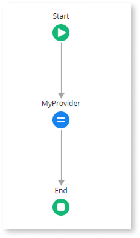
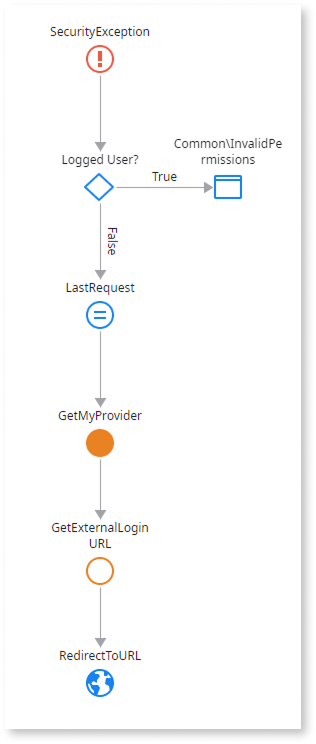
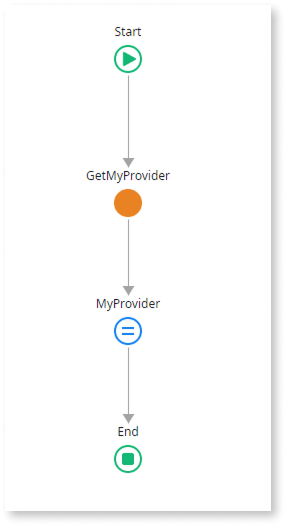
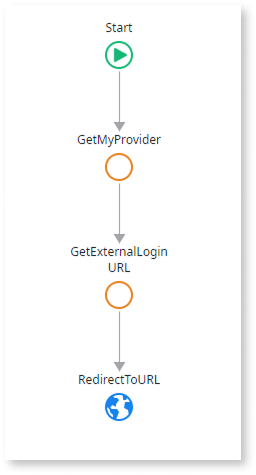
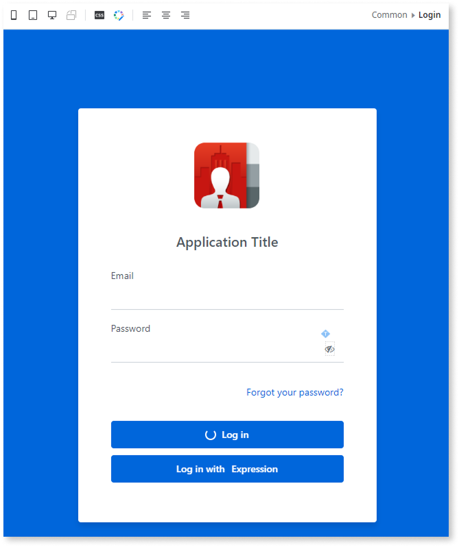
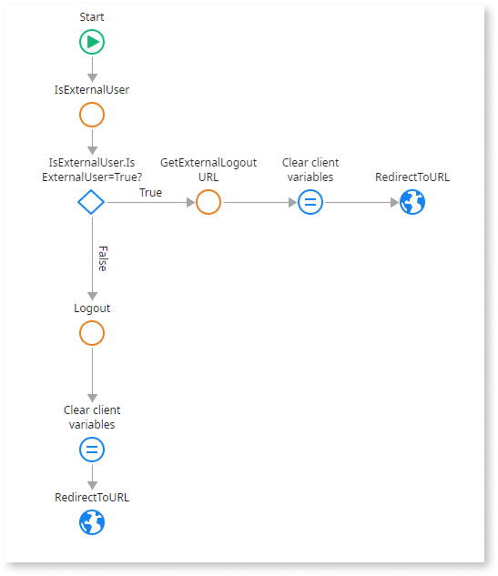
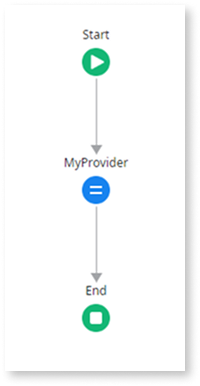

# Use external identity providers (IdPs) in an app

In the ODC Portal, you can configure external IdPs to manage authentication for different app stages (Development, QA, Production), ensuring that users authenticate through the provider assigned to their respective stage. After you [assign an External IdP](intro.md#assign-an-external-idp) to one or more stages in the ODC Portal, you need to update the end-user login and logout flows for each app you want to integrate with it.

You can choose one of the following options (you need to update the end-user login and logout flows in a different way depending on the scenario you choose):

* [**Delete the built-in login screen and redirect to an external provider.**](#delete-the-built-in-login-screen-and-redirect-to-external-provider) The recommended solution if you want to use a single external provider for your app, without the option of built-in provider.

* [**Modify the built-in login screen to add buttons for external provider login.**](#modify-to-add-button) The recommended solution if using multiple external providers or a single external provider and retain the option to login with the built-in provider.

After you complete the steps for your selected solution, republish the app, and [deploy the new revision in the ODC Portal to the appropriate stages](../../deploying-apps/deploy-apps.md) where the IdP is active.

If you need to integrate with external services that require direct access to the authentication token, note that the ODC Portal manages tokens internally for security reasons. The authentication token is never exposed to users.

## Delete the built-in login screen and redirect to external provider

For each app you want to modify, open it in ODC Studio and follow these steps:

1. [Modify the main user login flow](#modify-the-main-user-login-flow-idp-replaces-the-built-in-login).

1. [Modify the user info bar login flow](#modify-the-user-info-bar-login-flow-idp-replaces-the-built-in-login).

1. [Modify the user info bar logout flow](#modify-the-user-info-bar-logout-flow-idp-replaces-the-built-in-login).

### Modify the main user login flow { #modify-the-main-user-login-flow-idp-replaces-the-built-in-login }

If you chose the delete the built-in login screen scenario, to modify the main user login flow, follow these steps:

1. Create the [**GetMyProvider** server action to fetch a setting](#create-a-server-action-with-idp-name) with the IdP's name.

    

1. Go to the **Interface** > **Elements** tab, expand **UI Flows** > **Common**, and double-click **OnException**.

1. To delete the built-in login screen, delete the **Common\Login** **Destination**  element from the logic flow.

    

1. Add the **GetMyProvider** server action you created after the **LastRequest** **Assign** element.

1. Add the **GetExternalLoginURL** [public element](../../building-apps/libraries/use-public-elements.md) after the **GetMyProvider** server action.

1. In the **GetExternalLoginURL** properties, set the **IdentityProvider** to `GetMyProvider.MyProvider`.

1. Add a **Destination** element to the end, and then select **RedirectToURL**.

    

1. In the **RedirectToURL** properties, set the **URL** to `GetExternalLoginURL.ExternalLoginURL`. The app redirects the user to this URL to perform the login.

### Modify the user info bar login flow { #modify-the-user-info-bar-login-flow-idp-replaces-the-built-in-login }

If you chose the delete the built-in login screen scenario, to modify the user info bar login flow, follow these steps:

1. Create the [**GetMyProvider** wrapper client action](#create-a-wrapper-client-action-with-idp-name) for the server action you created previously.

    

1. Go to the **Interface** tab, then expand **UI Flows** > **Common** and double-click **UserInfo**. Click the **Login** text, hover over the **Text** button, and then click the **Link** button.

1. In the **On Click** property, select **New Client Action** from the dropdown, and name it `LogInWith_MyProvider`.

1. Add the **GetMyProvider** wrapper client action you created after the **LastRequest** element.

1. Add the **GetExternalLoginURL** [public element](../../building-apps/libraries/use-public-elements.md) after the **GetMyProvider** run client action, and in its properties, set the **IdentityProvider** to `GetMyProvider.MyProvider`.

1. Drag a **Destination** element on top of the **End** element, select **RedirectToURL**, and set its **URL** property to `GetExternalLoginURL.ExternalLoginURL`. 

    The app redirects the user to this URL to perform the login.

    

### Modify the user info bar logout flow { #modify-the-user-info-bar-logout-flow-idp-replaces-the-built-in-login }

If you chose the delete the built-in login screen scenario, to modify the user info bar logout flow, follow these steps:

1. Go to the **Interface** tab, then expand **UI Flows** > **Common** > **UserInfo**, and double-click **ClientLogout**.

1. To delete the built-in logout action, delete the **Logout** element from the logic flow.

    

1. Add the **GetExternalLogoutURL** [public element](../../building-apps/libraries/use-public-elements.md) after the **Start** element.

1. In the **RedirectToURL** **Destination** properties, set the **URL** to `GetExternalLogoutURL.ExternalLogoutURL`. The app redirects the user to this URL to perform the logout.

If you revert the provider for a stage back to the built-in provider, update the app's login flow to its original state. In the **RedirectToURL** **Destination** properties, set the **URL** to `GetOwnerURLPath()`.

## Modify the built-in login screen to add buttons for external provider login { #modify-to-add-button }

For each app you want to modify, open it in ODC Studio and follow these steps:

1. [Modify the login screen](#modify-the-login-screen-add-an-idp-button-alongside-the-built-in-login).

1. [Modify the user info bar login flow](#modify-the-user-info-bar-login-flow-idp-button-added-alongside-the-built-in-login).

1. [Modify the user info bar logout flow](#modify-the-user-info-bar-logout-flow-idp-button-added-alongside-the-built-in-login).

### Modify the login screen { #modify-the-login-screen-add-an-idp-button-alongside-the-built-in-login }

If you chose the modify the login screen scenario, to add a login button with an external provider to the built-in login screen, follow one of the three options below. To add multiple buttons, repeat the steps.

**Option 1: Drag a button from the toolbox**
:   

   1. [Create the DataActionMyProvider](#create-data-action) Data action.

   1. To load the login screen onto the canvas, go to the **Interface** tab, expand **UI Flows** > **Common**, and double-click **Login**.  
   
   1. Drag a **Button** element from the toolbox to the screen and place it next to or below the existing **Log in** button.  

   1. In the **Button** properties, set the **Text** to `Log in with`. You may also want to modify the **Text** property of the pre-existing **Log in** button.

   1. Drag an **Expression** element from the toolbox to the canvas, inside the previous button, and next to the **Text** element.

   1. In the **Expression** properties, set the **Value** to `DataActionMyProvider.MyProvider`.
    
       
   
   1. In the enclosing **Button** properties, Set the **On Click** property to **New Client Action**.

   1. Name it `LogInWith_<ExternalIdP>`. For example, `LogInWith_AzureAD`.

**Option 2: Add a built-in social login button (only for Google, Facebook, and Apple)**
:   
   
   1. Add a [social login button](../sso.md#add-the-social-login-button-to-the-login-screen).  
    
   1. In its Properties, select **New Client Action** from the **Handler** dropdown.

   1. Name it `LogInWith_<ExternalIdP>`. For example, `LogInWith_AzureAD`.

**Option 3: Use official login buttons for LinkedIn or Microsoft Entra ID**
:   
   
   LinkedIn and Microsoft Entra ID are not included in the list of Identity Providers available for the built-in **social login button**. To use their official login buttons, follow these steps:
   
   1. Download the official button image from the provider's website: [LinkedIn](https://content.linkedin.com/content/dam/developer/branding/signin_with_linkedin-buttons.zip) or [Microsoft](https://learn.microsoft.com/en-us/entra/identity-platform/howto-add-branding-in-apps#referring-to-microsoft-entra-accounts-in-your-application).
   
   1. In ODC Studio, go to the **Elements** tab, and import the button image.  

   1. Drag an **Image** widget to the login screen canvas.  

   1. In the **Image** properties, select the uploaded image from the **Image** dropdown.  
    
   1. Set the **Event** property to `onclick` and the **Handler** to `New Client Action`.

   1. Name it `LogInWith_<ExternalIdP>`. For example, `LogInWith_AzureAD`.

### Modify the user info bar login flow { #modify-the-user-info-bar-login-flow-idp-button-added-alongside-the-built-in-login }

If you chose the modify the login screen scenario, to modify the user info bar login flow, follow these steps:

1. Create the [**GetMyProvider** server action to fetch a setting](#create-a-server-action-with-idp-name) with the IdP's name.

    

1. Create the [**GetMyProvider** wrapper client action](#create-a-wrapper-client-action-with-idp-name).

    

1. Open the `LogInWith_<ExternalIdP>` action you created when you [modified the login screen](#modify-the-login-screen-add-an-idp-button-alongside-the-built-in-login), and delete the **LoginForm.Valid?** element and associated logic.

1. Add the **GetMyProvider** wrapper client action you created after the **LastRequest** **Destination** element.

1. Add the **GetExternalLoginURL** [public element](../../building-apps/libraries/use-public-elements.md) after the **GetMyProvider** element.

1. In the **GetExternalLoginURL** properties, set the **IdentityProvider** to `GetMyProvider.MyProvider`.

1. Drag a **Destination** element on top of the **End** element, select **RedirectToURL**, and set its **URL** property to `GetExternalLoginURL.ExternalLoginURL`.

    The app redirects the user to this URL to perform the login.

    

### Modify the user info bar logout flow { #modify-the-user-info-bar-logout-flow-idp-button-added-alongside-the-built-in-login }

If you chose the modify the login screen scenario, to modify the user info bar logout flow, follow these steps:

1. To open the **ClientLogout** client action, go to the **Interface** tab, expand **UI Flows** > **Common** > **UserInfo**, and then double-click **ClientLogout**. 

1. In the **Logic** tab, expand **Client Actions** > **(System)**, and drag the **IsExternalUser** action between the **Start** and the **Logout** nodes.

1. Add an **If** element after the **IsExternalUser** action, and in its properties, set the **Condition** to `IsExternalUser.IsExternalUser=True`.

1. Add the **GetExternalLogoutURL** [public element](../../building-apps/libraries/use-public-elements.md) in the **True** branch, to the right of the **If** element.

1. Copy the **Clear client variables Assign** element, paste it in the **True** branch to the right of the **GetExternalLogoutURL** action.

1. Add a **Destination** to the right of the **Clear client variables Assign**, in the **True** branch. Select **RedirectToURL**, and in its properties, set the **URL** to `GetExternalLogoutURL.ExternalLogoutURL`.
    
    

1. To save, click **Publish**.

## Create a server action to fetch a setting with the IdP's name { #create-a-server-action-with-idp-name }

For the **IdentityProvider** property of the **GetExternalLoginURL** action, instead of entering the provider's name as a string, it's a better practice to create an action that uses a setting, and modify the setting in the ODC Portal if needed.

To create the server action that fetches the setting:

1. In ODC Studio, create a new setting of the text data type, and name it `MyProvider`.

1. Create a new server action, name it `GetMyProvider`, and set the **Function** property to **Yes**. 

    Setting it as a function lets you get the output of the action in expressions, without exposing the server action publicly in a data action. Additionally, you can [set the value of MyProvider in the ODC Portal](#modify-setting-odc-portal), without needing to republish the app.
    
    

    The name of the IdP is **case sensitive**. Make sure it matches the IdP's name in the Identity providers page in the ODC Portal.

    

1. Add an output parameter, and name it `MyProvider`.

1. Add an **Assign** element after the **Start** element.

1. In the **Assign** properties, select **MyProvider** from the dropdown, and set its value to `Settings.MyProvider`.

    

## Create a wrapper client action { #create-a-wrapper-client-action-with-idp-name }

To be able to use the output parameter of the server action in the logic flow where you add the GetExternalLoginURL action without exposing a server action to public access without authentication, you need to create a client action. Follow these steps:

1. In ODC Studio, create a new client action, and name it `GetMyProvider`.

1. Add an output parameter, and name it `MyProvider`.

1. Add the MyProvider server action you created after the **Start** element.

1. Add an **Assign** element before the **End** element.

1. In the **Assign** properties, select **MyProvider** from the dropdown, and set its value to `GetMyProvider.MyProvider`.

    

## Create a data action { #create-data-action }

To be able to use the setting with the IdP name in an **Expression** in the Login screen, you need to create a data action in the Login screen that fetches the data from the server action. Follow these steps:

1. Go to the **Interface** tab, expand **UI Flows** > **Common**, right-click the **Login** screen, and then select **Fetch Data from Other Sources**.

1. Name it `DataActionMyProvider`.

1. Name the output parameter `MyProvider`.

1. Add an **Assign** after the **Start** element.

1. In the **Assign** properties, select **MyProvider** from the dropdown, and set its value to `GetMyProvider()`.

    

## Modify a setting in the ODC Portal { #modify-setting-odc-portal }

To modify a setting in the ODC Portal:

1. Under **Create**, go to **Apps**.

1. Search for your app.

1. On the **Configuration** tab, click **Settings**.

1. Click on the three dots (**...**) next to the setting you want to edit, and then click **Edit**.

1. Enter the new value.

1. Click **Save**.

## Related resources

* [Configure authentication with external identity providers](intro.md).
* [IdP and end-user group mapping](end-user-group-mapping.md).
