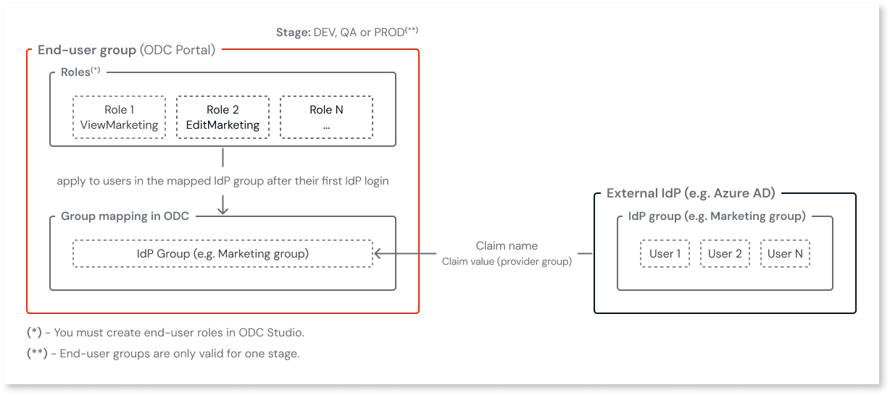

# IdP and end-user group mapping

In ODC, you can accelerate end-user onboarding through your identity provider (IdP). End-users must exist in your IdP, and the IdP is responsible for authenticating them.

You can map identity claims (for example, **group**) from your IdP to [end-user groups](../../user-management/end-users/groups.md). While using groups is recommended and usually easiest, any claim present in the issued token and its value(s) can be used for mapping (for example, mapping an individual by the **subject**/**sub** claim). Once the mapping is correctly configured, you don’t need to invite end-users individually. When users log in via the IdP, they're automatically added to the mapped ODC end-user group and granted the app roles you added to the group. For more details on how to add roles to a group, refer to [Add roles to an end-user group](../../user-management/end-users/groups.md#add-or-revoke-end-user-roles-to-a-group).

This feature requires your IdP to include the claims you choose to map on in the token it issues. If you map IdP groups, your IdP must support and emit group claims, and you may need to configure it to send them during authentication.

You can only map [end-users](../../user-management/intro.md#end-users). You can't map [members (IT-users)](../../user-management/intro.md#members-it-users) with organization roles, such as Admin or Developer.

Mapping synchronizes end-user permissions on each login. ODC updates the roles of existing users based on current mappings. If a user no longer satisfies the mapping (for example, they're removed from the IdP group or the claim value changes), they lose access, though the mapping remains visible in ODC until the next login.

Mapped end-users can't be unmapped directly from the ODC Portal. To unmap end-users, update the corresponding claim(s) in your IdP so the user no longer matches the mapping (for example, remove them from the group or change the claim value).

For more information about the high-level steps you need to complete to manage end-users, refer to [Managing end-users with external Identity Provider (IdP) authentication](../../user-management/end-users/intro.md#managing-end-users-with-external-identity-provider-idp-authentication).

## Prerequisites

Before mapping groups, ensure you have:

* To manage [**authentication**](../../user-management/intro.md#authentication) and **end-user groups**, you must have the appropriate permissions. For details, refer to [Roles and permissions for members (IT-Users)](../../user-management/roles.md).

* Groups created in your IdP.

* IdPs configured in ODC. Refer to [Configure authentication with external identity providers](intro.md).

* An existing [end-user group](../../user-management/intro.md) in ODC set up in the same [stage](../../user-management/intro.md#organization-app-stage-and-app-scope) as the IdP.

* The group [claim name and value](#group-claims) from your IdP.

**SAML providers only:**  

* You can only map an end-user group that's in the same scope as the one configured for the SAML provider.
* Group mapping isn't available for SAML providers configured with the Organization scope.

## Group claims { #group-claims }

A claim is a statement that an entity makes about itself. An entity can be a user or an app.

Your IdP provides the claim in two parts: a name and a value.

The following is an example of a group claim:

* Claim name: `groups`
* Claim value: `marketing`

In this example, the claim indicates that the user belongs to the `marketing` group. Some IdPs use group names as claim values, while others use unique group identifiers. Check it with your IdP.

If your IdP sends multiple group values in a single claim, it may use a delimiter to separate them (for example, a comma, semicolon, or pipe character). The **claim value delimiter** is the character or sequence of characters used to split the claim value into individual groups.

The maximum claim length is as follows:

* **Claim name**: 50 characters.
* **Claim value (provider group)**: 256 characters.
* **Claim value delimiter**: 3 characters.

For Microsoft Entra ID, enter `groups` as the claim name and the value corresponding to the **group Object ID** as the claim value.

For more information about possible validation errors, refer to [OS-ID-BIZ-40001](https://success.outsystems.com/support/troubleshooting/incident_models/incident_models_outsystems_developer_cloud/os_id_biz_40001/).

For help setting up claims, refer to:

* [Azure AD](https://learn.microsoft.com/en-us/azure/active-directory/hybrid/connect/how-to-connect-fed-group-claims)
* [Okta](https://help.okta.com/asa/en-us/content/topics/adv_server_access/docs/group-management.htm)

## Access group mappings

You can manage mappings in the ODC Portal from either:

* The [**End-user groups** page](#mapping-end-user-groups-option)
* The [**Identity providers** page](#mapping-idp-option)

## Managing end-user group mapping from the end-user groups page { #mapping-end-user-groups-option }

From the **End-user groups** page, you can:

* [Create an end-user group mapping](#create-mapping-end-user-groups-option)
* [Edit an end-user group mapping](#edit-mapping-end-user-groups-option)
* [Delete an end-user group mapping](#delete-mapping-end-user-groups-option)

### Create an end-user group mapping { #create-mapping-end-user-groups-option }

To map an IdP group to an end-user group from the **End-user groups** page, follow these steps:

1. In the ODC Portal, under **Manage**, go to **End-user groups**.
1. Search for the group you want to map, and then click it.
1. Go to the **Group mappings** tab.
1. Click **Add group mapping**.
1. Select a provider from the **Provider** dropdown list.
1. Enter the **Claim name**, **Claim value (provider group)**, and optionally the **Delimiter**.  
For more details about group claims and their maximum length values, refer to [Group claims](#group-claims).
1. Click **Save**.

The mapping is created.

You can view mappings by status (**Active**/**Inactive**). An **Inactive** status indicates that the IdP and group are in different stages. If the mapping status is **Inactive**,  hover over it for instructions on how to fix it.

### Edit an end-user group mapping { #edit-mapping-end-user-groups-option }

To edit an end-user group mapping from the **End-user groups** page, follow these steps:

1. In the ODC Portal, under **Manage**, go to **End-user groups**.
1. Search for the group you want to map, and then click it.
1. Go to the **Group mappings** tab.
1. For each group mapping you want to update, next to **Status**, click the ellipsis (...).
1. Click **Edit mapping**.
1. To change the IdP, select a provider from the **Provider** dropdown list.
1. To change the claim details, enter the **Claim name**, **Claim value (provider group)**, or the **Delimiter**.  

The mapping is updated.

You can view mappings by status (**Active**/**Inactive**). An **Inactive** status indicates that the IdP and group are in different stages. If the mapping status is **Inactive**,  hover over it for instructions on how to fix it.

### Delete an end-user group mapping { #delete-mapping-end-user-groups-option }

Deleting a mapping removes the group claim and breaks the link between the IdP and ODC group. End-users relying only on that mapping lose access.

To delete an end-user group mapping from the **End-user groups** page, follow these steps:

1. In the ODC Portal, under **Manage**, go to **End-user groups**.
1. Search for the group you want to map, and then click it.
1. Go to the **Group mappings** tab.
1. For each group mapping you want to delete, next to **Status**, click the ellipsis (...).
1. Click **Delete mapping**, and then confirm the deletion.

The mapping is deleted. Deleting an end-user group also removes all mappings and revokes group-based access.

## Managing end-user group mapping from the Identity providers page { #mapping-idp-option }

From the **Identity providers** page, you can:

* [Create an end-user group mapping](#create-mapping-idp-option)
* [Edit an end-user group mapping](#edit-mapping-idp-option)
* [Delete an end-user group mapping](#delete-mapping-idp-option)

### Create an end-user group mapping { #create-mapping-idp-option }

To map an IdP group to an end-user group from the **Identity providers** page, follow these steps:

1. In the ODC Portal, under **Manage**, go to **Identity providers**.
1. Search for the IdP you want to configure, and then click on it.
1. Go to the **Group mappings** tab.
1. Click **Add group mapping**.
1. Enter the **Claim name**, **Claim value (provider group)**, and optionally the **Delimiter**.  
For more details about group claims and their maximum length values, refer to [Group claims](#group-claims).
1. Under **End-user groups**, search for a group, and then click it.  
You can filter groups by stage.
1. Click **Save**.

The  mapping is created.

You can view mappings by status (**Active**/**Inactive**). An **Inactive** status indicates that the IdP and group are in different stages. If the mapping status is **Inactive**,  hover over it for instructions on how to fix it.

### Edit an end-user group mapping { #edit-mapping-idp-option }

To edit an end-user group mapping from the **Identity providers** page, follow these steps:

1. In the ODC Portal, under **Manage**, go to **Identity providers**.
1. Search for the IdP you want to configure, and then click on it.
1. Go to the **Group mappings** tab.
1. For each group mapping you want to update, next to **Status**, click the ellipsis (...).
1. Click **Edit mapping**.
1. To change the claim details, enter the **Claim name**, **Claim value (provider group)**, or the **Delimiter**.  
For more details about group claims and their maximum length values, refer to [Group claims](#group-claims).
1. To change the end-user group, under **End-user groups**, search for the new group, and then click it.  
You can filter groups by stage.
1. Click **Save**.

The  mapping is updated.

You can view mappings by status (**Active**/**Inactive**). An **Inactive** status indicates that the IdP and group are in different stages. If the mapping status is **Inactive**,  hover over it for instructions on how to fix it.

### Delete an end-user group mapping { #delete-mapping-idp-option }

Deleting a mapping removes the group claim and breaks the link between the IdP and ODC group. End-users relying only on that mapping lose access.

To delete an end-user group mapping from the **Identity providers** page, follow these steps:

1. In the ODC Portal, under **Manage**, go to **Identity providers**.
1. Search for the IdP you want to configure, and then click on it.
1. Go to the **Group mappings** tab.
1. For each group mapping you want to delete, next to **Status**, click the ellipsis (...).
1. Click **Delete mapping**, and then confirm the deletion.

The mapping is deleted. Deleting an end-user group also removes all mappings and revokes group-based access.

## Next steps

For more information about the high-level steps you must complete to manage end-users, refer to [Managing end-users with external Identity Provider (IdP) authentication](../../user-management/end-users/intro.md#managing-end-users-with-external-identity-provider-idp-authentication).

## Related resources

* [Best practices for user governance](../../user-management/best-practices-user-management.md)
* [Managing authorization and authentication for end-users](../../user-management/end-users/intro.md)
* [Managing authorization and authentication for members (IT-users)](../../user-management/it-users/intro.md)
