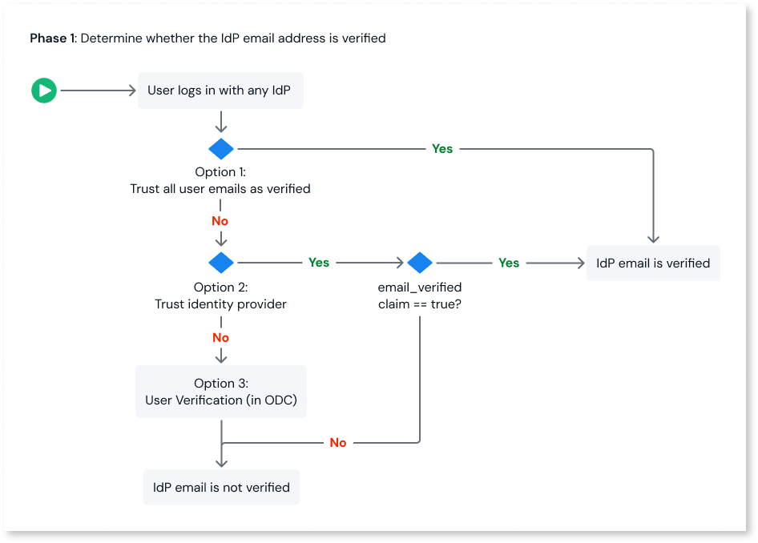
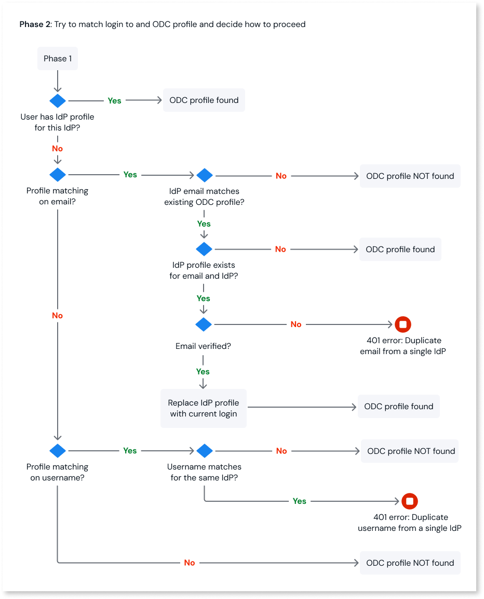
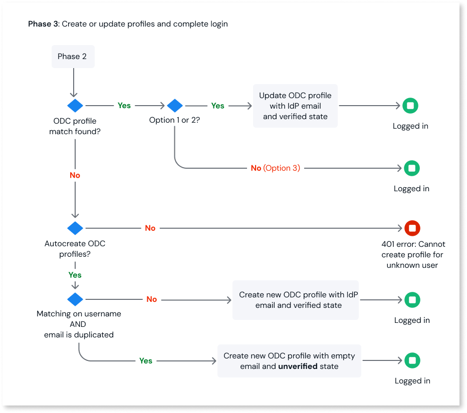

# Email verification and profile matching for external identity providers

Use this article to choose email verification behavior and understand how ODC matches and creates user profiles when users authenticate with external identity providers.

## Identity claims

Identity providers issue claims (for example, email, email_verified, username, and subject/sub). ODC uses these to verify emails and to match external logins to ODC profiles. For claim mapping requirements and behavior, refer to [Claim mapping and profile matching](#claim-mapping-logic). For group-based access using claims, refer to [IdP and end-user group mapping](end-user-group-mapping.md).

## Email verification logic {#email-verification-logic}

This email verification logic applies to all users that authenticate through
the IdP.

A verified email address affects what ODC stores on the ODC profile. For
organization access in **ODC Portal** and **ODC Studio**, the user also needs a
verified email address to receive organization roles.

While configuring an IdP, ODC provides different email verification approaches
for users depending on your IdP type.

For a flowchart of this process, refer to [User matching and profile creation flow](#profile-creation-flow).

### OIDC and social accelerator providers

For OIDC and social accelerator providers, you can choose from the following email verification methods:

**User verification**
:   ODC requires users to verify their email addresses by completing an email verification flow to confirm ownership.

**Trust identity provider**
:   ODC honors the `email_verified` claim from the IdP.  

    If the claim is missing or invalid, emails are considered unverified. Users with unverified email addresses must validate their email through the IdP.

**Trust all user emails as verified**
:   ODC considers all user emails from the IdP as verified.

### SAML providers

For SAML providers, you can choose from the following email verification methods:

**User verification**
:   ODC requires users to verify their email addresses by completing an email verification flow to confirm ownership.

**Trust identity provider**
:   The IdP includes email verification information in its attributes, and ODC trusts the verification status.  

    The IdP must have the email verification claim configured in the **Verified email** field. ODC expects the claim value to be a Boolean (`true` or `false`). If no valid email verification claim is returned, users are considered to have an unverified email.

**Trust all user emails as verified**
:   ODC considers all user emails from the IdP as verified.

## Profile matching for external IdPs {#profile-matching-external-idps}

When you configure an external IdP, you also choose how ODC matches external logins to ODC user profiles. These settings control profile matching when ODC doesn’t find a match by the IdP subject.

### User profile matching {#user-profile-matching}

Defines the fallback attribute ODC uses for matching:

**Email**
:   Matches the IdP email claim to an existing ODC profile.  

    Use this option when the IdP provides a stable email address per user and you need ODC to match invited or pre-created users to existing profiles on their first login.

**Username**
:   Matches the IdP username claim to an existing ODC profile within the same IdP. Username matching doesn't link profiles across different IdPs.  

    Use this option when the IdP provides a stable username per user within that IdP, and email is optional or not unique. One example is OutSystems 11 (O11) configured as a brokered IdP.

Email matching and username matching behave differently across identity providers. With email matching, if IdP A creates a user profile with a given email address, and the user later logs in with IdP B using the same email address, ODC recognizes the match and links both logins to the same profile. Username matching doesn't work across IdPs. You can pre-create a user for an IdP with username matching, and ODC matches them when they log in with that same IdP. However, if a user has the same username on IdP A and IdP B, ODC doesn't link them to the same profile.

**None**
:   Disables fallback matching. ODC matches only by the subject claim.  

    Use this option when you want ODC to match users only by subject and avoid linking users by email or username (for example, users migrated or created through an API that pre-populates the subject for this IdP).  

    If [**Auto-create users on login**](#auto-create-users-on-login) is selected, users without a subject match log in and ODC creates a new profile for them.

    If [**Auto-create users on login**](#auto-create-users-on-login) is cleared, only users who already have a subject match (pre-existing IdP profile) log in.

ODC always tries to match the user by subject first. If that match fails, ODC uses the **User profile matching** selection as the fallback.

Changing **User profile matching** for an existing IdP affects users who haven't logged in with that IdP yet. Plan for support requests after you change this setting.

To minimize disruption, consider creating a new IdP in ODC Portal with the intended **User profile matching** instead of changing this setting for an existing IdP.

For more information, refer to [Resolve orphaned profiles after first login](#resolve-orphaned-profiles-after-first-login).

### Auto-create users on login {#auto-create-users-on-login}

Use this setting to control what ODC does when it doesn't find a match:

**Selected**
:   ODC creates a new profile on first login.

**Cleared**
:   ODC rejects the login if it doesn't find a match.

Refer to [User matching and profile creation flow](#profile-creation-flow) for more details.

## Claim mapping and profile matching {#claim-mapping-logic}

You must map either the **Username** or **Email** field. If the IdP is (or will be) assigned to Organization, mapping the **email** claim is mandatory. In this case, a [verified email](#email-verification-logic) address is required, even when the **username** mapping is configured.

 If both the **Username** and **Email** fields are empty, a validation error displays.

Common matching scenarios include:

**Invited users, self-registered users, or API-created users**
:   On the user’s first login with an IdP, ODC matches [invited users](../../user-management/create-deactivate-and-delete-users.md#creating-users), [self-registered users](../../building-apps/ui/self-registration/intro.md), and users created using the [User and access management API](../../reference/apis/identity-v1.md) to an existing ODC profile by using the [**User profile matching**](#user-profile-matching) setting of the IdP. If [auto-create users on login](#auto-create-users-on-login) is selected, after ODC creates the IdP profile, subsequent logins from the same IdP match by subject.

    If you create a user using the API and include the IdP key and the user’s subject, ODC creates the user’s IdP profile before the first login. The first login then matches by subject. When you create users through the API, creating the user in the built-in identity provider is optional. This supports creation of users who log in with an external IdP and don't need a profile in the built-in identity provider.

    For more information, refer to [Built-in authentication and password-based login](#built-in-authentication-password-sign-in).

**Users created on first login**
:   If the IdP [**Auto-create users on login**](#auto-create-users-on-login) setting is selected and ODC doesn’t find a match for an existing profile, ODC creates a new profile. Subsequent logins with the same IdP match the subject.

**Multiple IdP scenarios**
:   If multiple IdPs are configured for the same assignment (for example, the Developer stage), users can log in with more than one IdP.

    On the first login with the new IdP, ODC matches the user by using that IdP **User profile matching** setting:

    * When **User profile matching** is **Email**, and ODC finds an existing ODC profile with the same email address, ODC matches the new IdP to that profile. Email matching works across different IdPs.
    * When **User profile matching** is **Username**, ODC doesn’t match profiles across different IdPs. Even if the user has the same username on two IdPs, ODC doesn’t link them to the same profile.
    * When no match is found, ODC creates a new ODC profile when **Auto-create users on login** is selected. Otherwise, ODC rejects the login.
    * When **User profile matching** is **None**, ODC matches only by subject. If there’s no subject match, ODC treats the profile as not found.

    Subsequent logins with the same IdP match the subject.

Ensure that each identity provider enforces unique, stable values for the claim
configured in **User profile matching** (**Email** or **Username**) for accounts
that authenticate into the same assignment. ODC requires uniqueness only for the
matching claim, not for the other claim.

If multiple users share the matching value, ODC can link them to the same ODC
profile.

With **Email** matching, the newer login takes over the existing IdP profile when
the same IdP returns the same email address for a different subject and ODC
treats that email as trusted and verified. If the email isn't verified, ODC
rejects the login with a `401` error.

With **Username** matching, ODC rejects the login with a `401` error when the
same IdP returns the same username for a different subject.

Across different IdPs, email matching links profiles that share the same email
address. Username matching doesn't link profiles across different IdPs. If your
IdP allows multiple users to share a verified email address, don't configure it
to match on email.

For more information about other matching scenarios, refer to [User matching and profile creation flow](#profile-creation-flow).

### Built-in authentication in combination with external IdPs {#built-in-authentication-password-sign-in}

Built-in authentication uses the built-in identity provider. Users log in with an email address and a password.

A user that logs in through an external IdP doesn’t always have a built-in identity provider profile. Without that profile, the user can’t log in with built-in authentication or use **Forgot password?** to set a password.

#### Users registered with an external IdP that log in with the built-in IdP {#external-idp-to-built-in}

The following table shows when built-in identity provider login is available based on how you create the user.

| User creation method | Built-in identity provider login available? | Reason |
| :---- | :---- | :---- |
| Auto-created via external IdP login only | No | ODC didn’t create a built-in identity provider profile, so the user didn’t set up a password. For a mitigation path, refer to [Enable built-in authentication for an external IdP user](../../user-management/create-deactivate-and-delete-users.md#enable-built-in-authentication). |
| Created via [User and access management API](../../reference/apis/identity-v1.md) with `addToBuiltInIdentityProvider` set to `true` | Yes | ODC created the built-in identity provider profile at user creation time. |
| [Invited via ODC Portal](../../user-management/create-deactivate-and-delete-users.md#creating-users), completed registration (followed the link in the invitation email and entered the verification code in the ODC Portal) and set up a password, then logged in through an external IdP | Yes | ODC created the built-in identity provider profile when the user completed registration. |
| Invited via ODC Portal, logged in through an external IdP before completing registration | No | The user hasn’t completed registration, so the user hasn’t set up a password. Completing registration sets up a password. |

#### Users registered with the built-in IdP that log in with an external IdP

If a user logs in with built-in authentication and later logs in with an external IdP, ODC first tries to match the external login to the existing ODC profile by subject. If there’s no subject match, ODC uses the [**User profile matching**](#user-profile-matching) setting as a fallback when the external IdP is assigned to the organization or stage where the user is logging in:

* **User profile matching** is set to **Email**, the external IdP maps the email claim, and the IdP email matches the ODC profile email.
* **User profile matching** is set to **Username**: because username matching only applies within the same IdP, ODC doesn't match the external IdP login to the built-in profile by username. ODC treats the profile as not found.
* **User profile matching** is set to **None**: no fallback matching occurs. ODC treats the profile as not found.

If ODC doesn’t find a match, ODC creates a new ODC profile (when **Auto-create users on login** is selected) or rejects the login (when it’s cleared).

#### Invitation email behavior for users already invited with the built-in IdP {#invitation-email-behavior}

For more information about invitations and user status scenarios, refer to [Invitations, reinvitations, and user statuses](../../user-management/create-deactivate-and-delete-users.md#invitations-reinvitations-and-user-statuses).

### User matching and profile creation flow {#profile-creation-flow}

The following flow details how ODC handles user login and profile matching when using an external IdP, based on IdP claims, IdP configuration, and ODC profile data.

When users attempt to log in with an IdP, ODC processes the login in three phases:

1. **Determine whether the IdP email is verified.**  
    ODC applies this phase to any user that authenticates through the IdP. The
    result depends on the option selected when you create the IdP:

    * **Trust all user emails as verified**: ODC treats the IdP email as
      verified.
    * **Trust identity provider**: ODC treats the IdP email as verified only
      when the IdP returns the `email_verified` claim as `true`.
    * **User verification**: In this login flow, ODC treats the IdP email as
      unverified.
1. **Identify an existing ODC profile.**
    A user has an IdP profile if they’ve previously logged in with that IdP or
    you created their ODC profile through the API and included IdP profile
    data.

    ODC always tries to match the user by subject first. If there’s no subject
    match, ODC uses the **User profile matching** setting as a fallback.

    * **Email**: ODC matches existing ODC profiles across different IdPs. If
      the same IdP already has an IdP profile for that email address and the
      current login comes from a different subject, ODC replaces the existing
      IdP profile only when the email is verified. Otherwise, ODC rejects the
      login with a `401` error.
    * **Username**: ODC checks usernames only within the same IdP. If the same
      IdP returns the same username for a different subject, ODC rejects the
      login with a `401` error.
    * **None**: ODC skips fallback matching. If there’s no subject match, ODC
      treats the profile as not found.
1. **Create or update profiles and complete login.**
    All successful logins create or update the user’s IdP profile for this IdP.

    * If ODC finds a profile match and the email verification option is
      **Trust all user emails as verified** or **Trust identity provider**, ODC
      updates the ODC profile with the IdP email and verified state.
    * If ODC finds a profile match and the email verification option is
      **User verification**, ODC logs in the user.
    * If ODC doesn't find a profile match and **Auto-create users on login** is
      cleared, ODC rejects the login with a `401` error.
    * If ODC doesn't find a profile match and **Auto-create users on login** is
      selected, ODC creates a new ODC profile. ODC stores the IdP email and
      verified state unless ODC isn't matching on email and another ODC profile
      already uses that email address. In that case, ODC creates the new
      profile with an empty email address and an unverified state.

This flow covers authentication, profile matching, and profile creation. It
doesn't cover invitation, registration, or the separate ODC email verification
flow.

App authorization happens separately based on the roles returned for that app
or stage.

A successful login doesn't by itself grant organization access. When a user
accesses **ODC Portal** or **ODC Studio**, ODC grants organization roles only
when the user already has organization roles and a verified email address.
Otherwise, ODC logs in the user but doesn't grant organization authorization,
and the invalid permissions page displays.

### Email changes in external identity providers {#email-changes-external-idps}

ODC matches returning users by subject first. Email changes affect how ODC matches the first login for an IdP that the user hasn’t used before.

* **User has logged in at least once with the IdP**: ODC matches the user by subject. For logging in to the organization (ODC Portal or ODC Studio), when you select **Trust identity provider** or **Trust all user emails as verified**, ODC updates the email stored in the ODC profile.
* **User has never logged in with the IdP**: On the first login, ODC uses the IdP **User profile matching** setting as fallback. When **User profile matching** is **Email**, and the user’s email changed in the IdP before their first login, ODC can’t match an invited or pre-created profile that used the old email address. If **Auto-create users on login** is selected, ODC creates a new ODC profile.

    This behavior can result in two ODC profiles for the same person.

To avoid duplicate profiles, keep the user’s email stable until the first successful login. If the email changed before the first login, delete the original profile and re-invite the user with the updated email address. Reassign roles and groups after the new profile is created.

For more information about recovering from duplicate profiles, refer to [Resolve orphaned profiles after first login](#resolve-orphaned-profiles-after-first-login).

## Resolve orphaned profiles after first login {#resolve-orphaned-profiles-after-first-login}

Changing the **User profile matching** setting for an existing IdP affects users who haven't logged in with that IdP yet. On first login with that IdP, if **Auto-create users on login** is selected and ODC doesn't match the user to the intended profile, ODC creates a new profile with no roles. This leaves the original profile orphaned.

To resolve this issue, follow these steps:

1. Identify the orphaned profile and the new profile for the same user.
1. Reassign roles from the orphaned profile to the new profile.
1. Delete the unneeded profile.

Users who have logged in at least once with the IdP don't experience this issue because ODC matches them by subject.

## Related resources

* [Configuring authentication with external identity providers](intro.md)
* [Manage identity providers](manage-external-idps.md)
