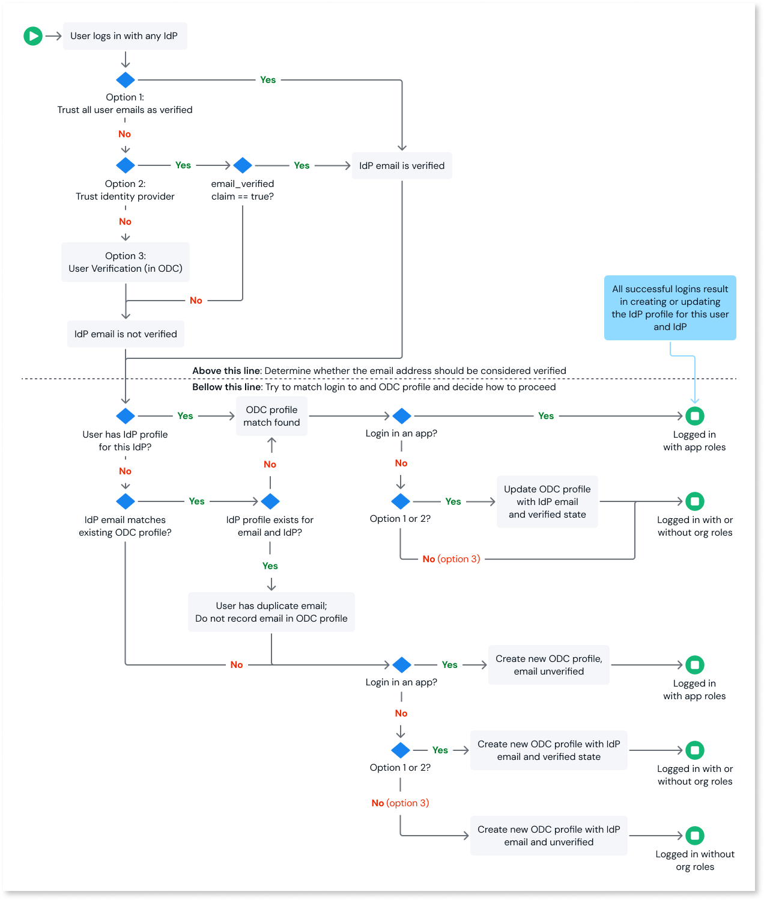

# Email verification and profile matching for external identity providers

Use this guide to choose email verification behavior and understand how ODC matches and creates user profiles when users authenticate with external identity providers.

## Identity claims

Identity providers issue claims (for example, email, email_verified, username, and subject/sub). ODC uses these to verify emails and to match external logins to ODC profiles. For mapping requirements and behavior, see [User matching and profile creation](#claim-mapping-logic). For group-based access using claims, refer to [IdP and end-user group mapping](end-user-group-mapping.md).

## Email verification logic { #email-verification-logic }

While configuring an IdP, ODC provides different user email verification approaches depending on your IdP type.

### OIDC and social accelerator providers

For OIDC and social accelerator providers, you can choose from the following email verification methods:

* **User verification**: ODC requires users to verify their email addresses by completing an email verification flow to confirm ownership.

* **Trust identity provider**: ODC honors the `email_verified` claim from the IdP. If the claim is missing or invalid, emails are considered unverified. Users with unverified email addresses must validate their email through the IdP.

* **Trust all user emails as verified**:  ODC considers all user emails from the IdP as verified.

### SAML providers

For SAML providers, you can choose from the following email verification methods:

* **User verification**: ODC requires users to verify their email addresses by completing an email verification flow to confirm ownership.

* **Trust identity provider**: The IdP includes email verification information in its attributes, and ODC trusts the verification status. The IdP must have the email verification claim configured in the **Verified email** field. If no valid email verification claim is returned, users are considered to have an unverified email.

* **Trust all user emails as verified**: ODC considers all user emails from the IdP as verified.

## User matching and profile creation { #claim-mapping-logic }

You must map either the **Username** or **Email** field. If the IdP is (or will be) assigned to the Organization scope, mapping the **email** claim is mandatory. In this case, a [verified email](#email-verification-logic) address is required, even when the **username** mapping is configured.

 If both the **Username** and **Email** fields are empty, a validation error displays.

ODC handles user profile matching differently depending on how users are created and which identity providers they use.

**Invited users or API-created users**: ODC profiles for invited users or those created using the [User and Access Management API](../../reference/apis/identity-v1.md) are matched to the external login using the email address the first time the user logs in. After that, for any future logins from the same IdP, the user is matched on the subject supplied by the IdP. The user's email can change, but their profiles will still match up.

**Users created on first login**: Users who log in without self-registration, invitation, or any pre-existing ODC profile are given a new profile that always matches the subject, independent of their email address.

**Multiple IdP scenarios**: Users who already have an ODC profile and have logged in with one IdP may log in using a different IdP if multiple are configured for the same scope. Those users must match their email with the second IdP the first time they log in. Future logins with the same IdP will match the subject, independent of their email.  

ODC doesn't support merging profiles when a login doesn't match an existing ODC profile per the claim-mapping rules. In this case, a new profile is created. For more details, refer to [User matching and profile creation flow](#profile-creation-flow).

### User matching and profile creation flow { #profile-creation-flow }

The following flow details how ODC handles user login and profile matching when using an external IdP, based on IdP claims and ODC profile data.

When users attempt to log in with an IdP, ODC first checks if they have an **existing IdP profile** (stores IdP **ID** and **subject**, plus the email verification state) associated with that specific IdP. An IdP profile is created for a user the first time they log in with that IdP or if it's created via an API. There are two options:

**Option A: User has an existing IdP profile for this IdP**  
If a user has a previously created IdP profile, ODC attempts to find a matching ODC profile.

* **If an ODC profile match is found:**
    * **Is the user logging in to an app?** If yes, the user is logged in with app roles.
    * **If the user is logging in to the organization (ODC Portal or ODC Studio):**
        * **Is the **Trust all user emails as verified** or the **Trust identity provider** option configured?**
            * **Yes:** Updates the ODC profile with IdP email and verified state, and logs in the user with or without organization roles.
            * **No:** Logs in the user with or without organization roles.

**Option B: User doesn't have an IdP profile for this IdP**  
If this is the user's first login with this IdP, ODC creates both a new IdP profile and a new ODC profile.

* **If the IdP email matches an existing ODC profile:**
    * **If the IdP profile exists for the email and IdP**: The users has a duplicated email, so the email isn't recorded in the ODC profile.
        * **Is the user logging in to an app?** Creates a new ODC profile, with email unverified, and logs in the user with app roles.
        * **If the user is logging in to the organization (ODC Portal or ODC Studio):**
            * **Is the **Trust all user emails as verified** or the **Trust identity provider** option configured?**
                * **Yes:** Creates a new ODC profile, with IdP email in verified state, and logs in the user with or without organization roles.
                * **No:** Creates a new ODC profile, with IdP email in unverified state, and logs in the user without organization roles.
    * **If the IdP profile doesn't exist for the email and IdP**:
        * Go to option A (ODC profile match found).
* **If the IdP email doesn't match an existing ODC profile:**
    * **Is the user logging in to an app?** Creates a new ODC profile, with email unverified, and logs in the user with app roles.
    * **If the user is logging in to the organization (ODC Portal or ODC Studio):**
        * **Is the **Trust all user emails as verified** or the **Trust identity provider** option configured?**
            * **Yes:** Creates a new ODC profile, with IdP email in verified state, and logs in the user with or without organization roles.
            * **No:** Creates a new ODC profile, with IdP email in unverified state, and logs in the user without organization roles.

## Related resources

* [Configuring authentication with external identity providers](intro.md)
* [Manage external identity providers](manage-external-idps.md)
