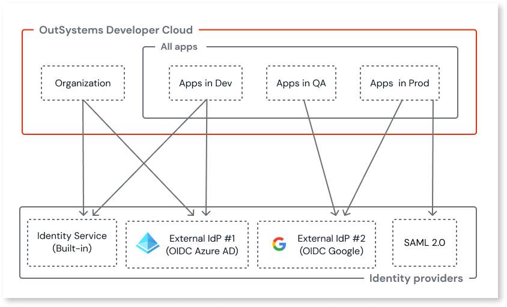

# Configure authentication with external identity providers

OutSystems Developer Cloud (ODC) comes bundled with Identity Service, a built-in Identity Provider (IdP). It provides authentication, authorization, and user management for your [organization](../platform-architecture/intro.md#platform) and apps. You access your organization's services through the ODC Portal and ODC Studio. As the default IdP, Identity Service is always available.

In addition, you can use an external, self-managed IdP as an authentication provider for your organization and your apps. ODC supports two main authentication protocols:

* **OpenID Connect (OIDC)** - An identity layer on top of OAuth 2.0. ODC supports using **proof key for code exchange** (PKCE) with OIDC providers for an additional layer of security.

* **SAML 2.0** - An XML-based standard for exchanging authentication and authorization data between identity providers and service providers.

You can configure most commercial IdPs to support these standards.

ODC also provides accelerators for [commonly used social providers](configure-social-accelerators.md) that use OpenID Connect for social authentication. These accelerators simplify the process of adding social login options for both your organization and your apps.

## System considerations

ODC has the following limitations for external identity providers:

**OpenID Connect**

* ODC doesn't support dynamic issuer URIs, usually found in multi-tenant configurations of IdP apps. The Discovery endpoint needs to return static URIs. If you use dynamic URIs, the authentication process throws an error similar to:

    ```
    Wrong issuer from token.
    Got: https://login.microsoftonline.com/<customer-tenant-id>/v2.0
    Expected: https://login.microsoftonline.com/{tenantid}/v2.0
    ```

* Only the `client_secret_post` authentication method is supported.

**SAML 2.0**  

* Only SAML 2.0 SP-initiated flows are supported.
* OutSystems recommends that SAML responses are signed.

<div class="info" markdown="1">

For the supported external identity providers, refer to the [OutSystems system requirements for ODC](../../getting-started/system-requirements.md#supported-external-identity-providers).

</div>

When you successfully configure and save an external IdP to ODC, it becomes an option for use as an active provider for your organization, your apps, or both. For OpenID Connect providers, you can apply the same configuration to multiple scopes. However, for SAML 2.0 providers, you can only define one scope (organization or apps in a specific stage) per configuration.

The following diagram shows an example setup.



## Before you begin

<div class="info" markdown="1">

If you're configuring [Microsoft Entra ID](azure-ad.md) or [Okta](okta.md) using OpenID Connect, you can skip this section and follow the specific guidance by following one of the embedded links.

</div>

Before you begin configuring an external identity provider for use in ODC, ensure you have the necessary information from your provider. The specific requirements depend on the authentication protocol:

**For OpenID Connect providers:**

* URL of the OpenID configuration (Discovery endpoint)

* Provider credentials (Client ID and Client Secret)

**For SAML 2.0 providers:**

* SAML metadata URL or metadata XML file

* Provider configuration details (Entity ID, SSO URL, certificates)

Your provider might use different names for these fields. For example, **Application ID** for the **Client ID** field or **Value** for the **Client secret** field. For more guidance, refer to your provider's support documentation.

If you want a user associated with an external provider to retain their profile and associated roles, they should use the same email address as on the built-in provider.

## Add an external IdP

ODC admins can configure an external IdP by navigating to the **ODC Portal** > **Manage** > **Identity providers** tab. A list of built-in providers and any external IdPs already added displays.

The configuration process depends on the authentication protocol your identity provider uses:

* **[Configure an OpenID Connect provider](configure-openid-connect.md)**

    Use this option for identity providers that support the OpenID Connect standard. This includes most commercial IdPs such as Microsoft Entra ID, Okta, and Google.

* **[Configure a SAML 2.0 provider](configure-saml2.md)**

    Use this option for enterprise identity providers that use the SAML 2.0 standard.

* **[Social provider with accelerator](configure-social-accelerators.md)**

    Use this option to add social authentication providers such as Apple, Google, Facebook, or LinkedIn using ODC's built-in accelerators.

For specific guidance on popular providers, refer to:

* [Microsoft Entra ID (OpenID Connect)](azure-ad.md)

* [Okta (OpenID Connect)](okta.md)

## Assign an external IdP { #assign-an-external-idp }

To assign an added external IdP, navigate to the **ODC Portal** > **Manage** > **Identity providers**. Then follow these steps:

1. Click on the provider card you want to assign.

   * For OIDC providers, you can assign the IdP to your organization, your apps, or both.
   * For SAML 2.0 providers, you can only assign the IdP to either the organization or apps in a specific stage.

1. Check the summary in the **Configurations** tab. The available button depends on the provider type and current assignment status:

    * For SAML 2.0, click **Assign**.

    * Otherwise, click **Manage assignments**.

1. Check the boxes where you want to assign the provider, and then click **Next**.

    <div class="info" markdown="1">

    When you switch the IdP for your organization or apps, all signed-in users are automatically logged out and logged in.

    </div>

1. Read the confirmation pop-up and then do one of the following:

    * Click the **Confirm changes** button to proceed.

    * Click **Cancel** to exit.

    Once ODC applies the provider successfully, a notification displays.

1. (Applies to OIDC only) Copy the pair(s) of **Redirect URLs** to the list of permitted redirects in the setup page of your external provider. You should copy the pair(s) for both the built-in domain and any active [custom domains](../custom-domains.md). If you're configuring [Okta](okta.md#setup-redirect-urls), you can follow the embedded link for specific guidance. Otherwise, refer to your provider's support documentation for further guidance (for example, [Microsoft Entra ID](https://learn.microsoft.com/en-us/azure/active-directory/develop/quickstart-register-app#add-a-redirect-uri)).

1. Click **Next**.

When you assign a provider for use by the apps, you need to create the logic in ODC Studio for each app you want to use it. For guidance on how to create the logic, refer to [Use external identity providers in an app](apps.md).

When you assign a provider for the organization's use, you don't need to do anything else. The option to log in with the provider becomes immediately available for users on the ODC Portal and ODC Studio login screens.

## Unassign an external identity provider { #unassign-external-idp }

When you need to remove an existing external identity provider from your organization or apps, use the following options:

* **OpenID Connect providers**: Use the **Manage assignments** button to modify or remove assignments.
* **SAML 2.0 providers**: Use the **Unassign** button to remove the provider assignment.

## Edit the configuration or delete an external IdP

You can only edit or delete a provider that is not in use. To edit or delete an external IdP, navigate to the **ODC Portal** > **Manage** > **Identity providers** . Then, follow these steps:

1. Click on the provider card you want to edit or delete.

1. Click the **ellipsis** (3-dots) to the right of the **Assign** button. Then click the **Edit configurations** or **Delete provider** button to launch the edit page or launch the delete confirm pop-up.

<div class="info" markdown="1">

To edit an identity provider, you must submit the correct **client secret** again.

</div>

<div class="info" markdown="1">

For SAML 2.0 providers, the **scope cannot be changed** after the provider is created. If you need to assign a different scope, add a new SAML identity provider and select the desired scope during setup.

</div>

## User matching and profiles

ODC handles user profile matching differently depending on how users are created and which identity providers they use.

**Invited users or API-created users**: ODC profiles for invited users or those created via the [User and Access Management API](../../reference/apis/identity-v1.md) are matched to the external login via email address the first time the user logs in. After that, for any future login from the same IdP, the user is matched on the subject supplied by the IdP. The user's email can change, but their profiles will still match up.

**Users created on first login**: Users who log in without self-registration, invitation, or any pre-existing ODC profile are given a new profile that always matches with the subject independent of their email address.

**Multiple IdP scenarios**: Users who already have an ODC profile and have logged in with one IdP may log in using a different IdP if multiple are configured for the same scope. Those users must match their email with the second IdP the first time they log in. Future logins with the same IdP will match with the subject, independent of their email.

<div class="info" markdown="1">

Combining profiles for users who fail to match on login is not supported. This results in a second profile being created.

</div>

## Understand the user creation and claim mapping logic { #claim-mapping-logic }

<div class="info" markdown="1">

You must map either the **Username** or **Email** field. If the IdP is (or will be) assigned to the Organization scope, mapping the **email** claim is mandatory. If both the **Username** and **Email** fields are empty, a validation error displays.

</div>

The following flow details how ODC handles user login and profile matching when using an external IdP, based on IdP claims and ODC profile data.


When users attempt to log in with an IdP, ODC first checks if they have an **existing IdP profile** (stores IdP **ID** and **subject**, plus the email verification state) associated with that specific IdP. An IdP profile is created for a user the first time they log in with that IdP or if it's created via an API. There are two options:

**Option A: User has an existing IdP profile**  
If a user has a previously created IdP profile, ODC attempts to find a matching ODC profile.

* **If an ODC profile match is found:**
    * **Is the user logging in to an app?** If yes, the user is logged in.
    * **If the user is not logging in to an app:**
        * **Is the IdP email verified?**
            * **Yes:** The ODC profile's email is marked as verified, and the user is logged in.
            * **No:** ODC checks how the ODC profile was matched.
                * **Was the profile matched on email?**
                    * **Yes:** The login attempt fails to prevent unauthorized access with an unverified email.
                    * **No:** The user is logged in.

* **If no ODC profile match is found:** A new ODC profile is created for the user.
    * **Is the user logging in to an app?**
        * **Yes:** A new ODC profile is created with an unverified email, and the user is logged in.
        * **No:** ODC checks if the IdP email is verified.
            * **Is the IdP email verified?**
                * **Yes:** A new ODC profile is created, the email is marked as verified, and the user is logged in.
                * **No:** A new ODC profile is created with an unverified email, and the user is logged in.

**Option B: User doesn't have an IdP profile**  
If this is the user's first time logging in with this IdP, ODC creates both a new IdP profile and a new ODC profile.

* **Is the IdP email verified?**
    * **Yes:** A new ODC profile is created, the email is marked as verified, and the user is logged in.
    * **No:** A new ODC profile is created with an unverified email, and the user is logged in.

### Email verification logic

The "IdP email is verified" check depends on the **Trust all user emails as verified** configuration in the ODC Portal that you set when you create an IdP.

* **If `Trust all user emails as verified` is set to `Yes`:** The IdP email is considered verified regardless of any claims from the IdP.
* **If `Trust all user emails as verified` is set to `No`:** ODC relies on the `email_verified` claim provided by the IdP. If the claim is `true`, the email is verified; otherwise, it is not.

## Avoid lockout scenarios { #lockout }

A lockout occurs when all users lose access to the ODC Portal and ODC Studio, or any apps developed in ODC.

This can happen if you remove the built-in IdP assignment on the **Identity Providers** page in the ODC Portal, either for the organization (for IT-users) or an app stage (for end-users), and your external IdP isn't working correctly.

<div class="warning" markdown="1">

If you plan to remove the built-in IdP assignment from the **Identity providers** page in the ODC Portal, make sure to fully test the external IdPs before you remove the built-in IdP assignment.

</div>

There are a few reasons why your external IdP might not be working correctly. It could be because you didn't set it up correctly or assign it to the appropriate stage. It could also be due to an issue on the provider's side.

If you encounter a lockout scenario, open a support ticket. A support agent can sign in to the tenant and reactivate the built-in provider. This allows users to log in or reset passwords for accounts using the built-in provider.

## Related resources

* [Best practices for user management](../../user-management/best-practices-user-management.md).
* [Managing authorization and authentication for end-users](../../user-management/end-users/intro.md).
* [Managing authorization and authentication for members (IT-users)](../../user-management/it-users/intro.md).
