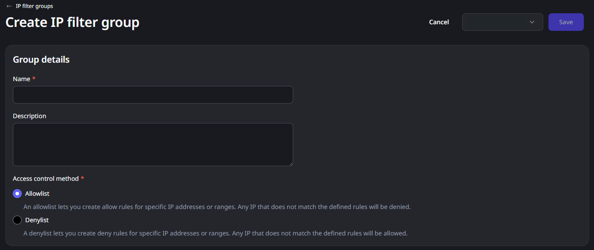
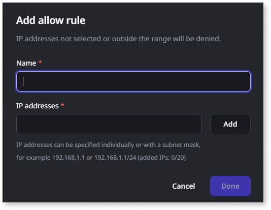

# Manage IP filters

IP filters require an add-on subscription. Please contact your OutSystems account team for more information.

This article is intended for administrators who need to control network access to their apps in ODC. Administrators can enhance security by creating and managing IP filter groups and defining access rules for each stage to specify which IP addresses are allowed. For more information on ODC's built-in security, refer to [Security of OutSystems Developer Cloud.](../security/security.md)

# Prerequisites

* A subscription to the Sentry add-on. Contact your account manager for provisioning.  
* **View configurations** and **Manage IP Restrictions** permissions. 	

# Control access with IP filters

ODC provides a method to manage network access to your apps through IP filters, enhancing security. This system revolves around **IP filter groups**, logical containers for access policies. Within these groups, you define rules, specifying the IP addresses permitted or blocked from accessing your apps. Each rule can contain up to 20 IP address entries.

A use case includes: 

* Restricting access to internal apps.

If your apps contain sensitive company data, you can use IP filters to ensure they're only accessible from your internal network.

An example includes: 

* Limiting access to an employee database to only office IP addresses.

ODC automatically generates a **default IP filter group** for each stage. Administrators can change the access control method of this pre-defined group at any time. New apps are automatically associated with each stage's default group. For more specific control, administrators can create **IP filter groups**. These customizable groups enforce tailored access policies for designated app sets.

When configuring an IP filter group, you must select its access control method: an **AllowList**, where all traffic is denied unless specifically permitted by a rule, or a **DenyList**, where all traffic is allowed unless explicitly denied by a rule. IP filter groups and their rules are stage-specific, operating independently for each app stage. Administrators can associate an app with only one IP filter group per stage. For operational flexibility, administrators can enable or disable individual IP filter rules within a group through rule activation without requiring deletion.

A use case includes: 

* Partner access to Production (Allowlist).

To secure a Production app for specific partners, create a user-defined IP filter group using the **AllowList** method. Then, add rules specifying the IP addresses of your trusted partners. Only traffic from these IPs is permitted in the production environment.

An example includes:

* For the Production stage, an IP filter group uses an **AllowList**. Rules within it allow access from partner IPs: `203.0.113.0/24` (Partner A), `198.51.100.10` (Partner B), and `192.0.2.0/27` (Partner C). The system blocks all other IPs. The Development stage for the same app can have a different IP filter group and access control method, demonstrating the **stage-specific** nature of the configuration.

# Associate apps with IP filter groups before deployment

To ensure consistent security from deployment, associate an app with a specific IP filter group for a given stage, even if the app hasn't been deployed to that stage yet. This approach guarantees that the system applies the correct IP filter rules to the app immediately upon deployment. It prevents any brief periods where the app might be exposed to default or incorrect rules. 

# Create an IP filter group

Follow these steps to create a new IP filter group:

1. Go to the ODC Portal.  
1. Go to the **Configure** tab and select **IP filters**.  
1. Select the stage.   
1. Click **Create group**.   
1. Enter the following:  
   * **Name**: A unique name for the group.  
   * **Description** (Optional).  
   * **Access control method**:  
     * AllowList  
     * DenyList
     

# Add rules to a group

Follow these steps to add rules to a group: 

1. Select the IP filter group.  
1. Click **Edit**.   
1. In the **Group configuration** section, click the **Rules** tab.   
1. Click **Add allow rule** if the access control method is AllowList, or **Add deny rule** if the access control method is DenyList.   
1. Enter the following:  
    * **Name**: A name for the rule.  
    * **IP addresses**: Enter up to 20 IPv4 or IPv6 addresses or ranges.  
1. Click **Add**.   
1. Click **Done**.   
1. In the **Group configuration** section, click the **Apps** tab.   
1. Select **Manage apps** and add apps to the group and apply rules. Since an app can only belong to one group at a time, adding apps to this IP filter group removes them from their current group.   
1. Click **Done**.

# Manage IP filter groups and rules

You can manage IP filter groups and the rules. For IP filter groups, you have the flexibility to:

* **Manage apps:** Add or remove apps associated with a specific IP filter group.  
* **Edit group details:** Modify the group's name and description. Note that administrators can't change the access control method (AllowList/DenyList) after creating the group.  
* **Edit or delete rules:** Modify existing rules within a group or remove them entirely.  
* **Copy groups:** Duplicate a user-created IP filter group and associated apps and/or rules to another stage.  
* **Delete groups:** Remove user-created IP filter groups when they're no longer needed.
