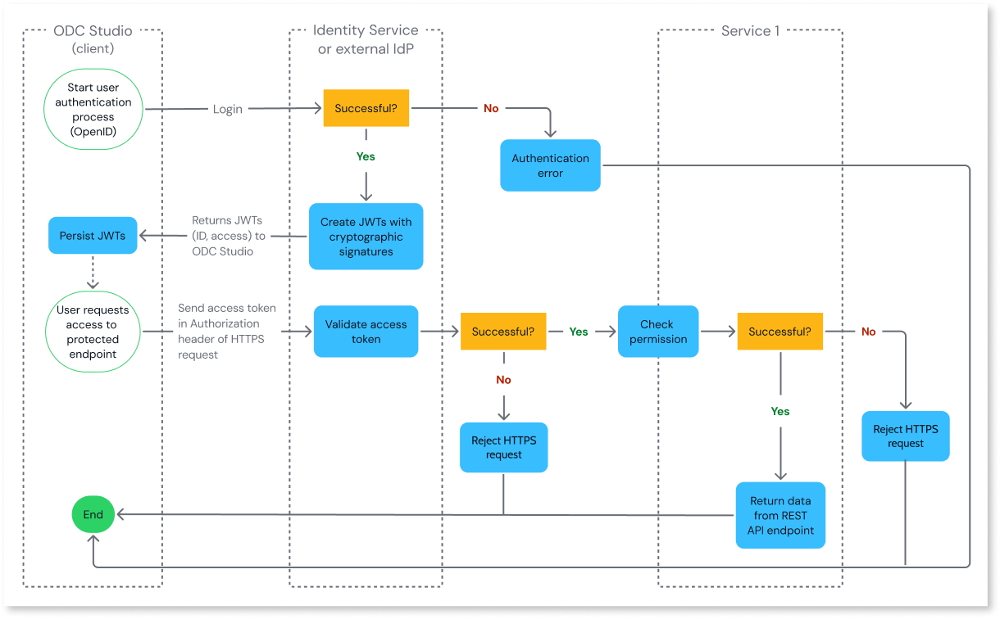

# Architecture of authentication and authorization mechanism

This article provides an overview of the architecture of the Identity Service of OutSystems Developer Cloud (ODC).

The Identity Service is the identity broker for the Platform and the Runtime. The Identity Service doesn't authenticate users directly. It delegates authentication to an identity provider (IdP) and brokers the result. ODC includes a built-in IdP, assigned by default, so authentication works without extra configuration.

You can also use an external, self-managed IdP as the authentication provider for the Platform services and your apps. ODC supports identity providers that use the OpenID Connect (OIDC) or SAML 2.0 protocols. This approach offers benefits such as:

* Centralized authentication method (ODC and non-ODC) across your organization.
* Custom password policy for the Platform services and your apps that aligns with your organization's security policy.
* Multi-factor authentication (MFA) process for the Platform services and your apps.

## Authentication and authorization

**Authentication** is the process of verifying a user's identity. Once authenticated, **authorization** is the process of verifying what a user can access.

Your organization's developers, DevOps engineers and architects are granted **organization permissions** to use ODC Studio and ODC Portal to access the Platform services.

Users of your apps are granted **app permissions** to access secured screens, data and logic flows. Developers create app roles in ODC Studio and assign them to users in the ODC Portal or [programmatically using REST APIs](../../reference/apis/public-rest-apis/end-user-management-use-cases/create-user-assign-role.md).

Go to [User management](../../user-management/intro.md) for more information on user permissions and roles.

## Secure endpoints

The Platform exposes **secure endpoints** based on REST API. When ODC Studio and ODC Portal send **HTTPS requests**, the requests reach these endpoints. An example of a request is when a developer clicks the 1-Click Publish button in ODC Studio.

Apps run in the Runtime and expose secure REST API endpoints. For example, when a user submits a form in an app, it's sent as an HTTPS request to the corresponding endpoint.

## Token technology

The Identity Service uses JSON Web Token (JWT) technology, an open standard for defining identity information as a JSON object. The key benefits of this technology include:

* JWTs are cryptographically signed using a public/private key pair which safeguards them from being modified by an attacker and ensures their authenticity.
* JWTs are self-contained, meaning they're quick to validate as they don't require a server database lookup. This means quick access to the Platform services and apps.
* ODC validates every token before the request reaches the target service, so service APIs never receive a request with an invalid token.

The Identity Service follows the OIDC standard: an identity layer on top of the OAuth 2 protocol.

### Secure sessions

ODC includes built-in protection against session fixation attacks, where an attacker tries to hijack a valid user session. ODC ensures that the session identifier is transparently changed on each login and validates this on every request.

### Token lifecycle and logout {#token-lifecycle-and-logout}

Access tokens are short-lived, with a five-minute lifetime. When an access token expires, ODC uses the refresh token to silently issue a new access token, keeping the user's session active without interrupting the user. For more details, refer to [Configure user session](../../user-management/configure-user-session.md).

When a user logs out, the platform immediately invalidates their session and refresh tokens, meaning no new access tokens can be issued and the user must re-authenticate. However, because access tokens are self-contained JWTs validated without a server lookup, the platform does not individually revoke them. Any access token issued just before logout will remain valid until its natural five-minute expiration. This brief window is standard, secure behavior for stateless validation, keeping exposure strictly limited.

## User flow

The following diagram shows an example of a user authentication and authorization flow. It shows what happens when a developer using **ODC Studio** (client) accesses a REST API endpoint exposed by **Service 1** (a Platform service).

Before a request reaches the target service, ODC checks the following conditions to **validate the access token**:

1. The access token hasn't expired.
1. The access token is currently active (its designated start time has passed).
1. The access token was issued in the past (to prevent timeline/clock-sync errors).
1. The cryptographic signature is authentic and valid.

If any of the conditions (1)-(4) fail, ODC rejects the HTTPS request before it reaches the service. Users must authenticate again by logging in to the client.

If the token validation is successful, the service checks the user's permission. If the permission check fails, the service rejects the HTTPS request and returns an error to the client.

The **ID** token contains authentication claims about the user but doesn't include personally identifiable information (PII). The **access** token serves as proof that the bearer is authorized to access ODC. The service uses it to retrieve the user's permissions when authorizing a request. The client and service transfer JWTs through the Bearer `Authorization` header over HTTPS.

When a user logs out, the platform invalidates the session and refresh tokens, but it doesn't invalidate an already-issued access token, which stays valid until it expires naturally. For details on access token expiry after logout, refer to [Token lifecycle and logout](#token-lifecycle-and-logout). When the refresh token expires, the user has to re-authenticate. By default, the maximum session duration is 12 hours. For end-user app sessions, you can [configure session duration and idle timeout](../../user-management/configure-user-session.md) per stage.

In the diagram, a user working in ODC Portal to access a REST API endpoint in a second Platform service is a valid example. Another valid example is a user working in a browser to access a REST API endpoint on a protected screen in an app.
