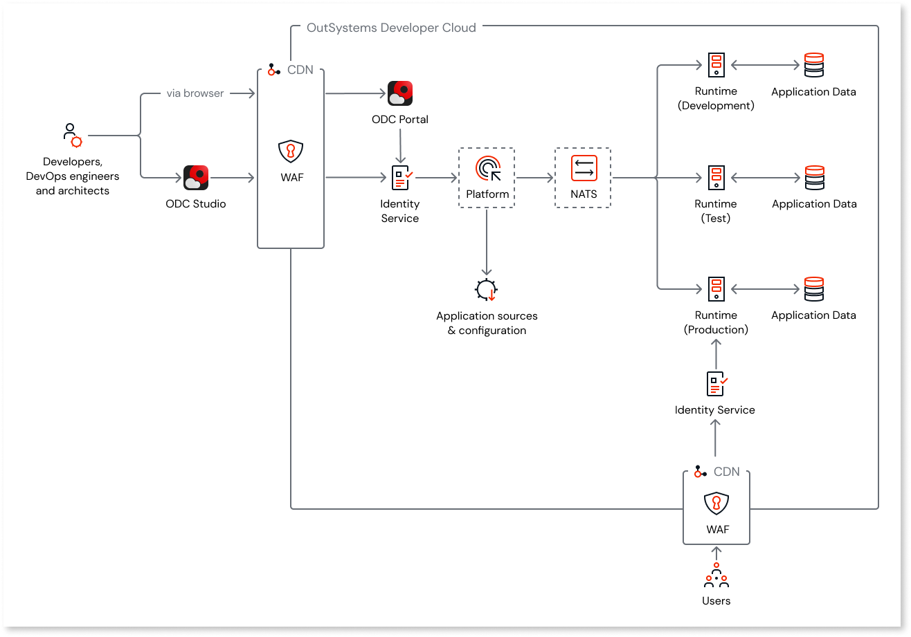
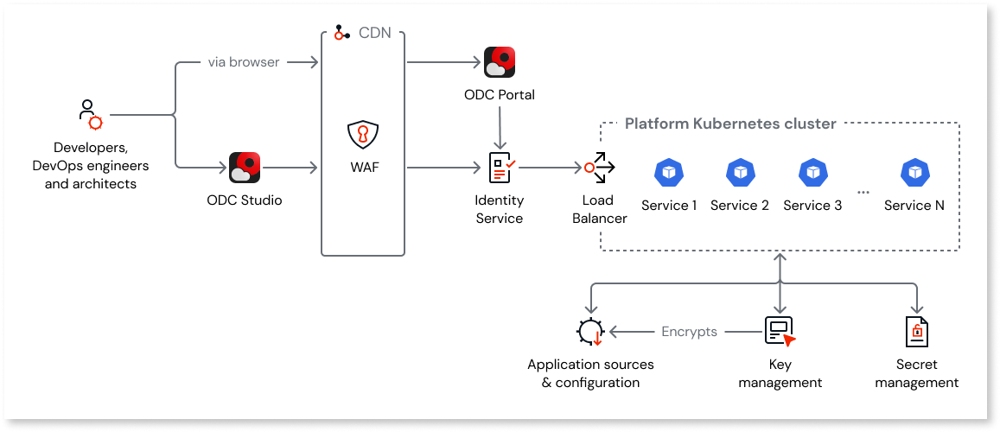
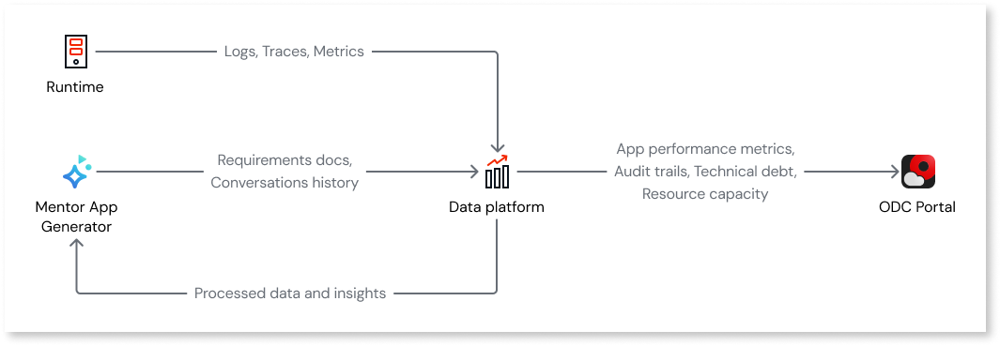
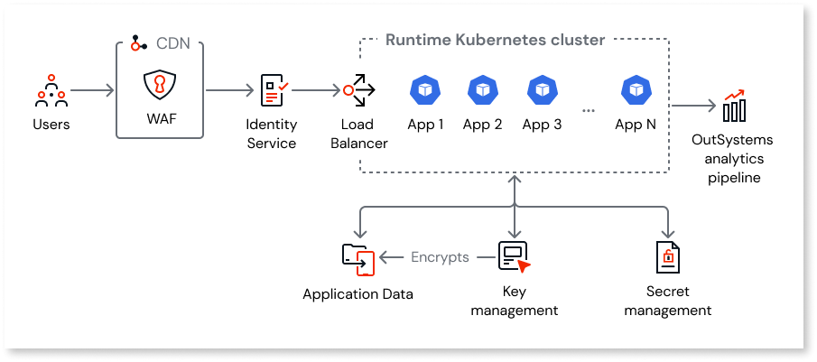
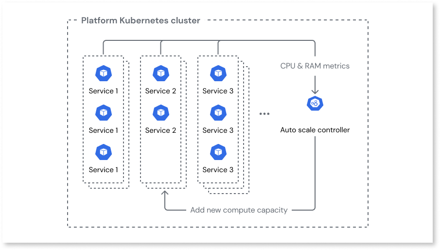
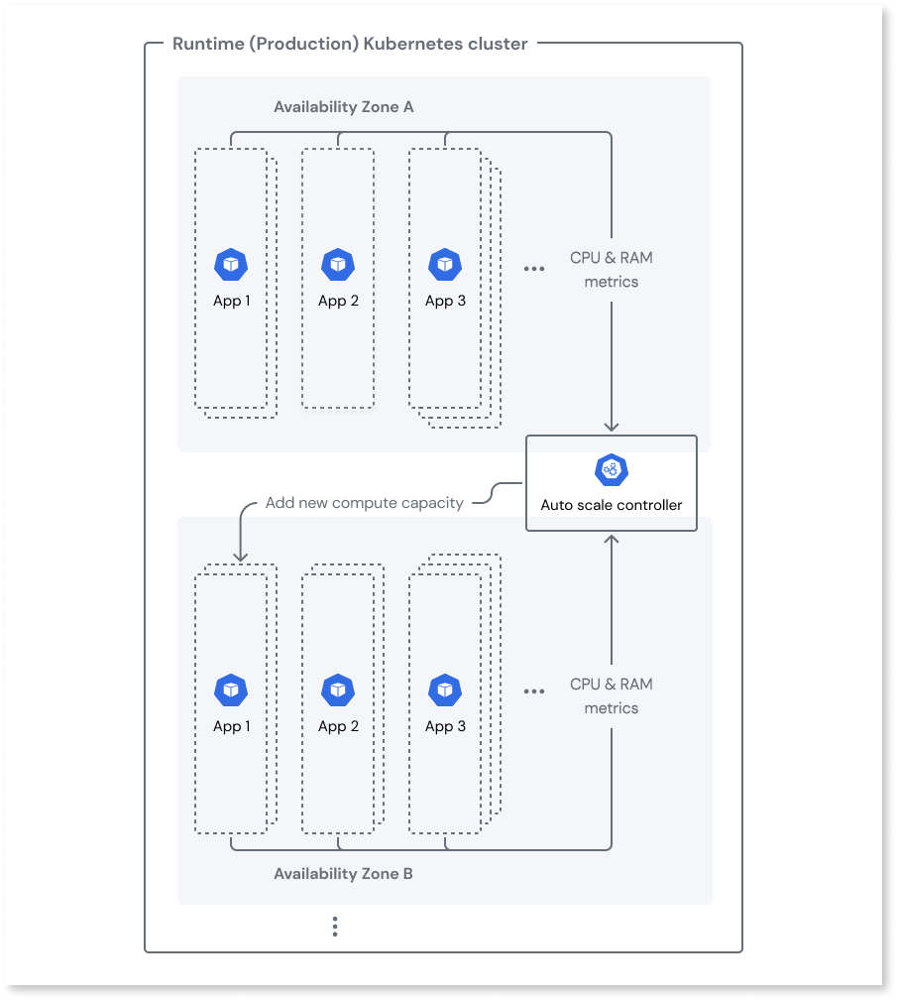
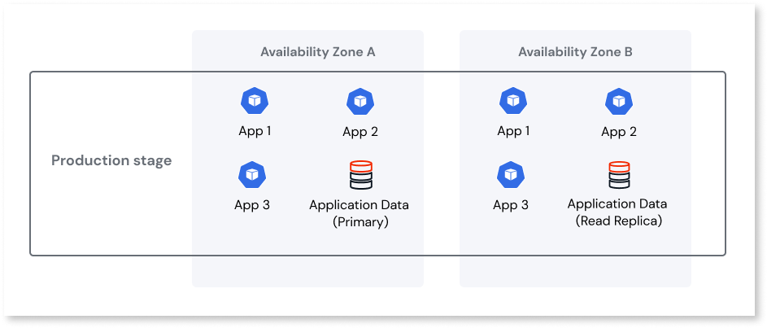
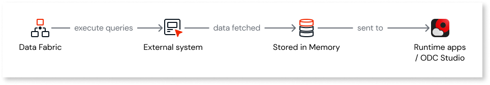
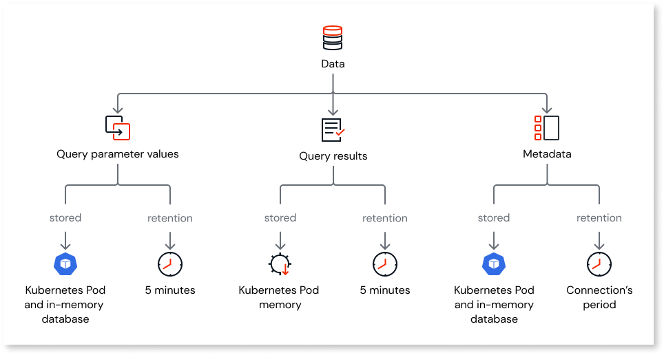
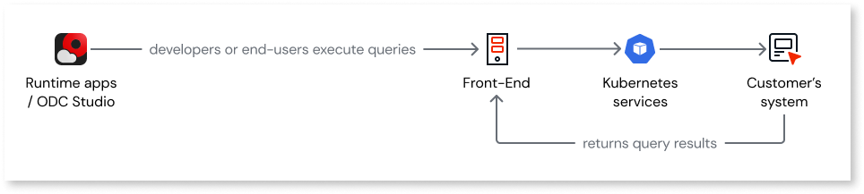

# Cloud-native architecture of OutSystems Developer Cloud

OutSystems Developer Cloud (ODC) is cloud-native. This means that the infrastructure of both the development **platform**, for building and deploying apps, and the independent **runtime**, for hosting and running the deployed apps, is built and deployed in the cloud. For more information, refer to [What Is Cloud Native?](https://www.outsystems.com/glossary/what-is-cloud-native/).

## OutSystems Developer Cloud

In addition to access to **ODC Studio** and [**ODC Portal**](../../onboarding/intro.md#ODC-portal), each ODC customer has:

* Access to multi-tenant development **platform** services.

* A runtime setup of isolated and independent stages, such as **development**, **test**, and **production**.

* A set of isolated, encrypted, and scalable databases and data stores for the platform services data. Secret data such as API keys are stored in a secret manager.

* An isolated, encrypted, and scalable relational database for each runtime stage.

* A built-in **identity service** to keep [user identities secure](identity.md).

The following diagram shows the high-level architecture of ODC.

All external requests to both the platform and each runtime stage go through a Content Delivery Network (CDN) and Web Application Firewall (WAF). All internal and external requests are encrypted using Transport Layer Security (TLS). For more information, see [Cloud-native network architecture and security of ODC](networking.md).

### Platform {#platform}

The development **platform** comprises multiple services, each responsible for specific functions that facilitate the building and deployment of apps. All the platform services benefit from a resilient microservices design with a REST API web service interface. Developers, DevOps engineers, and architects interact with these services using ODC Studio and ODC Portal.

The platform **load balancer** handles all requests to the services.

An example of a service is the Build Service. When developers select **1-Click Publish** in ODC Studio, the Build Service takes the OutSystems visual language model (OML project) and compiles it into a deployable app.

All the platform services are multi-tenant and benefit from automatic recovery and continuous upgrades.

The following diagram shows the high-level architecture of the development platform.

#### Data platform {#data-platform}

The **data platform** collects, processes, and stores data from several sources. This information is then made available for analysis and visualization, allowing customers to monitor app performance and usage and track platform operations. The data platform is also responsible for processing Mentor App Generator's data.

##### Features that send data to the data platform

The data platform receives data from the following features:

* [Monitor assets with ODC Analytics](https://www.outsystems.com/tk/redirect?g=e190d5fb-6b99-4d9b-a64f-a3b34be3588d): Receives and processes logs, traces, and metrics from ODC assets.
* [Analytics stream](https://www.outsystems.com/tk/redirect?g=43e08fbf-f050-4946-aad2-289ab110be44): Streams logs, traces, and metrics in real time to external analysis and monitoring tools.  
* [Audit trail](https://www.outsystems.com/tk/redirect?g=3f3bc6b9-7335-4d8b-bb41-2eb396b86f3c): Receives chronological records of platform actions and configurations.
* [Code quality](https://www.outsystems.com/tk/redirect?g=6be15662-74c5-4c35-9a7d-16a28816614c): Analyzes app code to provide insights into technical debt and identify areas for improvement.  
* [Mentor App Generator](https://www.outsystems.com/tk/redirect?g=b17a8f2d-c767-49b4-9f50-381329442aba): Supports the Mentor App Generator by processing requirements documents, conversation history, and app metadata.  
* [Monitor ODC resource capacity](https://www.outsystems.com/tk/redirect?g=25a0f102-51ac-4d76-8376-72b14f0f6218): Computes data related to resource consumption to help customers ensure optimal performance and capacity planning.

The following diagram shows how different ODC features interact through the data platform to exchange and process information.

##### Data residency

The Data platform runs in a designated region based on your ODC organization’s region. For example, if your ODC organization is located in the Asia Pacific (Mumbai) region, the Data platform is hosted in the Asia Pacific (Singapore) region.

<!--Changes to this table must also be replicated at the src\eap\manage-platform-app-lifecycle\odc-public-ips.md file-->

| Customer regions | Data platform region |
| :--- | :--- |
| US East (North Virginia), CA (Canada Central) | US East (North Virginia) |
| South America (São Paulo) | South America (São Paulo) |
| Europe (Frankfurt), Europe (London), Europe (Ireland), Middle East (Tel Aviv), Middle East (UAE), South Africa (Cape Town) | Europe (Frankfurt) |
| Asia Pacific (Singapore), Asia Pacific (Mumbai), Asia Pacific (Tokyo), Asia Pacific (Seoul), Asia Pacific (Sydney), Asia Pacific (Jakarta), Asia Pacific (Hong Kong) | Asia Pacific (Singapore) |

### Runtime {#runtime}

In ODC, the **runtime** is independent of the platform and comprises multiple **stages** that host and run deployed apps. Each stage is an isolated runtime environment. Staging lets multiple teams deliver independently and in parallel, a foundational part of the **continuous integration** approach to software development.

In a multi-portfolio organization, portfolios add a logical layer between your ODC organization and its runtime stages. Each portfolio has its own set of stages. This supports independent CI/CD delivery processes across portfolios.

For more information, refer to [Asset portfolios](../portfolios/portfolios-overview.md).

The following diagram shows the high-level runtime architecture, including the runtime load balancer that routes requests to your apps.

## Key technologies of the cloud-native infrastructure

The following is an overview of the cloud technologies used by ODC.

### Kubernetes

The core of both the platform and each of the runtime stages is the **Kubernetes cluster**.

Powered by AWS Elastic Kubernetes Service (EKS), the platform and each runtime stage use a cluster that provides isolated, scalable, and self-healing compute capacity.

#### Platform cluster {#platform-cluster}

To run on a Kubernetes cluster, each platform service is packaged into a **container**. A container is a lightweight, standalone, executable software package. It includes everything the app needs to run: code, runtime, system tools, system libraries, and settings. For more information about container security, refer to [Security in OutSystems Developer Cloud](../../security/security.md#containers).

##### Auto-scaling

The compute capacity for each running platform service is scalable. Many developers use the Build Service and other services concurrently without degrading platform performance. This lets multiple teams rapidly scale the development process independently of deployed apps.

The following diagram shows how auto-scaling works inside the platform cluster.

The **auto scale controller** monitors the CPU and RAM usage of each running service. It continuously checks the usage against the cluster compute capacity allocated and allocates additional capacity if the CPU and RAM usage exceeds a defined threshold.

The auto-scale controller makes the adjustment in real time with no user interaction required.

The isolated platform cluster sources its overall compute capacity from a multi-tenant pool. This means it's scalable.

#### Runtime cluster

In the example of the Build Service in the [previous section](#platform), the compiled app generated is a **container image**. An instance of a container image is a container. For more information about container security, refer to [Security in OutSystems Developer Cloud](../../security/security.md#containers).

The Build Service packages each container image into a separate container, making the infrastructure resilient to individual resource-intensive app(s) that degrade the performance of other apps.

##### High availability for apps

High availability (HA) is an optional add-on available only for production stages:

* When enabled, ODC replicates app containers running in each runtime cluster across multiple availability zones (AZ) to ensure high availability. An availability zone is a distinct location in the cloud that's engineered to be isolated from failure.  Whenever a failure occurs in an AZ, or an application container becomes unavailable, traffic is automatically routed to the healthy app container ensuring no disruption.  

* Without HA, failover isn't immediate and may take a few minutes to recover as additional application containers are launched into different AZs.

##### Auto-scaling

The compute capacity for each app container running in each non-Development runtime stage is scalable. This lets each app scale independently.

The following diagram illustrates how auto-scaling works inside the runtime cluster.

The **auto scale controller** monitors the CPU and RAM usage of each app container. It continuously checks the usage against the cluster compute capacity allocated and allocates additional capacity if the CPU and RAM usage exceeds a defined threshold.

The auto-scale controller makes the adjustment in real time with no user interaction required.

The overall compute capacity for the isolated runtime stage cluster is scalable because it's resourced from a multi-tenant pool.

### Databases and data stores

#### Platform data

Each platform service makes calls to the databases and data stores.

The following table describes the platform databases and data stores.

| Data stored | Service used | Service description |
| - | - | - |
| App revisions and dependency information. | Amazon Aurora | A PostgreSQL-compatible relational database built for the cloud. |
| Current and historic app revisions, in the form of OML projects, stored as blob data. | S3 | An object storage service offering industry-leading scalability, data availability, security, and performance. |
| Configuration and metadata from the Build Service. | DynamoDB | Configuration and metadata include settings, build parameters, and other service-specific information required for the operation of the Build Service. A fully managed, serverless, key-value NoSQL database designed to run high-performance apps at any scale. |
| Current and historic app container images. | Elastic Container Registry (ECR) | A fully-managed Docker container registry that makes it easy to store, share, and deploy container images. |

#### Runtime data

Each runtime stage has an isolated Amazon Aurora Serverless database. In a multi-portfolio organization, each portfolio has its own stages, and each stage has its own database. The following diagram shows an example of the database architecture for a runtime stage.

The Amazon Aurora database architecture model decouples compute and storage, and both automatically scale independently. The Database CPU and Memory automatically scale as the amount of load increases, and the database storage volume automatically scales as the amount of data stored increases.

#### High availability for data

High availability (HA) is an optional add-on available for production stages:

* When enabled, a second (standby) runtime database is deployed in a separate availability zone (AZ). When an AZ fails or the primary database becomes unavailable, the standby database is automatically promoted to the primary, and traffic is automatically routed to the new primary database to minimize disruption.

* Without HA, failover isn't immediate, and the primary database can take a few minutes to recover in a secondary availability zone. Because data is written to multiple AZs, failures don't cause data loss.

#### Platform to runtime

Build Service stores the app container image and passes it to a runtime stage for deployment. OutSystems follows the **build once, deploy anywhere** continuous delivery principle, which makes ODC an efficient cloud product.

## Customer data handling in Data Fabric {#data-fabric}

Many times your data is stored in an external location. Data Fabric helps you to access and integrate data into your apps.

### Data stored in external systems

Customers use [Data Fabric connectors](../../integration-with-systems/external-databases/intro.md) for integrations. Data Fabric processes all your external system data uniformly, with no persistent storage within Data Fabric or ODC architecture.

Data Fabric connectors retrieve essential metadata from external systems, which developers use to select integration tables, objects, and columns. The selected metadata is securely stored in serverless, NoSQL databases during the connection's lifetime in ODC Portal.

### Memory

Data Fabric executes queries on the external system during runtime in OutSystems apps or when developers preview data in ODC Studio. Once the data is fetched, it's stored in memory for processing before being sent to runtime apps or ODC Studio.

Memory used in these scenarios includes Kubernetes Pod memory and an in-memory database, containing non-human-readable bits and bytes. Memory data isn’t logged.

Different types of data are stored distinctively in memory:

* **Query parameter** values are held by Kubernetes Pod memory and the in-memory database, typically discarded once the client consumes the result. If an error prevents the client from closing the statement, which triggers deletion, the parameter values are deleted after roughly 5 minutes.

* **Query results** reside in memory in the Kubernetes Pod memory, with the same retention time as query parameter values.
* **Metadata**, such as tables, columns, and primary and foreign key constraints, remains in memory in the Kubernetes Pod and the in-memory database for the connection's duration.

### Caches

In the ODC architecture, caches optimize performance by storing certain information. This principle extends to integration with external systems, caching the following types of information:

* Metadata: This type of data is cached during connection creation or when refreshing metadata in the ODC Portal. The data is then stored in serverless, NoSQL databases.
* Query statements that execute in runtime Apps are cached to maintain consistent execution plans in the underlying system to enhance performance. Developers should follow security best practices and avoid sensitive data in query statements.
* Query results are cached in Kubernetes pod memory. This cache expiration is defined by the developer at the aggregate level.

### Connection secrets

When creating a connection, developers must supply external system details such as username, password, and host. ODC securely stores sensitive data like passwords by encrypting them as secrets in a cloud secret store. Passwords are never stored in clear text and secrets are not human-readable. Secrets are decrypted only when connecting to the external system by an automated process and without human intervention.

When editing an existing connection, ODC doesn't fetch and decrypt secrets from the cloud secret store. Instead, you enter the secret details again to save the connection.

### Data in transit

Queries executed by developers in data preview (ODC Studio) or by end-users in runtime apps, along with their results, traverse different channels for communication. Queries begin at the frontend, pass through various Kubernetes services, connect to the customer's system, and return to the frontend with query results.

There are two communication channels in this process:

* **Message-oriented middleware**: For sensitive or potentially Personally Identifiable Information (PII), messages are encrypted before transmission. ODC uses a key management service to encode and decode messages, ensuring security and confidentiality.

* **REST APIs**: All endpoints exclusively use HTTPS for transit. Each HTTP request maintains access control through web tokens. Web tokens contain only essential information for authentication and authorization, and to validate the caller's access to the API.

### Monitoring

ODC monitoring and observability tools never log sensitive data to ensure confidentiality. Sensitive data is omitted so it can't be read by humans. For troubleshooting purposes, queries are logged when errors occur, query results aren't logged. In the interest of security, query results are never logged, not even for troubleshooting purposes.

### Departure

When a connection to an external system is deleted in ODC Portal or an ODC subscription is terminated, persistently stored customer metadata is automatically deleted. When deleting the customer environment without removing the connection, the in-memory database clears the metadata approximately 4 hours later.

## Logging, monitoring, and analytics {#logging-monitoring-analytics}

Logs and metrics are collected from each app container running in each runtime stage cluster. In ODC Portal, you filter logs by stage. In a multi-portfolio organization, you also filter logs by portfolio.

Automatic monitoring by EKS replaces unhealthy app containers running in each runtime stage cluster with a healthy replica. An app container is unhealthy if it's continuously unresponsive.

For more information about monitoring and support in ODC, refer to [Security in OutSystems Developer Cloud](../../security/security.md#monitoring-and-support).

---

Some features mentioned in this article may require [add-ons](../subscription-console.md) to the ODC Platform edition. Please contact your OutSystems account team for more information.

