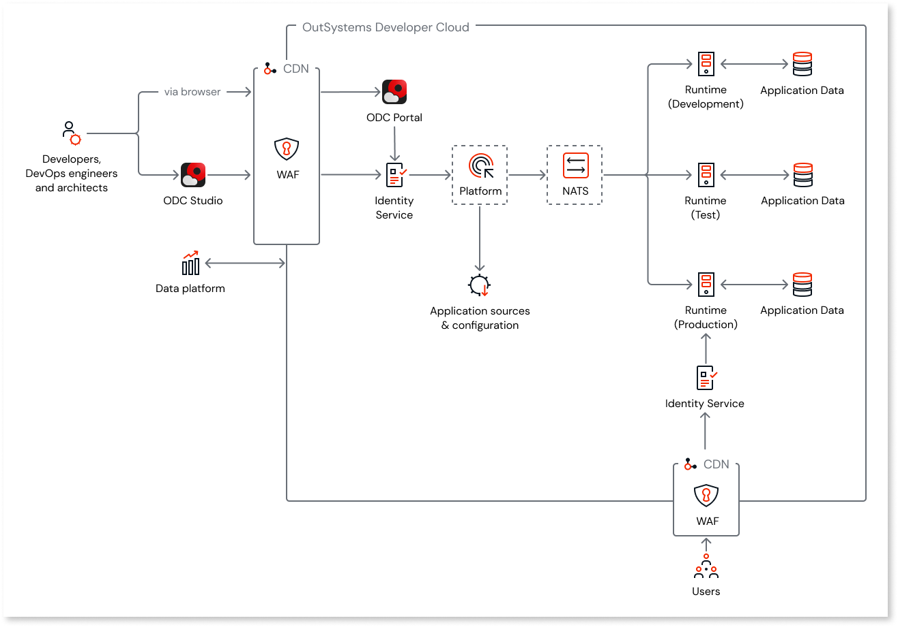
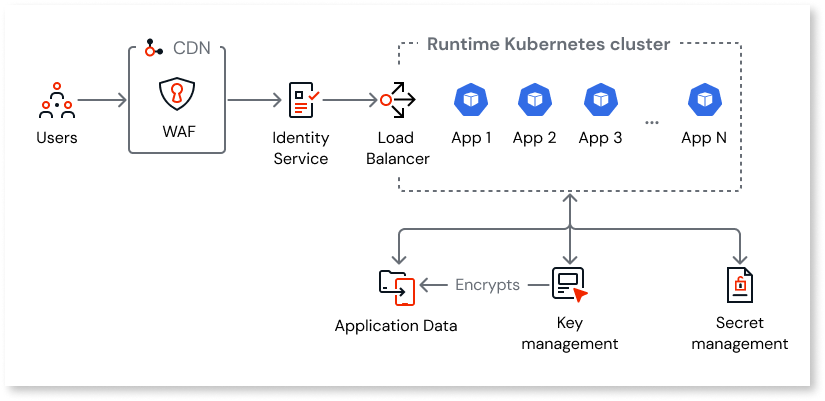

# Cloud-native architecture of OutSystems Developer Cloud

OutSystems Developer Cloud (ODC) is cloud-native. This means that the infrastructure of both the development **Platform**, for building and deploying apps, and the independent **Runtime**, for hosting and running the deployed apps, is built and deployed in the cloud. See [What Is Cloud Native?](https://www.outsystems.com/glossary/what-is-cloud-native/) for more information.

## OutSystems Developer Cloud

In addition to access to **ODC Studio** and [**ODC Portal**](../../onboarding/intro.md#ODC-portal), each OutSystems Developer Cloud customer has:

* Access to multi-tenant development **Platform** services.
* A Runtime setup of isolated and independent stages, for example: **Development**, **Test**, and **Production**.
* A set of isolated, encrypted, and scalable databases and data stores for the Platform services data. Secret data such as API keys are stored in a secret manager.
* An isolated, encrypted, and scalable relational database for each Runtime stage. 
* A built-in **Identity Service** to keep [user identities secure](identity.md).

The following diagram shows the high-level architecture of the OutSystems Developer Cloud.

 NATS (Neural Autonomic Transport System), a secure messaging system, handles all internal requests between the Platform and Runtime stages. All external requests to both the Platform and each of the Runtime stages go through a Content Delivery Network (CDN) and Web Application Firewall (WAF). All internal and external requests are encrypted using Transport Layer Security (TLS). See [Cloud-native network architecture and security of OutSystems Developer Cloud](networking.md) to learn more.

#### Platform { #platform }

The development **Platform** comprises multiple services, each responsible for specific functions that facilitate the building and deployment of apps. All the Platform services benefit from a resilient microservices design with a REST API web service interface. Developers, DevOps engineers, and architects interact with these services using ODC Studio and ODC Portal.

The Platform **Load Balancer** handles all requests to the services. 

An example of a service is the Build Service. When developers click the 1-Click Publish button in ODC Studio, the Build Service takes the OutSystems visual language model (OML project) and compiles it into a deployable app.

All the Platform services are multi-tenant and benefit from automatic recovery and continuous upgrades.

The following diagram shows the high-level architecture of the development Platform.

 

#### Runtime { #runtime }

In OutSystems Developer Cloud, the **Runtime** is independent of the Platform and comprises multiple **stages**, each independent of the other, that serve to host and run the deployed apps. Staging lets multiple teams deliver independently and in parallel, a foundational part of the **continuous integration** approach to software development.

The Runtime **Load Balancer** handles all requests to the apps.

The following diagram shows the high-level Runtime architecture.

 

## Key technologies of the cloud-native infrastructure

The following is an overview of the cloud technologies used by OutSystems Developer Cloud.

### Kubernetes

The core of both the Platform and each of the Runtime stages is the **Kubernetes cluster**.

Powered by AWS Elastic Kubernetes Service (EKS), the Platform and each of the Runtime stages use a cluster: an isolated, scalable, and self-healing compute capacity.

#### Platform cluster { #platform-cluster }

To run on a Kubernetes cluster, each Platform service is packaged into a **container**. A container is a lightweight, standalone, executable software package. It includes everything the app needs to run: code, runtime, system tools, system libraries, and settings. See [Security in OutSystems Developer Cloud](../../security/security.md#containers) for more information about container security.

##### Auto scaling

The compute capacity for each running Platform service is scalable. Many developers can use the Build Service or any other service concurrently without any performance degradation of the Platform. This lets multiple teams rapidly scale the development process independently of the deployed apps.

The following diagram shows how auto scaling works inside the Platform cluster.

 

The **auto scale controller** monitors the CPU and RAM usage of each running service. It continuously checks the usage against the cluster compute capacity allocated and allocates additional capacity if the CPU and RAM usage exceeds a defined threshold.

The auto scale controller makes the adjustment in real time, with no user interaction required.

The isolated Platform cluster resources its overall compute capacity from a multi-tenant pool. This means it's scalable.

#### Runtime cluster

In the example of the Build Service in the [previous section](#platform), the compiled app generated is a **container image**. An instance of a container image is a container. See [Security in OutSystems Developer Cloud](../../security/security.md#containers) for more information about container security.

The Build Service packages each container image into a separate container, making the infrastructure resilient to individual resource-intensive app(s) that degrade the performance of other apps.

The auto scale controller replicates app containers running in each Runtime (Production) cluster across multiple availability zones to ensure **high availability (HA)**. An availability zone is a distinct location in the cloud that's engineered to be isolated from failure.

##### Auto scaling

The compute capacity for each app container running in each non-Development Runtime stage is scalable. This lets each app scale independently.

The following diagram illustrates how auto scaling works inside the Runtime cluster.

The **auto scale controller** monitors the CPU and RAM usage of each app container. It continuously checks the usage against the cluster compute capacity allocated and allocates additional capacity if the CPU and RAM usage exceeds a defined threshold.

The auto scale controller makes the adjustment in real time, with no user interaction required.

The overall compute capacity for the isolated Runtime stage cluster is scalable because it's resourced from a multi-tenant pool.

### Databases and data stores

#### Platform data

Each Platform service makes calls to the databases and data stores.

The following table describes the Platform databases and data stores.

| Data Stored | Service Used | Service Description |
| - | - | - |
| App revisions and dependency information. | Amazon Aurora | A PostgreSQL-compatible relational database built for the cloud. |
| Current and historic app revisions, in the form of OML projects, stored as blob data. | S3 | An object storage service offering industry-leading scalability, data availability, security, and performance. |
| Configuration and metadata from the Platform Build Service. | DynamoDB | Configuration and metadata include settings, build parameters, and other service-specific information required for the operation of the Platform Build Service. A fully managed, serverless, key-value NoSQL database designed to run high-performance apps at any scale. |
| Current and historic app container images. | Elastic Container Registry (ECR) | A fully-managed Docker container registry that makes it easy to store, share, and deploy container images. |

#### Runtime data

Each Runtime stage has an isolated Amazon Aurora Serverless database. The following diagram shows this.

Data is automatically written to two availability zones simultaneously.

The Amazon Aurora database architecture model decouples compute and storage. Storage volume automatically scales as the amount of data stored increases.

You can store secret data for your apps such as API keys as secret settings in a secret manager.

#### Platform to Runtime

Build Service stores the app container image and passes the image to a Runtime stage for deployment. OutSystems follows the "Build once, deploy anywhere" **continuous delivery** principle, which makes OutSystems Developer Cloud an efficient cloud product.

## Customer data handling in Data Fabric { #data-fabric }

Many times your data is stored in an external location. Data Fabric helps you to access and integrate data into your apps.

### Data stored in external systems

Customers use [Data Fabric connectors](../../integration-with-systems/external-databases/intro.md) for integrations. Data Fabric processes all your external system data uniformly, with no persistent storage within Data Fabric or ODC architecture.

Data Fabric Connectors retrieve essential metadata from external systems, making it crucial for developers to select integration tables, objects, and columns. The selected metadata is securely stored in serverless, NoSQL databases during the connection's lifetime in the ODC Portal.

### Memory

Data Fabric executes queries on the external system during runtime in OutSystems apps or when developers preview data in ODC Studio. Once the data is fetched, it's stored in memory for processing before being sent to runtime apps or ODC Studio.

Memory used in these scenarios includes Kubernetes Pod memory and an in-memory database, containing non-human-readable bits and bytes. Memory data isn’t logged.

Different types of data are stored distinctively in memory:

* **Query parameter** values are held by Kubernetes Pod memory and the in-memory database, typically discarded once the client consumes the result. If an error prevents the client from closing the statement, which triggers deletion, the parameter values are deleted after roughly 5 minutes.
* **Query results** reside in memory in the Kubernetes Pod memory, with the same retention time as query parameter values.
* **Metadata**, such as, tables, columns, Primary Key/Foreign Key constraints, remain in memory in the Kubernetes Pod and the in-memory database for the connection's duration.

### Caches

In the ODC architecture, caches optimize performance by storing certain information. This principle extends to integration with external systems, caching the following types of information:

* Metadata: This type of data is cached during connection creation or when refreshing metadata in the ODC Portal. The data is then stored in serverless, NoSQL databases.
* Query statements that execute in runtime Apps are cached to maintain consistent execution plans in the underlying system to enhance performance.
* Query results are cached in Kubernetes pod memory. This cache expiration is defined by developer at the aggregate level.

### Connection secrets

When creating a connection, developers must supply external system details such as username, password, and host. ODC securely stores sensitive data like passwords by encrypting them as secrets in a cloud secret store. Passwords are never stored in clear text and OutSystems can't access them.

### Data in transit

Queries executed by developers in data preview (ODC Studio) or by end-users in runtime Apps, along with their results, traverse different channels for communication. Queries begin at the frontend, pass through various Kubernetes services, connect to the customer's system, and returns to the frontend with query results.

There are two communication channels in this process:

* **Message-oriented middleware**: For sensitive or potentially Personally Identifiable Information (PII), messages are encrypted before transmission. ODC uses a key management service to encode and decode messages, ensuring security and confidentiality.

* **REST APIs**: All endpoints exclusively use HTTPS for transit. Each HTTP request maintains access control through web tokens. Web tokens contain only essential information for authentication and authorization, and to validate the caller's access to the API.

### Monitoring

ODC monitoring and observability tools never log sensitive data to ensure confidentiality. Sensitive data is omitted to prevent human readability. For troubleshooting purposes, queries are logged when errors occur, query results aren't logged. In the interest of security, query results are never logged, not even for troubleshooting purposes.

### Departure

When a connection to an external system is deleted in ODC Portal or an ODC subscription is terminated, persistently stored customer metadata is automatically deleted. When deleting the customer environment without removing the connection, the in-memory database clears the metadata approximately 4 hours later.

## Logging, monitoring, and analytics { #logging-monitoring-analytics }

Logs and metrics are collected from each of the app containers running in each Runtime stage cluster. Developers and DevOps engineers can filter logs on ODC Portal.

Automatic monitoring by EKS replaces unhealthy app containers running in each Runtime stage cluster with a healthy replica. An app container is unhealthy if it's continuously unresponsive.

See [Security in OutSystems Developer Cloud](../../security/security.md#monitoring-and-support) for more information about monitoring and support in ODC.

---

Some features mentioned in this article may require add-ons to the ODC Platform edition. Please contact your OutSystems account team for more information.

