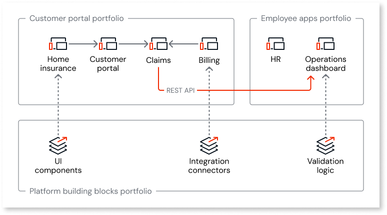
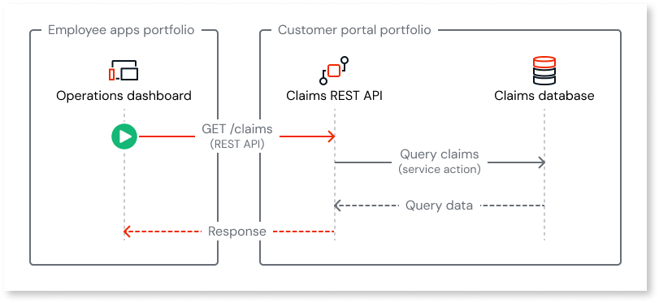

# App architecture with multiple portfolios

In a multi-portfolio organization, you make additional architecture decisions on top of the standard [app architecture](../../app-architecture/intro.md) process. This article focuses on those decisions: identifying what crosses portfolio boundaries, mapping bounded contexts to portfolios, defining ownership of shared components, and assembling the final architecture. The example in this article uses an insurance company with three portfolios: a customer portal portfolio, an employee apps portfolio, and a platform building blocks portfolio.

This article assumes you're familiar with [how portfolios work](portfolios-overview.md). This article pairs with [Portfolio planning and setup](portfolios-plan.md) when you define your portfolio structure and app architecture together.

## Cross-portfolio boundaries

Cross-portfolio design starts with understanding which functionality and data you need available across portfolios. The following questions help:

* Which business concepts are used by assets in more than one portfolio?

* Which logic, UI components, or integration wrappers are needed by multiple portfolios?

* Do assets in one portfolio need to read or write data owned by assets in another portfolio?

The answers help you identify what to extract into shared [libraries](../../building-apps/libraries/libraries.md) or expose as [REST APIs](../../integration-with-systems/exposing_rest/intro.md). For a full breakdown of what's shared within and across portfolios, refer to [Reuse and dependencies](portfolios-overview.md#whats-shared-and-portfolio-scoped) in the portfolios overview.

**Example:** The insurance company identifies the following cross-portfolio needs:

* Both the customer portal portfolio and the employee apps portfolio need the same branded UI components and themes.

* Both portfolios connect to the same SAP and Guidewire external systems.

* Both portfolios apply the same validation logic for policy numbers and date calculations.

* The internal operations dashboard needs to display customer claims data, which is owned by an app in the customer portal portfolio.

## Ownership of shared components

With multiple portfolios, the shared library layer needs clear ownership so it's clear who controls versioning, release schedule, and breaking changes.

### Ownership of shared libraries

Cross-portfolio libraries typically sit with a platform group or Center of Excellence (CoE). That group controls the release schedule of shared components and manages versioning. Other portfolios adopt updated library versions when they're ready, without affecting their release schedule.

### Shared building blocks portfolio

A dedicated portfolio for those libraries gives the platform group its own delivery process and governance while other portfolios consume the libraries.

**Example:** The insurance company assigns ownership of the following shared libraries:

* A **UI components library** with branded themes and common patterns. Both the customer portal portfolio and the employee apps portfolio consume it.

* An **integration connectors library** with wrappers for SAP and Guidewire.

* A **validation logic library** with common business rules (date calculations, policy number formats).

For cross-portfolio data, the Claims app in the customer portal portfolio exposes a REST API. The operations dashboard in the employee apps portfolio consumes it to display customer claims data. The customer portal portfolio owns this API, not the platform building blocks portfolio.

## Complete architecture

A complete architecture brings business domains, apps, libraries, and cross-portfolio communication together.

Cross-portfolio communication uses a REST API boundary; service actions and entities don't cross portfolio boundaries. The following diagram shows a common cross-portfolio pattern: an app consumes data from another portfolio by calling a REST API.

The following checks help you confirm the design for each portfolio:

* All apps that need to share service actions and entities are in the same portfolio.

* Shared functionality is in libraries, not duplicated across portfolios.

* Cross-portfolio data flows use REST APIs with clear ownership of each endpoint.

* Each portfolio has clear ownership, governance, and delivery process for its assets.

The following diagram shows a common cross-portfolio pattern: an app consumes data from another portfolio by calling a REST API.

**Example:** The insurance company assembles the following architecture:

**Customer portal portfolio:**

* The **Home Insurance** app provides the customer-facing user interface.

* The **Customer Portal** app manages customer information and exposes it to the Home Insurance app through service actions.

* The **Claims** app implements risk processing and claims services. It exposes service actions to the Home Insurance app within the portfolio, and exposes a REST API for the operations dashboard in the employee apps portfolio.

* The **Billing** app handles payments and billing, integrating with Guidewire through the shared integration connectors library.

**Employee apps portfolio:**

* The **HR** app manages employee information.

* The **Operations Dashboard** app displays cross-portfolio data by consuming the claims REST API from the customer portal portfolio.

**Platform building blocks portfolio:**

* The **UI components library** provides branded themes and common patterns.

* The **Integration connectors library** provides wrappers for SAP and Guidewire.

* The **Validation logic library** provides common business rules.

All three portfolios consume the platform-building block libraries. Each portfolio has its own stages, CI/CD delivery process, and configurations, so changes in one portfolio don't affect the others.

Notice that the Claims app uses a dual-exposure pattern: it exposes a service action to apps within the customer portal portfolio and a REST API to apps in other portfolios. To avoid duplicating business logic, both the service action and the REST API are wrappers that call the same internal server action. This pattern fits when you need an app to expose functionality both within its portfolio and to other portfolios while keeping a single source of truth for the business logic.

## Related resources

For more information about app architecture with portfolios, refer to:

### Portfolio context

* [Asset portfolios](portfolios-overview.md)

* [Portfolio planning and setup](portfolios-plan.md)

### Architecture guidance

* [Building a well-architected app](../../app-architecture/recommended-architecture.md)
