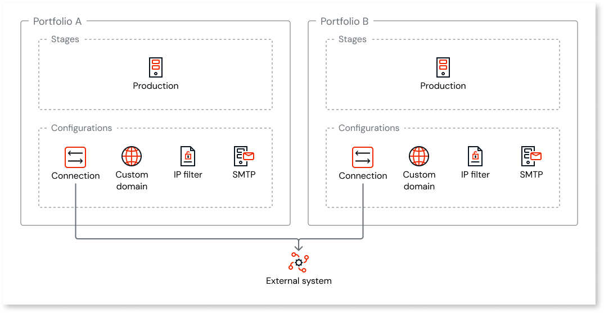

# Configuration management with multiple portfolios

In a multi-portfolio organization, configurations such as custom domains, connections, and identity providers are portfolio-scoped. Each portfolio maintains its own domains, connections, identity providers, and other settings without affecting other portfolios. This article covers how to manage and plan configurations with multiple portfolios.

This article assumes you understand [how configuration management works in ODC](../configuration-management.md) and are familiar with [how portfolios work](portfolios-overview.md).

## Configuration isolation

Each portfolio has its own set of stages, and you configure these settings separately for each portfolio. Changes to one portfolio don't affect other portfolios. When your organization provisions an additional portfolio, it starts with default configurations. Configuration values from other portfolios don't carry over.

If two portfolios connect to the same external system, you set up the connection separately in each. The same applies to custom domains, IP filters, SMTP, and other settings. Each portfolio maintains its own configuration independently.

The following diagram shows configuration isolation across portfolios.

## Configuration scopes

The following table summarizes how each configuration type is scoped with portfolios. For more information about related platform capabilities, refer to [Configurations and platform capabilities](portfolios-overview.md#configurations-and-platform-capabilities).

| Configuration | Scope | What this means |
| --- | --- | --- |
| Agent guardrails | Portfolio stage | Guardrails policies are configured at the stage level and enabled for each agent. |
| AI models | Portfolio stage | AI model endpoints and credentials are configured for each stage within a portfolio. |
| App settings default values | Portfolio stage | Default values for app settings are configured for each stage within a portfolio. |
| Connections (external databases, SAP, Salesforce) | Portfolio stage | Connection strings and credentials are specific to each portfolio's stages. |
| Content security policy (CSP) | Portfolio stage | CSP is activated for each stage within a portfolio. |
| Custom domains | Portfolio stage | Each portfolio's stages can have different domains. |
| Identity providers | Portfolio stage | Each portfolio's stages have their own IdP assignments. |
| IP filters | Portfolio stage | IP filter rules are applied to each stage within a portfolio. |
| Monitoring and logs | Portfolio stage | Logs and traces are scoped to each portfolio's stages. |
| Private gateways | Portfolio stage | Each portfolio's stages have their own private gateway configuration. |
| Session settings | Portfolio stage | Session duration and idle timeout are configured for each stage within a portfolio. |
| SMTP / email | Portfolio stage | Each portfolio's stages have their own SMTP settings. |

This article focuses on platform configurations that you manage for a portfolio and its stages. For app-level settings managed in ODC Studio, refer to [Configuration management](../configuration-management.md).

## Configuration setup for an additional portfolio

An additional portfolio starts with default configurations. The following list includes common settings you configure for its stages:

* **Custom domains**: Add your organization's domains to the additional portfolio's stages. Each custom domain must be unique to a portfolio and stage.

* **Identity providers**: Assign IdPs to the additional portfolio's stages. Existing IdP assignments from other portfolios don't apply automatically. For more information, refer to [Identity provider management with multiple portfolios](portfolios-identity-providers.md).

* **Connections**: Configure external database connections, SAP connections, and other integrations for each stage in the portfolio.

* **IP filters**: If you use IP filters, create and assign filter rules for the additional portfolio's stages.

* **Private gateways**: If apps in the portfolio need to access private network endpoints, activate a private gateway for each stage in the portfolio.

* **SMTP / email**: If apps in the portfolio send emails, configure the SMTP settings for each stage in the portfolio.

Depending on your apps, also review other stage-level settings in [Configuration scopes](#configuration-scopes), such as AI models, agent guardrails, app settings default values, content security policy (CSP), and session settings.

## Multiple portfolios example

An insurance company has three portfolios. The following describes how each portfolio is configured:

**Customer portal portfolio:**

* Custom domain: `portal.example.com` on the production stage.

* IP filters: No restrictions

* Connections: SAP connection for customer data, configured for each stage.

* SMTP: Configured on the production stage to send emails from `noreply@example.com`.

**Employee apps portfolio:**

* Custom domain: `internal.example.com` on the production stage.

* IP filters: Restricted to the corporate IP range.

* Private gateway: Activated on the production stage to access internal HR and payroll systems.

* Connections: Separate SAP connection for employee data, configured for each stage.

* SMTP: Configured on the production stage to send emails from `hr@example.com`.

**Platform building blocks portfolio:**

* No custom domain — this portfolio contains shared libraries, not end-user-facing apps.

* No IP filters or private gateway needed.

* Connections: None — libraries are stateless and don't connect to external systems.

* No SMTP configuration needed.

Each portfolio's configurations are independent. Changing the custom domain for the customer portal doesn't affect the employee apps portfolio.

## Related resources

For more information about configuration management with portfolios, refer to:

### Portfolio context

* [Asset portfolios](portfolios-overview.md)

* [Portfolio planning and setup](portfolios-plan.md)

### Configuration and identity

* [Configuration management](../configuration-management.md)

* [Identity provider management with multiple portfolios](portfolios-identity-providers.md)
