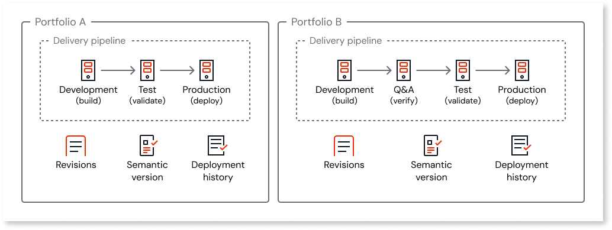

# Asset deployment with multiple portfolios

In a multi-portfolio organization, each portfolio has its own stages and delivery pipeline. An asset belongs to one portfolio, and you deploy and promote it only through that portfolio's stages. You can't deploy an asset to a stage in a different portfolio.

The deployment process is the same as in a single-portfolio organization, including publishing, promoting through stages, impact analysis, and rollback. For details, refer to [Deploying assets](../../deploying-apps/deploy-apps.md).

This article assumes you are familiar with [how portfolios work](portfolios-overview.md).

## Delivery pipeline by portfolio

Each portfolio has its own set of stages (for example, development, test, production) and its own delivery pipeline. Revisions, semantic versions for production, and deployment history are scoped to the portfolio. Each portfolio keeps its own revision numbers, versions, and deployment records.

The following diagram shows how each portfolio has its own promotion path.

In ODC Studio, the portfolio context is shown for the app you are working in. Publishing the app sends the build to the development stage of that portfolio.

## Undeploying assets

Undeploying an asset removes it from that portfolio's stage only. Assets in other portfolios aren't affected.

## Libraries

Libraries aren't deployed on their own. They ship inside the container of an app that consumes them. For more information, refer to [Deploying assets](../../deploying-apps/deploy-apps.md).

## Multiple portfolios example

An insurance company has three portfolios:

* **Customer portal portfolio**: Customer-facing apps deploy through this portfolio's stages only.

* **Employee apps portfolio**: HR and operations deploy employee apps through this portfolio's pipeline, independent of the customer portal portfolio.

* **Platform building blocks portfolio**: Shared libraries are consumed by apps in other portfolios; library code is packaged when those apps deploy, not as separate library deployments.

Changing what is deployed to production in the customer portal portfolio doesn't change deployments in the employee apps portfolio.

## Related resources

For more information about deploying assets with portfolios, refer to:

### Portfolio context

* [Asset portfolios](portfolios-overview.md)

* [Development with multiple portfolios](portfolios-develop.md)

### Deployment procedures

* [Deploying assets](../../deploying-apps/deploy-apps.md)

* [Rollback apps](../../deploying-apps/rollback.md)
