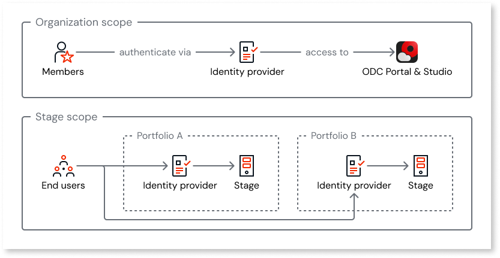

# Identity provider management with multiple portfolios

In a multi-portfolio organization, identity provider (IdP) assignments are portfolio-scoped for end-user authentication. This article covers how IdP assignment works with multiple portfolios.

This article assumes you understand [how external identity providers work in ODC](../external-idps/intro.md) and are familiar with [how portfolios work](portfolios-overview.md).

## IdP scopes

IdPs have two assignment scopes: the **organization** and **stages**. Members (IT-users) authenticate at the organization level, while end-users authenticate at the stage level. For end-user authentication, stage assignments are portfolio-specific. You assign IdPs to the stages in one or more portfolios.

The following diagram shows how the organization scope and stage scope relate to portfolios.

### Organization scope

Members (IT-users) authenticate to the ODC Portal and ODC Studio at the organization level, regardless of which portfolios they work in.

### Stage scope for end-users

Each portfolio has its own set of stages (development, non-production, production). You assign IdPs to stages of one or more portfolios. This means:

* Different portfolios can use different IdPs for end-user authentication.

* When you assign an IdP to a stage, it applies only to apps in that portfolio's stage.

* IdP assignments don't carry over to stages in other portfolios. Set up IdPs for each portfolio's stages separately.

Customer-facing portfolios often use a third-party IdP or social login, while internal portfolios typically use corporate SSO. If portfolios separate apps by department, region, or compliance boundary, each may need its own IdP. You can also assign different IdPs to different stages within the same portfolio, for example, the built-in IdP for development and an external IdP for production.

Adding an external IdP and configuring redirect URIs are covered in [adding an external IdP](../external-idps/intro.md#add-an-external-idp) and [configuring redirect URIs](../external-idps/redirect-uris.md). During assignment, choose the stages in the portfolio or portfolios you want to assign the IdP to.

## IdP assignment to portfolio stages

IdP assignment uses the standard [assignment steps](../external-idps/assign-idp.md). When you select the scope, choose the stages you want to assign the IdP to.

The **Manage authentication** permission is portfolio level. To manage IdP assignments for a portfolio's stages, a user needs this permission for that portfolio. For more information, refer to [User management with multiple portfolios](portfolios-user-management.md).

## Lockout considerations

With multiple portfolios, lockout risks apply independently in each portfolio. If you remove the built-in IdP assignment from a portfolio's stages and the external IdP isn't working correctly, end-users lose access to apps in that portfolio. Apps in other portfolios are unaffected.

The same [lockout avoidance best practices](../external-idps/manage-external-idps.md#lockout) apply, including thorough testing of the external IdP before removing the built-in IdP assignment from any portfolio's stages.

## Multiple portfolios example

An insurance company has three portfolios with different IdP needs:

**Customer portal portfolio:**

* **Production and test stages**: A third-party IdP (for example, Microsoft Entra External ID) for customer authentication. Customers sign in with their own accounts.

* **Development stage**: The built-in IdP for developer testing.

**Employee apps portfolio:**

* **All stages**: Corporate SSO (for example, Okta with SAML 2.0) for employee authentication. Employees use their corporate credentials.

**Platform building blocks portfolio:**

* **All stages**: The built-in IdP only. This portfolio contains shared libraries, so end-user authentication isn't a primary concern.

Each portfolio's IdP configuration is independent. Changing the IdP assignment for the customer portal portfolio doesn't affect the employee apps portfolio.

## Related resources

For more information about identity providers with portfolios, refer to:

### Portfolio context

* [Asset portfolios](portfolios-overview.md)

* [User management with multiple portfolios](portfolios-user-management.md)

### Identity providers

* [Configuring authentication with external identity providers](../external-idps/intro.md)
