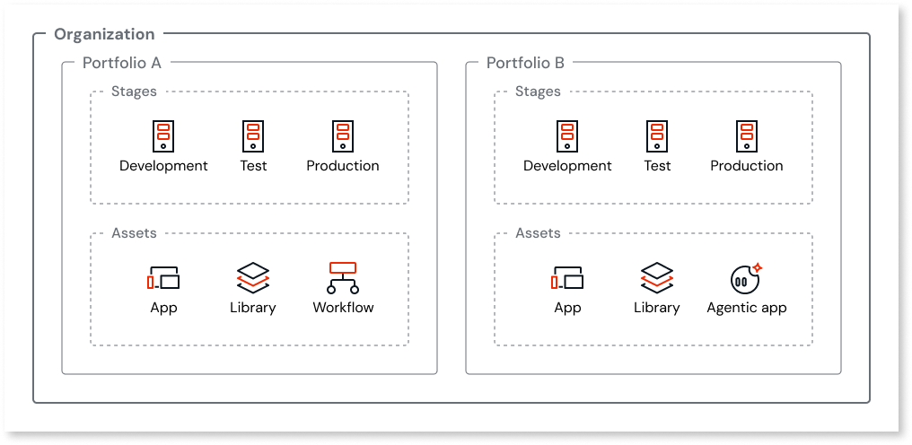
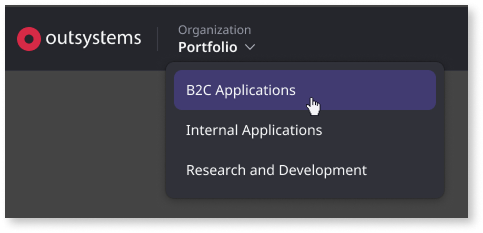
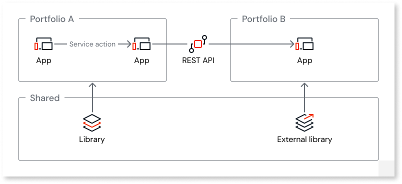

# Asset portfolios

Using multiple portfolios requires an add-on [subscription](../subscription-console.md) for each additional portfolio. Contact your OutSystems account team for more information.

Portfolios let you group and isolate assets within a single ODC organization, based on non-functional requirements (NFRs) or governance rules. Each portfolio has its own set of stages, and you create assets within that portfolio.

As your organization grows, different asset groups often require different runtime resources, configurations, non-functional requirements, or governance rules. A single organization-wide runtime and configuration model makes it hard to separate assets with different requirements. Portfolios let you isolate groups of assets while keeping organization-level governance centralized.

## Benefits of portfolios

Portfolios help you:

* Strengthen compliance and security by grouping assets with shared NFRs and applying portfolio-specific configurations. This keeps different NFR baselines in a single organization without applying the same settings to all assets. For more information about portfolio-scoped configurations, refer to [Configurations and platform capabilities](#configurations-and-platform-capabilities).

* Keep [governance](#governance-and-permissions) clear across departments, countries, or IT groups by managing users and identity at the organization level and assigning roles that include portfolio level permissions. This supports least privilege access while keeping responsibility boundaries clear.

* Isolate data and workloads by running each portfolio in its own set of stages and databases. This prevents heavy queries in one portfolio from affecting assets in another portfolio.

* Reduce cross-portfolio release risk by keeping deployments and promotions isolated within each portfolio's stages.

* Reuse libraries across portfolios rather than duplicating them across organizations. This reduces duplication and helps you manage changes to shared components.

## Portfolios in the ODC hierarchy

ODC organizes assets and runtime stages in a hierarchy:

* **Organization**: The top-level container for people, governance, and organization-wide capabilities.

* **Portfolio**: A set of stages and assets with isolated runtime resources (compute, database, storage) and configurations.

* **Stage**: A step in the delivery process that includes runtime resources for deployed assets (for example, development and production).

* **Asset**: An app, library, workflow, or agentic app that belongs to a portfolio.

The following diagram shows the ODC hierarchy with portfolios.

Portfolios are pre-named by default (for example, _Portfolio 1_, _Portfolio 2_). You can rename them in the ODC Portal under **Management** > **View** > **Organization**.

## Work in a portfolio {#work-in-a-portfolio}

In the ODC Portal, you work in one portfolio at a time. Select the portfolio you want to work in. Your apps, stages, configurations, deployments, and logs are all for that portfolio. Users, roles, and audit trails, for example, are managed at the organization level and stay the same regardless of which portfolio you select.

You only see portfolios that your role gives you access to. If you have access to just one, that one is selected for you.

## Use cases

You can use multiple portfolios when different groups of assets need their own runtime resources, configurations, or governance rules. For example, you can separate assets that need different identity providers, custom domains, IP filters, private gateways, or other runtime configurations, such as:

* Employee-facing apps and customer-facing apps that use different authentication providers, domains, or network access rules.

* Mission-critical apps that require stricter isolation from less critical workloads.

* Apps managed by different departments that need their own resources, configurations, and delivery process.

* Shared libraries and templates maintained by a center-of-excellence (CoE) in a dedicated portfolio that other portfolios reuse.

### Multiple portfolios example

An insurance company uses three portfolios to manage its assets:

* **Customer portal portfolio**: Customer-facing apps that use a third-party identity provider on a public domain. This portfolio follows a weekly release schedule and applies specific IP filters and custom domains. For compliance reasons, customer data cannot be mixed with other internal data.

* **Employee apps portfolio**: Employee-facing apps that use corporate SSO on an internal domain. HR and operations share this portfolio and follow a monthly release schedule with a formal approval workflow.

* **Platform building blocks portfolio**: A center-of-excellence (CoE) maintains shared libraries for UI components, integration connectors, and common validation logic. Apps in the other portfolios consume these libraries.

Each portfolio has its own runtime resources, configurations, stages, and delivery process, so changes in one portfolio don't affect the others.

## Governance and permissions

With portfolios, you manage users at the organization level and assign roles that include portfolio level permissions. This keeps responsibility boundaries clear when multiple groups share the same organization. Each user has one organization-level role. This supports least privilege access and reduces the risk of unintended changes outside the portfolios a user is responsible for.

Organization-level permissions cover organization-wide governance tasks, while portfolio level permissions apply within a portfolio, including its assets, stages, and stage-level configurations.

Portfolio-scoped permissions determine whether a user can:

* Manage portfolios and stages.
* Create and change assets.
* Release and deploy assets.
* Access logs and code quality findings.
* Manage stage-level configurations and connections.
* Install and update Forge assets.

For more information about portfolio level permissions, refer to [User management with multiple portfolios](portfolios-user-management.md). For the full permission registry, refer to [Roles and permissions for members (IT-users)](../../user-management/roles.md).

## What's shared and what's portfolio-scoped {#whats-shared-and-portfolio-scoped}

You create assets in a portfolio, and each portfolio has its own set of stages, independent from other portfolios. This supports an independent delivery process for each portfolio. Your assets are portfolio-scoped, meaning they belong to a single portfolio. You can use shared building blocks across portfolios to standardize common functionality while keeping portfolios independent.

The following table shows which assets are available across portfolios and which assets are portfolio-scoped.

| Asset | Shared across portfolios | Notes |
| --- | --- | --- |
| AI models | No | AI models are portfolio-scoped. |
| Agents | No | Agents are portfolio-scoped. |
| Apps | No | Apps are portfolio-scoped. Service actions, entities, events, and other public elements are only reusable by other apps in the same portfolio. |
| Connections | No | Connections expose entities and actions that assets in the same portfolio consume. Each portfolio's stages have separate connection configurations. |
| External libraries | Yes | External libraries are reusable across portfolios. |
| Libraries | Yes | Libraries expose public elements that you reuse across portfolios. For more information, refer to [Libraries](../../building-apps/libraries/libraries.md). |
| Templates | Yes | Templates are assets that you create in one portfolio and use to create assets in another portfolio. Templates are reusable across portfolios only when they don't depend on other apps (for example, public elements from apps such as service actions or entities). |
| Workflows | No | Workflows are portfolio-scoped. For more information, refer to [Workflows in ODC](../../building-apps/workflows/workflows-in-odc.md). |

### Databases and data

Each portfolio's stages have their own database. Apps in different portfolios don't share a database, which prevents heavy queries in one portfolio from affecting apps in another.

### Configurations and platform capabilities {#configurations-and-platform-capabilities}

The following table summarizes how common configurations and platform capabilities are scoped when you use portfolios. The **Scope** column indicates where a configuration applies:

* **Organization**: Applies across the organization, regardless of portfolio.

* **Portfolio**: Applies within a single portfolio (portfolio-scoped).

* **Portfolio stage**: Applies to a stage within a portfolio.

| Configuration | Scope | Notes |
| --- | --- | --- |
| Agent guardrails | Portfolio stage | Guardrails policies are configured at the stage level and enabled for each agent. For more information, refer to [Agent guardrails](../../building-apps/build-ai-powered-apps/guardrails.md). |
| Agent evaluations | Portfolio stage (Development) | Agent evaluations are scoped to assets in the development stage of a portfolio. For more information, refer to [Agent evaluations](../../building-apps/build-ai-powered-apps/about-agent-evaluations.md). |
| Analytics | Portfolio stage | Analytics data is scoped to assets in each portfolio's stages. |
| App settings default values | Portfolio stage | Default values for app settings are configured for each stage. For more information, refer to [Configure app settings](../configure-app-settings.md). |
| AppShield | Organization | AppShield is a licensed plugin for mobile apps. For more information, refer to [AppShield](../../security/app-shield/intro.md). |
| Audit trail | Organization | Audit trails record events across the organization. Each event includes its scope, such as a portfolio or the organization. For more information, refer to [Audit trail](../../monitor-and-troubleshoot/audit-trail/audit-trail.md). |
| Code quality | Portfolio stage (Development) | Code quality findings are scoped to assets in the development stage of a portfolio. For more information, refer to [Manage technical debt in ODC](../../monitor-and-troubleshoot/manage-technical-debt/managing-tech-debt.md). |
| Connections (external databases, SAP, Salesforce) | Portfolio stage | Connection configurations are specific to each portfolio's stages. |
| Content security policy (CSP) | Portfolio stage | CSP is activated for each stage. For more information, refer to [Content security policy](../../security/configure-csp.md). |
| Custom domains | Portfolio stage | You can assign different domains to each portfolio's stages. |
| High availability | Portfolio stage (Production) | High availability (HA) is an optional add-on for production stages. For more information, refer to [ODC platform architecture](../platform-architecture/intro.md). |
| Identity providers | Portfolio stage | Each portfolio's stages have their own IdP assignments. |
| IP filters | Portfolio stage | IP filter rules are applied to each stage in a portfolio. |
| Monitoring and logs | Portfolio stage | Logs and traces are scoped to each portfolio's stages. |
| Platform limits | Portfolio stage | Most platform limits are stage-specific. For more information, refer to [Platform limits](../../getting-started/system-requirements.md#platform-limits). |
| Platform updates | Portfolio stage | Platform updates are scheduled and applied to stages within a portfolio. For more information, refer to [Managing platform infrastructure updates](../self-service-db-operations.md). |
| Private gateways | Portfolio stage | Each portfolio's stages have their own private gateway configuration. For more information, refer to [Configure a private gateway to your network](../private-gateway.md). |
| Session settings | Portfolio stage | Session duration and idle timeout are configured for each stage in a portfolio. |
| SMTP / email | Portfolio stage | Each portfolio's stages have their own SMTP settings. For more information, refer to [Configure SMTP settings for emails](../configure-emails.md). |
| Streams (analytics and audit trail) | Organization | Streams send observability data and audit trail logs to external destinations. For more information, refer to [Streaming observability data](../../monitor-and-troubleshoot/stream-app-analytics/stream-app-analytics-overview.md) and [Stream audit trail logs](../../monitor-and-troubleshoot/audit-trail/audit-trail-streaming.md). |

### Reuse and dependencies

Portfolios create a boundary for reuse. Within a portfolio, apps share public elements, such as service actions and entities. Across portfolios, shared logic is implemented in libraries, and apps integrate using REST APIs.

The following diagram shows common reuse and communication patterns within and across portfolios.

The following table shows how reuse behaves within a portfolio compared to across portfolios:

| Behavior | Within a portfolio | Across portfolios |
| --- | --- | --- |
| Public elements from apps (service actions, entities) | Available | Not available |
| Public elements from libraries | Available | Available |
| External libraries | Available | Available |
| Data sharing between apps | Service actions and entities | REST APIs |

### Deployment and stages

Each portfolio has its own stages (for example, development, test, and production) and CI/CD delivery process. Deployments and promotions are scoped to the portfolio, and deployments in one portfolio don't affect another. Impact analysis includes only supported cross-portfolio references (for example, libraries), and each entry identifies the portfolio the asset belongs to. Each stage has its own configurations (connections, secrets).

## Restrictions and known limitations

Portfolios have the following limitations:

* ODC creates a main portfolio by default. The main portfolio can't be removed from the organization.

* All portfolios and stages in your organization run in the same region.

* There's no built-in capability to move assets between portfolios.

* Trial AI models are available only in the main portfolio.

* Developing in a multi-portfolio organization requires ODC Studio version 1.7.13 or later.

## Related resources

For more information about adopting, planning, and working with portfolios, refer to:

### Planning and architecture

* [Portfolio planning and setup](portfolios-plan.md)

* [App architecture with multiple portfolios](portfolios-app-architecture.md)

### Configure and govern

* [User management with multiple portfolios](portfolios-user-management.md)

* [Identity provider management with multiple portfolios](portfolios-identity-providers.md)

* [Configuration management with multiple portfolios](portfolios-configurations.md)

### Develop and deploy

* [Development with multiple portfolios](portfolios-develop.md)

* [Asset deployment with multiple portfolios](portfolios-deploy-assets.md)
