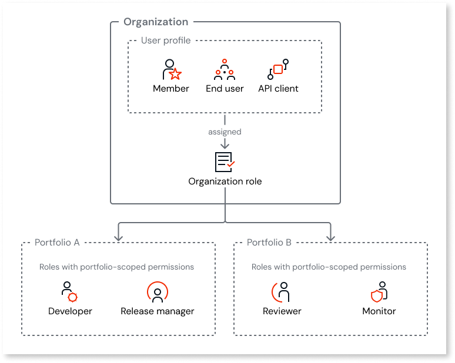
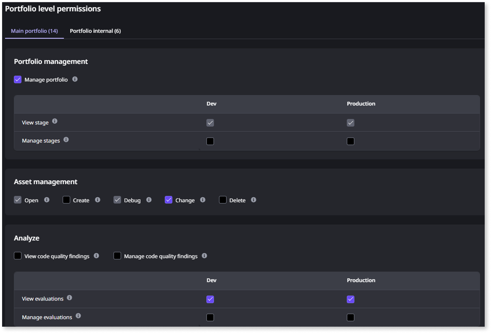

# User management with multiple portfolios

When your organization uses multiple asset [portfolios](portfolios-overview.md), you manage users at the organization level. Organization roles include portfolio level permissions that define what a user can do in each portfolio. This article covers how roles and access work across multiple portfolios.

This article assumes you understand [how user management works in ODC](../../user-management/intro.md) and are familiar with [roles and permissions for members](../../user-management/roles.md).

## Centralized user management

You manage all users (members, end-users, and API clients) at the organization level, regardless of how many portfolios you have. This means:

* You create and deactivate users once, at the organization level.

* A single user profile exists across all portfolios. You don't create separate accounts for each portfolio.

* You assign organization roles to users at the organization level. Organization roles can include portfolio level permissions for one or more portfolios.

The following diagram shows how user profiles, roles, and permissions are scoped in a multi-portfolio organization.

## Portfolio level permissions

Organization roles include portfolio level permissions, which lets you control what each user can do in each portfolio. The same role can grant different permissions in each portfolio.

The following permission categories are portfolio level:

* **Portfolio management** (Manage portfolio, View stage, Manage stage)

* **Asset management** (Open, Create, Debug, Change, Delete)

* **Release management** (Release, Deploy assets)

* **Monitoring** (Access asset logs and traces, Access user information)

* **Analyze** (View and manage code quality findings)

* **Configuration management** (Manage stage-level settings, such as domains, IP filters, and SMTP)

* **Connection management** (Create, Change, Delete connections)

* **End-user management** (View end users, Manage end-user access, Manage end-user groups)

* **Forge** (Install/Update assets, Submit/Edit assets)

* **Maintenance** (View platform updates)

Stage-specific permissions (such as deploy to a specific stage) are still scoped to a stage, but they appear under the portfolio that owns that stage.

## How built-in roles work with portfolios

The two built-in roles, **Administrator** and **Developer**, behave differently when your organization has multiple portfolios:

* **Administrator**: Includes permissions across all portfolios. When additional portfolios are provisioned, the Administrator role includes them automatically.

* **Developer**: Applies to the main portfolio only. Working in additional portfolios requires either a custom role or the Developer role assigned to those portfolios.

## Custom roles with portfolios

When you create a [custom role](../../user-management/roles.md#custom-roles), you define which permissions the role includes. With multiple portfolios, configure the role's portfolio level permissions for the portfolios a user works in. This gives a user consistent permissions across the portfolios they work in.

The following guidance applies when planning custom roles for a multi-portfolio organization:

* **Cross-portfolio roles**: If a user needs the same permissions across all portfolios (for example, an architect who oversees the full organization), configure the role with the same portfolio level permissions for each portfolio, or use the built-in Administrator role.

* **Portfolio-specific roles**: If portfolios have different governance needs, create roles tailored to each portfolio and configure portfolio level permissions only for the relevant portfolios.

* **Least privilege**: The [principle of least privilege](../../user-management/best-practices-user-management.md) applies in each portfolio. A developer who needs full access in one portfolio may only need read-only access in another.

## Identity providers

With multiple portfolios, identity provider (IdP) assignments are portfolio level. Each portfolio's stages can use a different IdP. For details, refer to [Identity provider management with multiple portfolios](portfolios-identity-providers.md).

## End-users

End-users are managed at the organization level. A user who logs into apps in multiple portfolios has a single profile. The following applies in a multi-portfolio organization:

* A user who exists in multiple portfolios counts only once toward the organization-level end-user limit.

* End-user roles are assigned for each app and stage.

* End-user groups are portfolio-specific. A user can belong to end-user groups in different portfolios, but each group belongs to a single portfolio.

* If different portfolios use different IdPs, the same end-user may authenticate through different providers depending on which portfolio's app they access.

## Multiple portfolios example

An insurance company has three portfolios. Here's how they set up user management:

**Organization-level setup:**

* All users (IT and end-users) are created centrally. The IT admin creates user accounts once.

**Administrator role:**

* The platform admin has the built-in Administrator role, which automatically gives them full access to all three portfolios.

**Customer portal portfolio:**

* The product team has a custom Portal Developer role with asset management, release, and monitoring permissions. This role is assigned only to the customer portal portfolio.

**Employee apps portfolio:**

* The HR and operations teams have a custom Internal Developer role with similar permissions, assigned only to the employee apps portfolio.

**Platform building blocks portfolio:**

* The center of excellence team has a custom Platform Engineer role with asset management and Forge permissions, assigned only to this portfolio.

* A senior architect also has the Platform Engineer role for this portfolio and a read-only Reviewer role for the other two portfolios, so they can monitor code quality across the organization.

## Related resources

For more information about roles, permissions, and identity management with portfolios, refer to:

### Portfolio context

* [Asset portfolios](portfolios-overview.md)

### Roles and identity

* [Roles and permissions for members (IT-users)](../../user-management/roles.md)

* [Identity provider management with multiple portfolios](portfolios-identity-providers.md)
