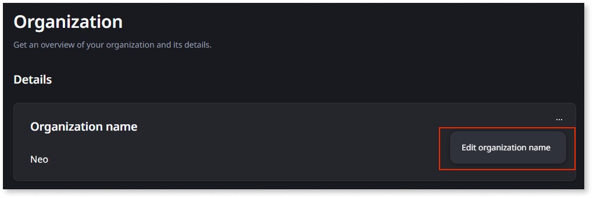

# Change your organization name

Your organization's display name appears throughout the ODC Portal and in ODC Studio headers. The name is a display label and has no effect on your apps, users, domains, or configurations. It's possible to change it at any time in ODC Portal.

## Prerequisites {#prerequisites}

To change the organization name, you need the [**Manage organization** permission](../user-management/roles.md#permissions-registry).

## Change the organization name {#change-org-name}

To change your organization name, follow these steps:

1. In the ODC Portal, select **Management** > **Organization**.

1. In the **Details** section, in the **Organization name** container, click the elipsys and then **Edit organization name**.
1. Type the new name.

    

1. Click **Save**.

A toast notification confirms the change and the name updates throughout the portal.

## Organization name rules {#org-name-rules}

The organization name must meet the following requirements:

* Maximum 100 characters.
* Allowed characters: letters, accented letters, numbers, and spaces.
* Additional allowed characters: `. , : ' ( ) - _ & @ # +`

If the name violates one of these requirements, an error message displays inline.
