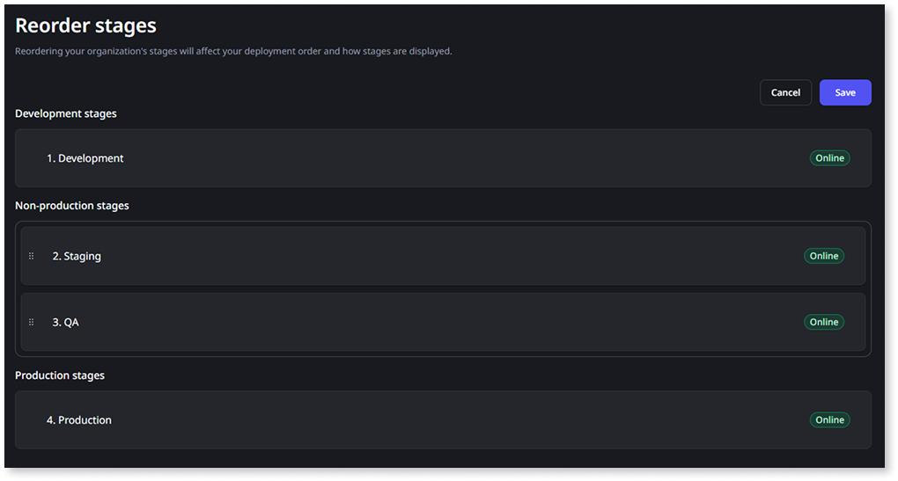

# Change the order of your stages

Stage order determines the sequence assets [move through during deployment](../deploying-apps/deploy-apps.md#deploy-to-stages). When you reorder a stage, you might also want to [rename it](rename-organization.md#change-stage-name).

The Development stage is always first and the Production stage is always last. Both positions are locked. Only the stages between them can be reordered.

If your organization or portfolio has only one non-production stage, there's nothing to reorder, so the **Reorder stages** option doesn't display.

## Prerequisites {#prerequisites}

To reorder stages, you need the **Manage portfolios** permission.

In a multi-portfolio organization, reordering applies to the stages of the [portfolio](portfolios/portfolios-overview.md#work-in-a-portfolio) you're currently working in.

## Change the stage order {#reorder}

To reorder stages, follow these steps:

1. In the ODC Portal, in the navigation bar, click **Management** > **Organization**.
1. On the **Stages** section, click **Reorder stages**.
1. Drag the non-production stages to the desired sequence.

    

1. Click **Save**.

A toast notification confirms the change. The updated stage order applies to deployments going forward.

## Automation and integrations {#automation}

Besides the ODC Portal, you can rename a stage or change stage order programmatically through the [Portfolio API](../reference/apis/portfolio-v2.md).

If you have scripts or integrations that call the ODC APIs to for deployment automations, confirm how you're identifying the stages.

Each stage includes both a `key` (a stable identifier that doesn't change) and an `order` value (an integer reflecting its current position). The `order` value of a given stage changes when you reorder stages, whether you reorder it from the ODC Portal or through the API: the same value now points at a different stage.
