# Install Self-hosted ODC stages

This article guides you through installing a new self-hosted stage. The flow starts when you receive a welcome email, continues in the ODC Portal and the **Self-hosted configurator**, and finishes in the ODC Portal. The configurator includes a registry configuration step.

## Prerequisites {#prerequisites}

Review the system requirements in [System requirements to install Self-hosted ODC](sh-install-reqs.md).

Make sure you have:

* **CLI access**: Install the CLI for your Kubernetes distribution on the machine where you run the Self-hosted configurator, then run the authentication command to set the cluster as the current context:

    * **OpenShift**: [OpenShift CLI (`oc`)](https://mirror.openshift.com/pub/openshift-v4/clients/oc/latest/). Run `oc login` to connect.
    * **AKS**: [Azure CLI](https://learn.microsoft.com/en-us/cli/azure/install-azure-cli). Run `az aks get-credentials` to configure cluster access.
    * **EKS**: [AWS CLI v2](https://docs.aws.amazon.com/cli/latest/userguide/getting-started-install.html) and [eksctl](https://eksctl.io). Run `aws eks update-kubeconfig` to configure cluster access.
    * **GKE**: [Google Cloud CLI](https://cloud.google.com/sdk/docs/install). Run `gcloud container clusters get-credentials` to configure cluster access.

* **Auto-installed tools**: The Self-hosted configurator automatically installs the following tools during installation:

    * **macOS**: Homebrew, `jq`, `curl`, `kubectl`, `helm`
    * **Linux**: `jq`, `curl`, `kubectl`, `helm`
    * **Windows**: `kubectl`, `helm`. PowerShell 5.0 or higher is required.
* **ODC Portal permissions**: Make sure you have the **Manage stages** permission. The user who configures the identity provider (IdP) must have the **Manage authentication** permission. The user who receives the welcome email has the admin role, which includes all permissions.

## Set up access to the ODC Portal {#setup-access}

After you subscribe to ODC Self-hosted, OutSystems provisions your tenant. Once provisioning is complete, the designated admin contact receives a welcome email with a verification code and a link to register in the ODC Portal.

To create your account, follow these steps:

1. Open the welcome email, copy the verification code, and click **Get started**.

    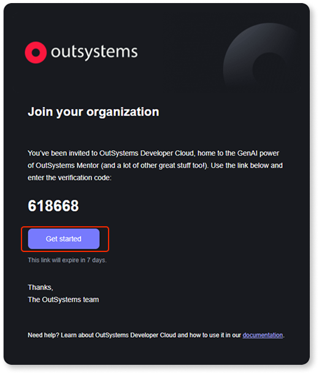

1. Enter your account details, select the checkboxes, and click **Create account**.

    After you complete registration, the ODC Portal sign-in page opens.

1. Sign in with your credentials.

## Install a new self-hosted stage {#install-stage}

To install and configure a new self-hosted stage, follow the steps in these sections.

### Open the self-hosted stage in the ODC Portal {#open-stage}

To open the self-hosted stage in the ODC Portal, follow these steps:

1. On the ODC Portal **Welcome** page, click **Configure stages**.

    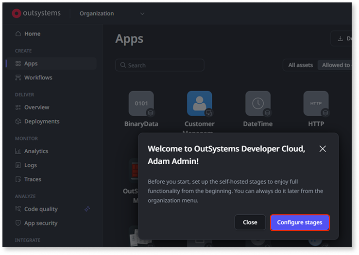

    If you miss the link or need it later, go to **Management** > **Organization**.

1. Under **Stages** page, click the **ellipsis** (3-dots) for the self-hosted stage you want to manage, and then select **Configure self-hosted stage**.

    

    The **Development** stage is configured by default and appears as **Online** because it runs in the OutSystems cloud environment.

    

    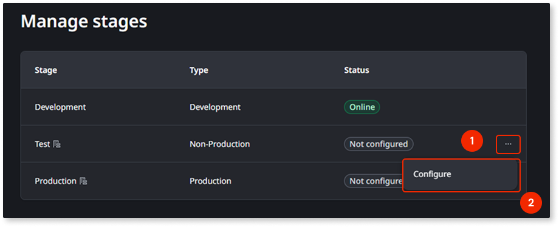

1. Read the requirements, select the confirmation checkbox, and click **Continue**.

1. From the drop-down list, choose your operating system, and copy the installation command shown on the **Self-hosted configurator installation** page.

    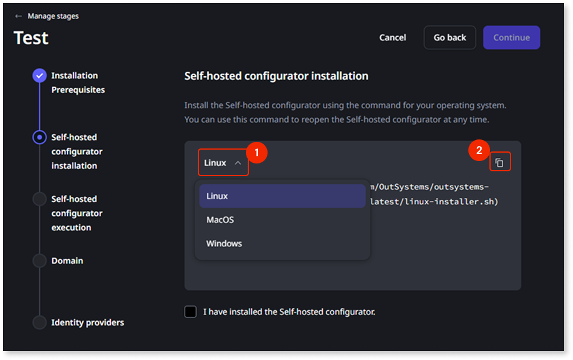

### Install the Self-hosted configurator {#install-configurator}

To install the Self-hosted configurator, do the following:

1. In a shell session with the target cluster set as the current context, run the copied command as an administrator.

    The command installs the **Self-hosted configurator**. After the installation completes, your browser automatically opens the **Log in to Self-hosted setup** page in the Self-hosted console.

    

    If the **Log in to Self-hosted setup** page in the Self-hosted console doesn't open automatically, copy the URL (for example, `http://localhost:5050/`) from the shell session and paste it in your browser.

    If any auto-installed tool fails, install it manually and run the command again. Refer to the [Prerequisites](#prerequisites) for the full list of auto-installed tools per OS.

    

### Get the Self-hosted configurator credentials from the ODC Portal {#get-credentials}

To get the Self-hosted configurator credentials from the ODC Portal, follow these steps:

1. In the ODC Portal, on the **Self-hosted configurator installation** page, select the confirmation checkbox, and then click **Continue**.

    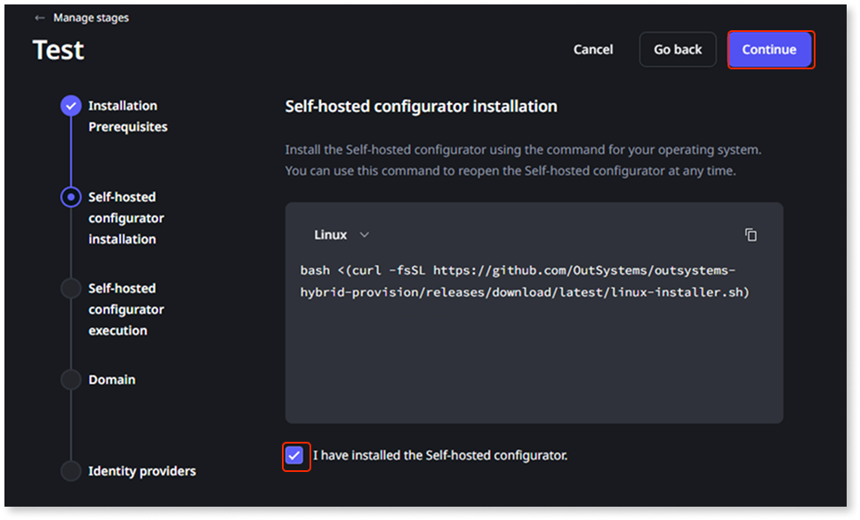

1. If this is your first time generating credentials for the tenant, in **Self-hosted configurator credentials**, click **Generate credentials**.
1. Copy the generated values:
    * **Organization**
    * **Client ID**
    * **Client secret**

    

    If your **Client secret** has expired, click **Generate new secret** next to the **Client secret** expiration date.

    

    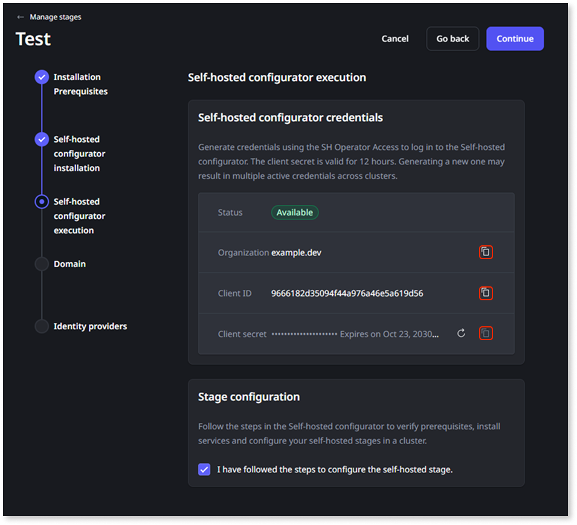

### Set up the Self-hosted configurator {#setup-configurator}

To set up the Self-hosted configurator, follow these steps:

1. In the **Self-hosted configurator**, on the **Log in to Self-hosted setup** page, authenticate using the generated credentials.

    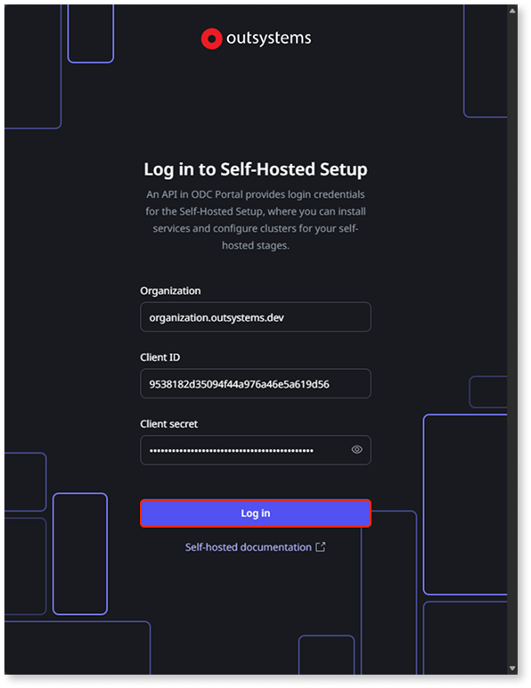

1. When the prerequisites check completes, select **Start configuration**.

    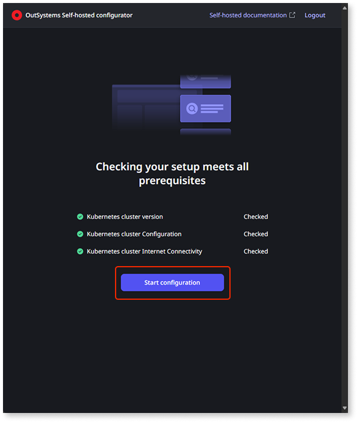

### Configure registry {#configure-registry}

To configure the container registry, follow these steps:

1. On the **Configure registry** screen, choose how to manage container images for this cluster:

    * **Use OutSystems default registry**: OutSystems provisions and manages an OCI registry inside your cluster. This option is available on OpenShift only. Click **Next** and proceed to [Install services](#install-services).

    * **Configure a custom OCI registry**: you provide an external OCI-compliant registry. Continue with the steps below.

    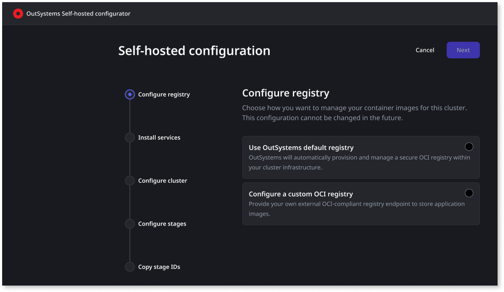

If you selected **Configure a custom OCI registry**, continue with the following steps:

1. Select your registry provider: **AWS ECR**, **Azure ACR**, **Google Artifact Registry (GAR)**, or **Other**.

1. Fill in the applicable fields for your provider. For field descriptions, required permissions, and guidance on choosing the correct expiration value, refer to [Set up the custom OCI registry for self-hosted stages](sh-registry.md).

    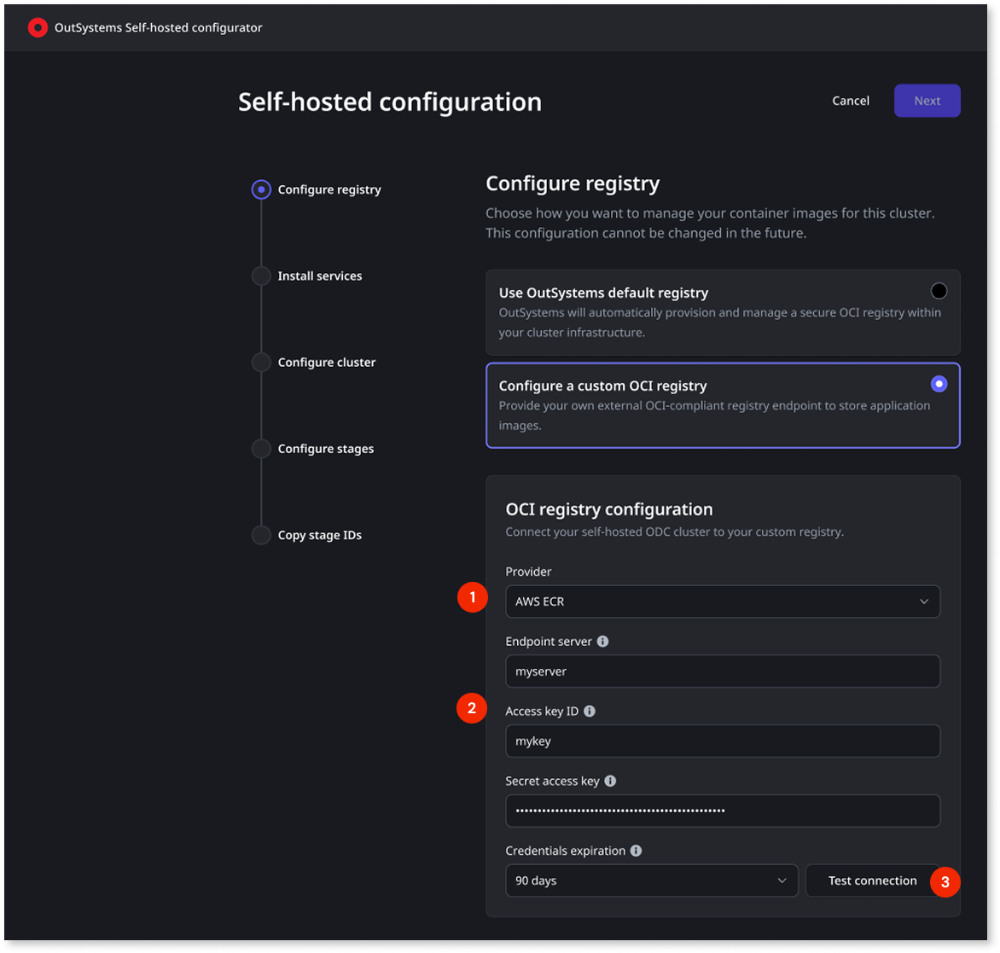

1. Click **Test connection**. When the test succeeds, click **Next**.

### Install services {#install-services}

To install services on your self-hosted cluster, follow these steps:

1. To install the required services on your self-hosted servers, click **Start Installation**.

    The installation may take up to 20 minutes.

    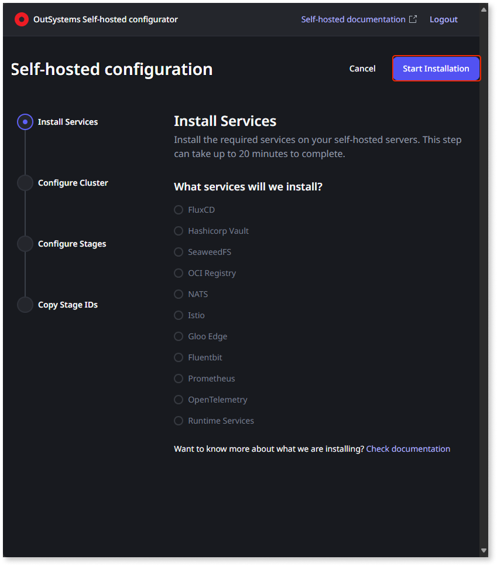

1. When the installation is complete, click **Next** to continue. The wizard will proceed to **Configure cluster** and for the Application Performance Monitoring configuration.

1. Configure the Application Performance Monitoring (APM) integration:
    1. Enter the **APM endpoint server** and **Token** for your OpenTelemetry-compatible tool.
    1. Click **Test connection**. When the test succeeds, click **Next**.

        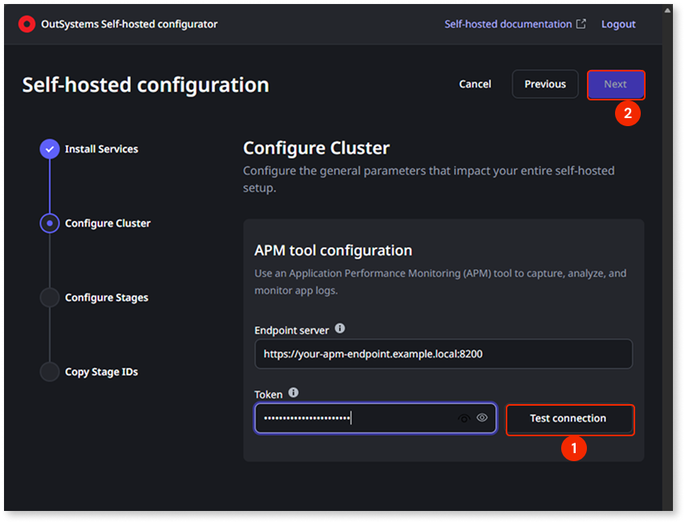

        If **Test connection** fails, verify that you meet the [connectivity requirements](sh-install-reqs.md).

1. Configure the self-hosted stage:
    1. Choose the stage you are managing in the ODC Portal, and click **Edit**.

        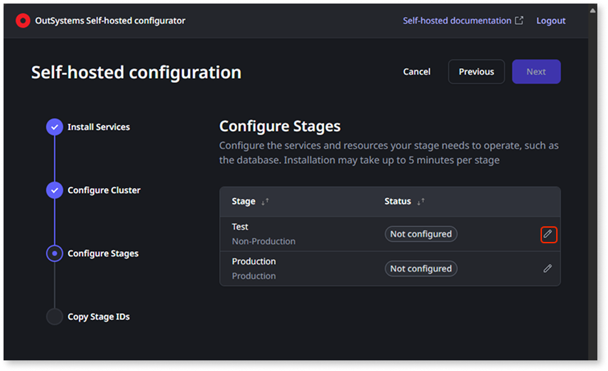

        

        For self-hosted stages, configure the **Test** stage first so you can deploy and validate your applications there, and then configure the **Production** stage.

        

    1. Configure the database connection for the selected stage:
        1. Enter the **PostgreSQL** connection details. Make sure the user for the database connection is `postgres`.
        1. Click **Test connection**. When the test succeeds, click **Save**.

            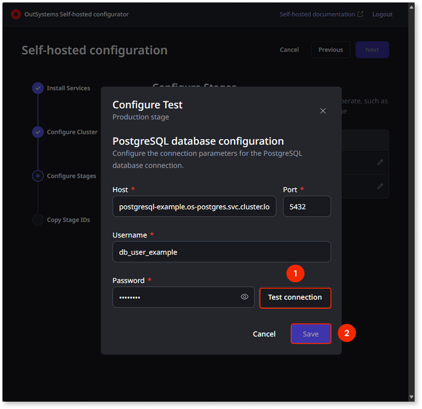

            If **Test connection** fails, verify that you meet the [connectivity requirements](sh-install-reqs.md).

        1. Click **Next**.

1. Copy the generated **stage ID** and click **Finish configuration**. You need the stage ID when you [configure your load balancer and domain](sh-domain-config.md).

    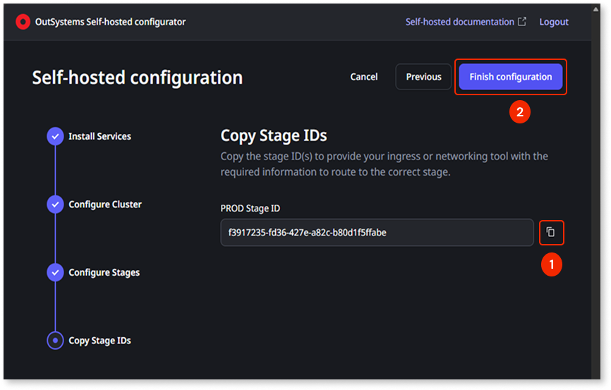

The stage appears in the **Stages** tab of the Self-hosted configurator with the status **Configured**.

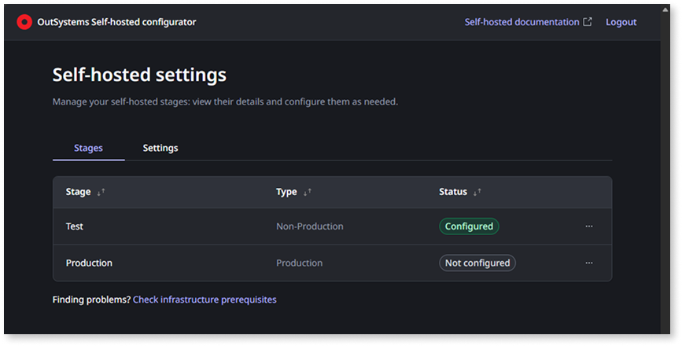

If you need to change your APM tool configuration later, you'll need to [access the Self-hosted configuratior again](sh-open-configurator.md).

The Self-hosted configurator is now complete. The remaining steps take place outside the configurator: first you configure your network infrastructure, then you return to the ODC Portal to register the domain and set up authentication.

### Configure your domain {#configure-domain}

Before going back to the ODC Portal, configure your load balancer, DNS records, and TLS certificates to route traffic to the stage ID you copied. For full configuration instructions, refer to [Configure inbound app traffic for Self-hosted ODC](sh-domain-config.md).

### Add a domain for the self-hosted stage in the ODC Portal {#add-domain}

With your infrastructure configured, return to the ODC Portal to complete the stage setup. To add a domain in the ODC Portal, follow these steps:

1. In the ODC Portal, select the confirmation checkbox, then click **Continue**.

    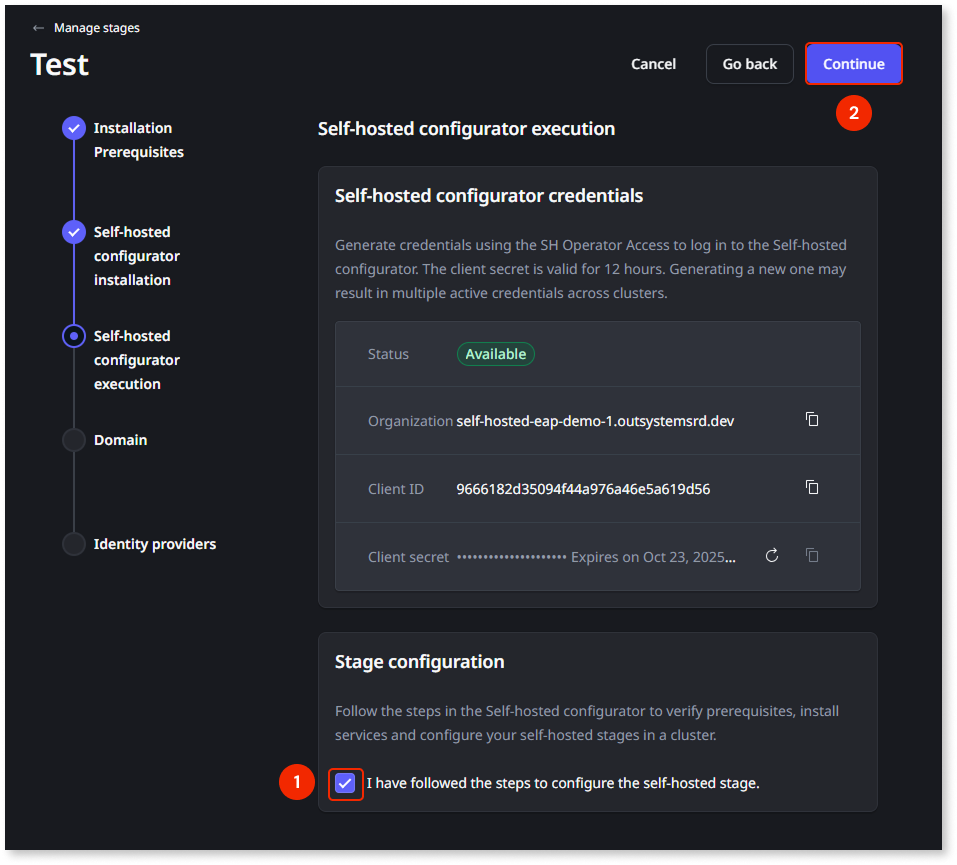

1. Paste the domain into the **Domain** field, and then click **Continue**.

    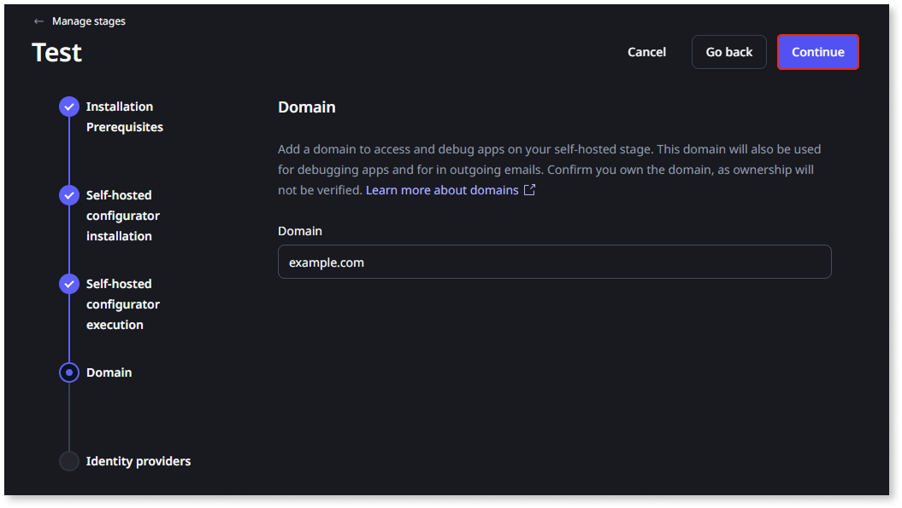

### Set up identity providers (IdPs) for the self-hosted stage in the ODC Portal {#setup-idps}

To add IdPs in the ODC Portal, follow these steps:

1. Click **Open identity providers**.

    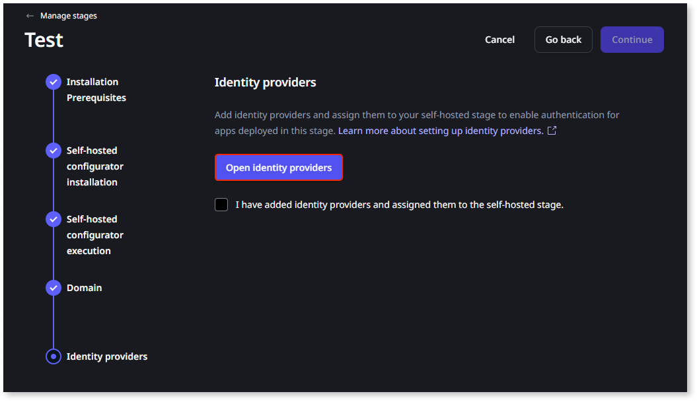

    This opens the ODC Portal's Identity providers page in a new tab.

1. At **Add provider**, under **For self-hosted** select **OpenID Connect**.

    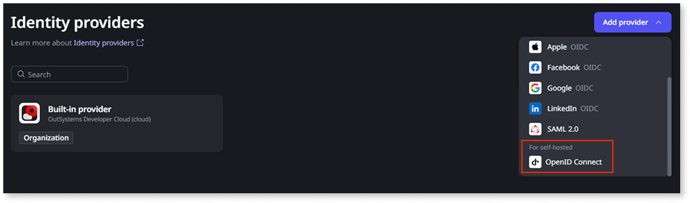

1. [Add IdPs and assign them](../external-idps/intro.md) to your self-hosted stage.

    

    The Development stage also requires an external IdP. Add a second connector under **For Cloud** and assign it to the Development stage. The built-in identity provider cannot be assigned to any stage in a self-hosted tenant. For details, refer to [Identity providers in self-hosted tenants](../external-idps/intro.md#idp-self-hosted).

    

1. Return to the tab where you're configuring your stage in the ODC Portal, select the confirmation checkbox, and then click **Continue**.

    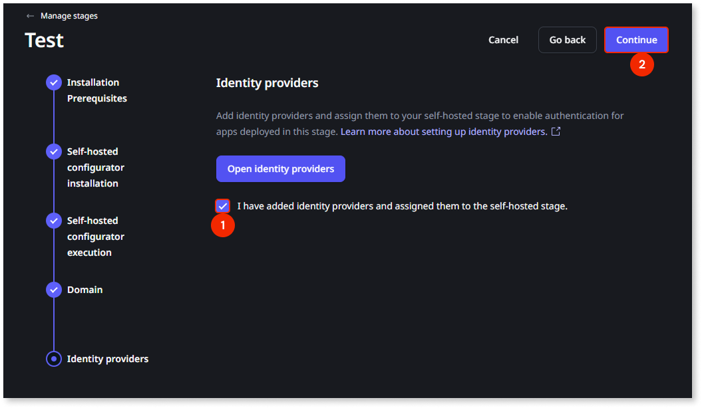

On the **Manage stages** page, the stage appears as **Configured**.

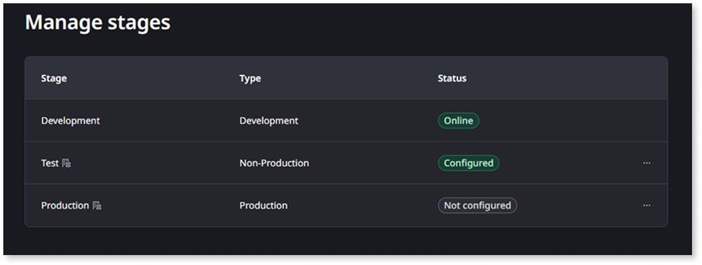

The **Online** status indicator displays only for cloud-supported stages. Self-hosted stages display their configuration status instead.

To make changes after setup, such as updating APM credentials or rotating registry credentials, refer to [Reopen the Self-hosted configurator](sh-open-configurator.md).

## Configure additional stages {#additional-stages}

To add or edit additional stages, in the ODC Portal, go to  **Management** > **Organization**, and repeat the installation procedure for each self-hosted stage. The same **Self-hosted configurator** flow applies to every stage.

## Remove a stage {#remove-stage}

To remove a self-hosted stage, contact OutSystems support. Do not attempt to remove a stage by manually uninstalling or deleting OutSystems-managed services from your cluster.

Manually removing OutSystems-managed services does not guarantee a clean state and can cause conflicts if you attempt a new installation afterward.

## Troubleshooting {#troubleshooting}

If you encounter an error, verify that you meet all system and network requirements. If the problem persists, contact OutSystems support.
