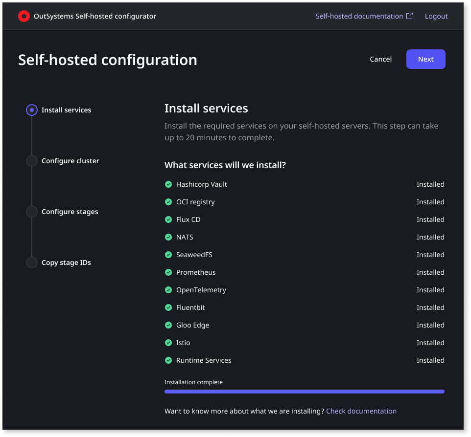
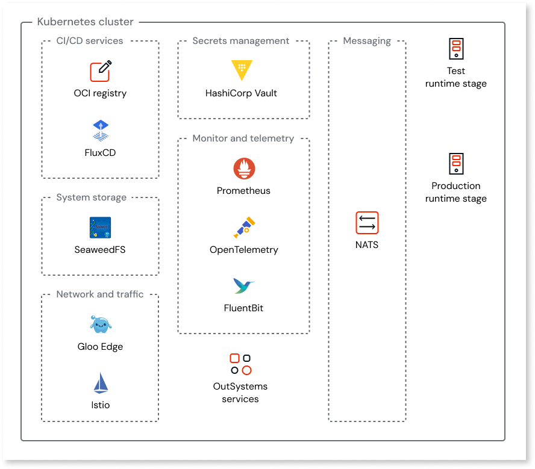

# Services installed in a self-hosted cluster

When you set up ODC self-hosted, OutSystems installs a set of services into your OpenShift cluster. These services make sure your self-hosted stages can run applications securely, reliably, and in full integration with the rest of the ODC platform.  
Each service plays a specific role, but together they form the backbone of the self-hosted stages. Some are dedicated to **security** (Vault), others to **deployment and packaging** (Flux CD, OCI Registry), and others to **reliability and observability** (Prometheus, OpenTelemetry, FluentBit).

This collection of services allows your cluster to operate as a fully functional OutSystems runtime environment. OutSystems builds, patches, and evolves these services, while you maintain the infrastructure where they run.

You’ll have visibility over the installation of these components during setup:

This article explains what is installed and why each component is necessary.

## Secrets management

Managing secrets like credentials, certificates, and tokens securely is critical in any enterprise platform. The secrets management service ensures that sensitive information is stored safely and accessed only by authorized components, without embedding it in code or configuration files.

**HashiCorp Vault** Vault provides a secure way to store and access sensitive information such as credentials, tokens, and certificates. Instead of embedding secrets directly in configuration files, they are stored centrally and accessed securely by the platform. This ensures your applications and services have the credentials they need, without exposing them in unsafe ways.

## CI/CD services

To deploy applications to your self-hosted stages, the platform must package them as container images, store those images, and ensure they are delivered correctly into your cluster. The CI/CD and deployment services make sure this process is automated, reliable, and consistent with the rest of the OutSystems pipeline.

**OCI Registry** The registry stores the application images generated during the build process. These images are versioned and securely kept so they can be deployed into your cluster when needed. It is the central repository for the containerized applications that make up your OutSystems workloads.

**Flux CD** Flux CD is responsible for applying deployments into your cluster. It continuously ensures that the applications and services running in your cluster match the desired state defined by the platform. This means that when you deploy or update an app from the OutSystems Portal, Flux CD carries out the actual work of synchronizing it with your self-hosted stages.

## Messaging and coordination

A modern platform is made up of many distributed services that must exchange information quickly and reliably. The messaging service ensures that communication between these services is fast, lightweight, and fault tolerant.

**NATS** NATS is a lightweight, high-performance messaging system used for communication between platform distributed services. It ensures reliable coordination across the distributed components that run inside your cluster. Without it, services would not be able to exchange the real-time messages they need to stay synchronized and function as a whole.

## System storage

Some platform services need persistent and scalable storage for files and artifacts that support your applications. System storage provides this capability in a way that is resilient and optimized for distributed environments.

**SeaweedFS** SeaweedFS is a distributed file system used by the platform to manage certain types of system storage. It provides durability and scalability for the artifacts and files that OutSystems services need to keep available. This enables your self-hosted stages to run reliably even as workloads grow.

## Monitoring and telemetry

To operate applications at scale, you need visibility into how both the platform and your applications are performing. Monitoring and telemetry services collect logs, metrics, and traces, and make them available for integration with your observability tools.

**Prometheus** Prometheus collects metrics from the services running in your cluster. These metrics provide visibility into the performance and health of the platform’s components. It is the foundation for monitoring the runtime environment itself.

**OpenTelemetry and FluentBit** OpenTelemetry and FluentBit gather logs and traces from applications and services, and stream them into your observability destination. This makes it possible to connect the runtime activity of your apps with the monitoring tools you already use. These components ensure that you can diagnose issues and understand how your applications are behaving at scale. To ensure platform stability, OutSystems collects telemetry data (logs, metrics, and traces) focused solely on platform health. This data is used exclusively by OutSystems to proactively detect issues and assist with troubleshooting. OutSystems doesn't collect your end-user data or business-logic data, and doesn't monitor your underlying Kubernetes cluster or hardware infrastructure.

## Networking and traffic management

The platform must securely route traffic to your applications and manage communication between services inside the cluster. Networking and traffic management services provide routing, load balancing, and service-to-service communication with built-in security.

**Gloo Edge and Istio** Gloo Edge and Istio provide the networking layer that controls how traffic flows in and out of your cluster and between services inside it. They handle routing, load balancing, and secure communication between the different platform components. This makes it possible to expose your applications safely to external users while keeping internal service-to-service communication secure and reliable.

## OutSystems runtime services

At the heart of the platform are the services that support your apps runtime. They are responsible for managing critical functions such as timers, workflows and app authentication, for example.

