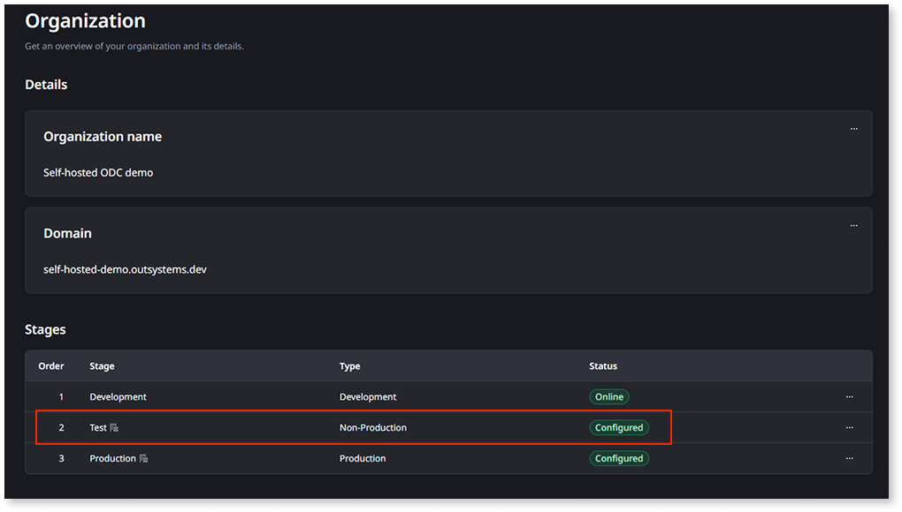
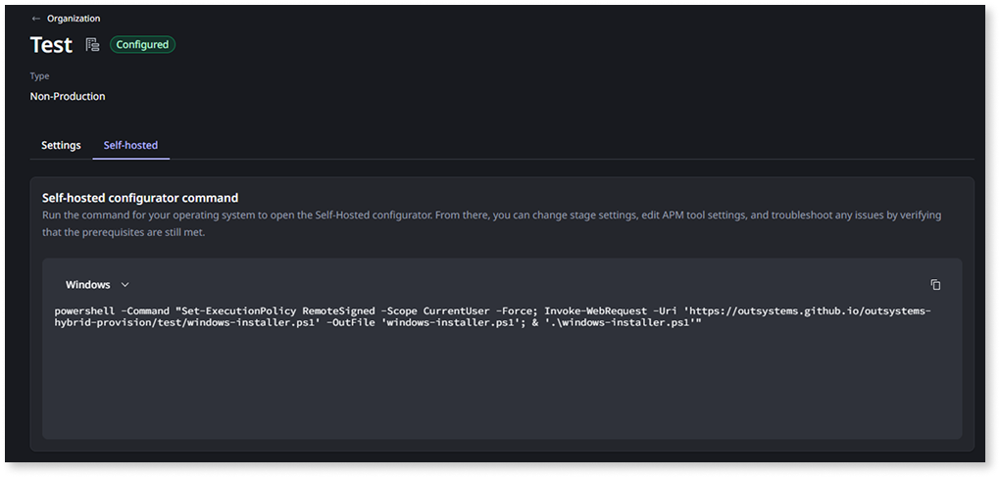
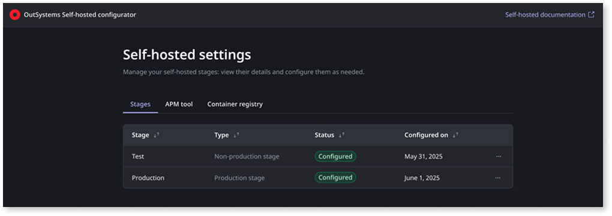

# Open the Self-hosted configurator

After your self-hosted cluster is set up, you may need to reopen the Self-hosted configurator to make changes to your configuration. Common reasons include:

* Updating your APM tool endpoint or credentials.
* Updating a stage's database connection details, for example to rotate credentials or change the port.
* Continuing stage setup.
* Updating your container registry credentials.

This article covers how to reopen the configurator on an already-bootstrapped cluster. It is not the same as running a new installation. The platform services are already installed, so you won't go through the full setup wizard again.

## Prerequisites {#prerequisites}

Refer to [Install Self-hosted ODC stages](install-sh.md#prerequisites) for the full list of prerequisites.

## Reopen the configurator {#reopen-configurator}

1. In the ODC Portal, go to **Management** > **Organization**.

    

1. In the **Stages** table, click the self-hosted stage you want to open the configurator for, such as **Test** or **Production**.

1. On the stage detail page, select the **Self-hosted** tab.

    

1. From the drop-down list, choose your operating system, and copy the **Self-hosted configurator command**.

1. In a shell session with the target cluster set as the current context, run the copied command.

    This opens the Self-hosted configurator. Because the cluster is already bootstrapped, this command opens the existing configurator rather than running a new installation.

    

    If the **Log in to Self-hosted setup** page does not open automatically, copy the URL (for example, `http://localhost:5050/`) from the shell session and paste it in your browser.

    

1. On the same **Self-hosted** tab, scroll down to **Self-hosted configurator credentials**.

1. Copy your credentials, or generate a new client secret if the existing one has expired.

1. In the Self-hosted configurator, on the **Log in to Self-hosted setup** page, authenticate using your credentials.

    What you see next depends on your cluster setup:

    * **At least one stage is already configured** — the configurator takes you directly to **Self-hosted settings**. Continue with the next step.
    * **No stages are configured yet** — the prerequisites check page appears. Select **Start configuration** to open the **Configure stages** step in the setup wizard and complete stage configuration.

1. In **Self-hosted settings**, select the tab for what you need to change:
    * **Stages** to update the database connection details for a stage, for example to rotate credentials or change the port.
    * **APM tool** to update your APM endpoint or credentials.
    * **Container registry** to update your registry credentials.

    
