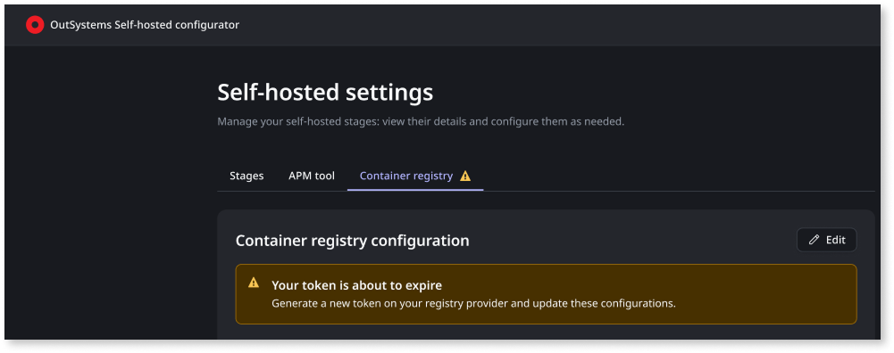
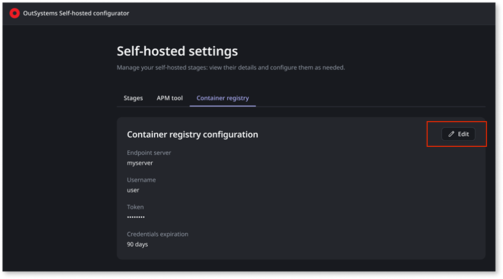

# Set up the custom OCI registry for self-hosted stages

Self-hosted ODC uses a container registry to store and serve the application container images that run in your cluster. When you deploy an application, ODC builds a container image in the cloud and syncs it to this registry, making it available to your self-hosted stages.

On OpenShift, you can let OutSystems services provision and manage an in-cluster registry, or you can provide your own. On all other supported distributions (AKS, EKS, GKE), you must provide a custom OCI-compliant registry.

This article covers the requirements and configuration for a custom OCI registry in Self-hosted ODC. If you use the OutSystems-managed registry, available on OpenShift only, this article doesn't apply.

The registry must exist and be reachable before you start the Self-hosted configurator. During setup, the configurator asks you to select a provider and enter credentials. The registry provider and endpoint can't be changed after setup.

You can share your OCI registry with other workloads. ODC does not require dedicated credentials. OutSystems stores images under a `self_hosted/` prefix to avoid naming collisions with other content in the registry.

For additional isolation, you can use a registry-level path structure during initial configuration (for example, a Harbor project or a GAR repository path) to scope ODC images to a specific location within the registry (for example, `<registry>/outsystems/<image>`). This is recommended for organizational clarity but is not a functional requirement.

## Requirements {#requirements}

Your custom OCI registry must meet the following requirements:

* It must implement the Docker Registry V2 Distribution API and return a `Docker-Distribution-API-Version: registry/2.0` header on `GET /v2/`.
* It must be accessible over HTTPS. Custom ports are supported if included in the endpoint URL (for example, `registry.example.com:8443`).
* It must exist and be reachable from the cluster before you start the Self-hosted configurator.

ODC handles repository creation automatically — you don't need to pre-configure image paths. For AWS ECR, the operator triggers the `CreateRepository` API on the first push, which is why `ecr:CreateRepository` is required. For all other providers (ACR, GAR, Harbor, Artifactory, Docker Hub), image paths are provisioned dynamically on first upload.

For Google Artifact Registry, the repository resource itself must be pre-created before setup, since the endpoint URL requires specifying it and IAM is bound at the repository level. Image paths within it are still created automatically.

## Capacity and retention {#capacity-retention}

Provision an initial 150 GB of storage for the initial setup. Ensure the storage is scalable, as the overall size of the container registry will grow as more applications are promoted to self-hosted stages.

When configuring retention and garbage collection policies on your registry, follow these rules:

* Do not create cleanup policies to delete images or tags.
* Do not restrict repositories to a single tag.
* Pruning untagged manifests older than 7 days is permitted.

Immutability is optional. ODC uses SHA256 digest references for internal consistency, so tag-locking doesn't affect functionality. You can enable it on production repositories for compliance purposes without impacting ODC operations.

## TLS and certificates {#tls-certificates}

Your registry must present a TLS certificate trusted by the cluster's CA bundle.

The named providers (AWS ECR, Azure ACR, Google Cloud GAR) use publicly trusted certificate authorities, and usually, no additional configuration is needed.

For registries that use a private or self-signed certificate authority, add the CA certificate to the cluster's trusted certificate store before running the Self-hosted configurator.

## Provider credentials {#provider-credentials}

Set up credentials on your registry provider before you start the Self-hosted configurator. The configurator asks for these during setup and can't proceed without them. Required fields and permissions vary by provider.

### AWS ECR {#aws-ecr}

Before you start the Self-hosted configurator, create an IAM access key for a user or role and have the following ready from your AWS account.

| Field | Description |
| --- | --- |
| **Endpoint server** | The ECR registry URL, for example `AWS_ACCOUNT_ID.dkr.ecr.AWS_REGION.amazonaws.com`. |
| **Access key ID** | The access key ID for the IAM user or role. |
| **Secret access key** | The corresponding secret access key. |
| **Credentials expiration** | How long until the credential expires: 30, 90, 180, or 365 days. |

The IAM user or role must have the following permissions. Apply them account-wide (`"Resource": "*"`) — some permissions, such as `ecr:GetAuthorizationToken`, can't be scoped to individual repository ARNs.

* `ecr:GetAuthorizationToken`
* `ecr:BatchCheckLayerAvailability`
* `ecr:GetDownloadUrlForLayer`
* `ecr:BatchGetImage`
* `ecr:PutImage`
* `ecr:InitiateLayerUpload`
* `ecr:UploadLayerPart`
* `ecr:CompleteLayerUpload`
* `ecr:CreateRepository`
* `ecr:BatchDeleteImage`

### Azure ACR {#azure-acr}

Before you start the Self-hosted configurator, create a service principal in Azure Active Directory and have the following ready from your Azure account.

| Field | Description |
| --- | --- |
| **Endpoint server** | The ACR login server URL, for example `REGISTRY_NAME.azurecr.io`. |
| **Client ID** | The service principal application (client) ID. |
| **Client secret** | The service principal client secret. |
| **Tenant ID** | (Optional) The Azure Active Directory tenant ID. |
| **Credentials expiration** | How long until the credential expires: 30, 90, 180, or 365 days. |

Assign the service principal the `AcrPush` role, which covers both push and pull operations. You can scope the assignment to the entire registry or restrict it to specific repositories.

### Google Cloud GAR {#google-cloud-gar}

Before you start the Self-hosted configurator, create a service account and have the following ready from your Google Cloud account.

| Field | Description |
| --- | --- |
| **Endpoint server** | The registry endpoint, including project and repository path, for example `REGION-docker.pkg.dev/PROJECT_ID/REPOSITORY`. |
| **Service account key** | The service account JSON key file. |
| **Credentials expiration** | How long until the credential expires: 30, 90, 180, or 365 days. |

Assign the service account the `roles/artifactregistry.writer` role, scoped at the repository level through IAM binding. This role covers both push and pull operations.

### Other {#other}

Before you start the Self-hosted configurator, have the following ready from your registry.

| Field | Description |
| --- | --- |
| **Endpoint server** | The registry endpoint URL. |
| **Username** | The username for authentication. |
| **Token** | The access token or password. |
| **Credentials expiration** | How long until the credential expires: 30, 90, 180, or 365 days. |

The token must have push, pull, list, and delete permissions on the target repository.

The following table shows the credential type and required permissions for common registries that use the Other path.

| Registry | Credential type | Required permissions | Scope |
| --- | --- | --- | --- |
| Harbor | Robot account | Push and pull project rights | Specific project |
| Artifactory | User token | Deploy and Read | Specific repositories |
| Docker Hub | Personal access token | Read and Write | User namespace |

## Credentials expiration {#credentials-expiration}

During setup, you select how long your registry credentials are valid: 30, 90, 180, or 365 days. The value you enter must match the actual expiration of the token you generated on your registry provider. The platform relies solely on this value and never validates it against the registry.

When credentials are about to expire or have expired, the Self-hosted configurator displays a warning or an error on the **Container registry** tab in the settings homepage. For example:

OutSystems sends an email notification ahead of the expiration date to all users with the **Manage stages** permission.

When credentials expire, the sync between the ODC cloud registry and your self-hosted registry stops. Apps already running are unaffected. Deployments of new revisions to self-hosted stages may fail due to the image not being present in the self-hosted OCI.

When you update and save new credentials, the sync catches up automatically. No revisions published during the outage are lost and no manual steps are needed.

## Manage credentials after setup {#manage-credentials}

The **Container registry** tab in the Self-hosted configurator settings is available only for custom registry configurations. If you use the OutSystems-managed registry in OpenShift, this tab is not shown.
To access the settings, reopen the Self-hosted configurator. Refer to [Reopen the Self-hosted configurator](sh-open-configurator.md).

AWS ECR, Azure ACR, and Google Cloud GAR all support multiple active credentials simultaneously, so you can activate new credentials before revoking the old ones — zero-downtime rotation is possible. For **Other** registries, verify this with your provider before rotating.

To update or rotate your credentials, follow these steps:

1. If rotating, generate a new credential on your registry provider first.
1. In the Self-hosted configurator, go to the **Settings** page and select **Container registry**.

    

1. Click **Edit**, update the authentication fields and, if needed, the **Credentials expiration** value.
1. Click **Test connection**. When the test succeeds, click **Save**. The platform propagates the new credential within seconds.
1. If rotating, confirm deployments work, then revoke the old credential on your provider.
