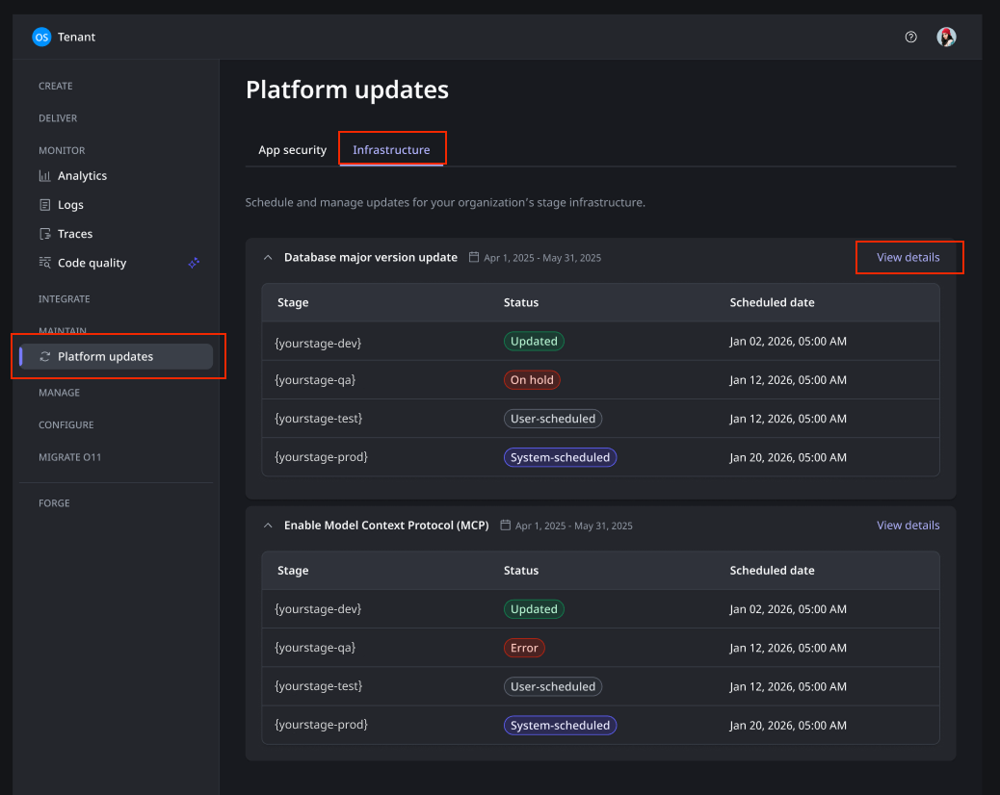
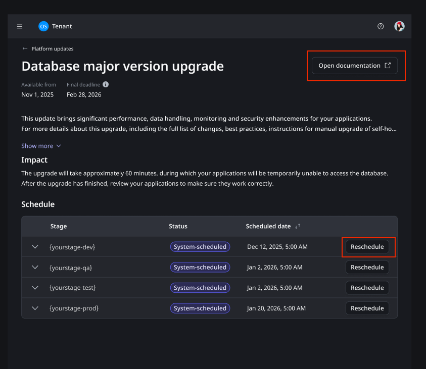
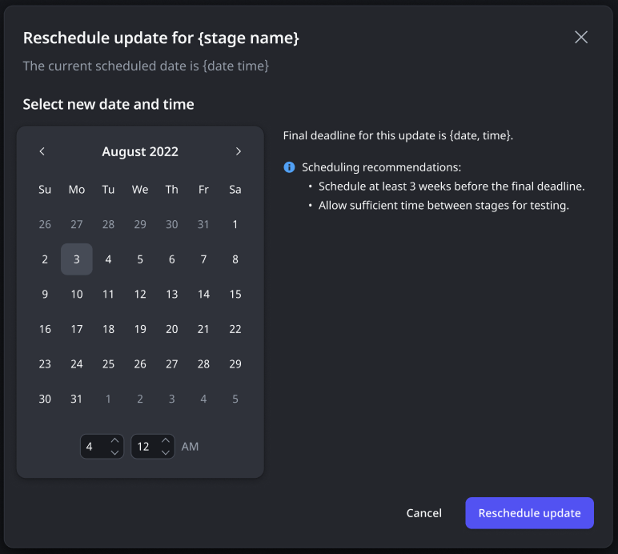

# Managing platform infrastructure updates

Whenever OutSystems updates the ODC platform infrastructure, it's done within a set time window. Within that time, you have the flexibility to reschedule these updates for each stage of your tenant. This allows you to pick the most convenient time to prepare for the changes and ensure a smooth update process.

## Where to find the upcoming updates

In your ODC Portal you can find a list of all scheduled updates on your infrastructure, see there details and reschedule any of the operations. To do this:

1. On the ODC Portal, click **Maintain** -> **Platform updates**. This opens the Platform updates screen.

1. On the Platform updates screen select the **Infrastructure** tab.

1. Here, you'll find a list of all upcoming updates, with information on:

    * The update scope/short description.
    * The time-frame in which the update occurs.
    * The affected stages, the status of the update and the scheduled date for the update to run.

Here you can also get to the details page, by clicking in **View details**. This allows you to get more detail on the update, re-scheduled it, and check the documentation for any breaking changes.

## Rescheduling an update

When you open a details screen, you can see detailed information on the update. Namely, a more detailed description, its impact, the available time-frame, access to the update documentation, and options to re-schedule for any of your stages.

To rescheduled, do the following:

1. Click on the rescheduled button for the desired stage. This opens a pop up.
1. In the pop up select the desired date for the update, and click **Reschedule update**.

The schedule table changes the scheduled date for your selection and the status changes to **User-scheduled**.

## Updates life cycle

Updates have a life cycle and within that life cycle the process goes through several different states:

* Before the update starts:
    * **Checking update**. This is a process that runs on your tenant before the update to ensure your tenant is ready for the update.
    * **System scheduled.** When the Checking update ends and the update is possible on your tenant, the system defines a date for the update. If you don't reschedule it, the update runs on that defined date.
    * **User scheduled.** Whenever you decide to reschedule an update the update changes the date when it runs and changes the state.
    * **Skipped.** This update is not necessary for your tenant and won't be applied.
    * **Canceled**. Whenever an update is canceled by OutSystems, this state becomes visible.

* During the update:
    * **In progress**. During the update this status indicates that the update is running.
    * **Pending update.** This indicates that the update is still going but something is preventing the update to finish.

* After the update:
    * **Updated**. The update finished with success, if there are breaking changes you should test for them to ensure they're fixed.
    * **Error**. There was an error during the update. You get notified of this error and an automatic reschedule happens.

## Other considerations on the updates

1. Updates are mandatory and you can't reschedule them outside of the defined time-frame.

1. Always make sure to check the documentation page for the update to check for breaking changes and guidance on what to do in case of any.

1. It's recommended that you do the update on dev first, test the update and then do the remainder stages. This is especially important if the update introduces breaking changes.
