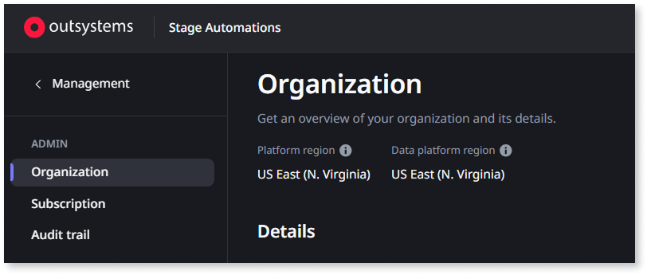

# View your ODC subscription and organization information

ODC Portal gives you two places to check information about your ODC. Use the subscription console for your subscription details, consumption, and add-ons. Use the Organization screen for your Platform region and Data platform region.

The subscription console is a centralized hub for viewing application objects (AOs), end-users, and add-ons. To access the subscription console, in the ODC Portal go to **Management** > **Admin** > **Subscription**.

The subscription console is only accessible to users with the **View subscription** permission in ODC Portal.

The subscription console has three main areas.

* **Subscription information.** This displays your Edition, End-date, and Activation code.
* **Overview tab**. This gives you a high-level view of all relevant parameters of your subscription.
* **Add-ons tab**. This gives you information on the available add-ons and if you have subscribed to them or not.

Your organization has allocated resource limits for runtime resources. These capacities, defined by your subscription, determine the maximum usage limits for each resource. For more information, refer to [Monitor ODC resource capacity](../getting-started/capacity-limits.md).

## Overview tab {#overview-tab}

The **Overview** tab provides visibility of all your relevant consumptions. Entitlements are grouped into two levels:

* **Organization**: Entitlements that apply across your entire organization.
* **Portfolio**: Entitlements that apply to a specific [portfolio](portfolios/portfolios-overview.md) (for example, **B2C Apps**) and are tracked per stage.

To access the details page of each entitlement, click on the corresponding panel.

### Organization entitlements {#organization-entitlements}

The following entitlements apply at the organization level:

* [Application objects](https://www.outsystems.com/tk/redirect?g=cd994c70-9dcc-46ed-b423-84099beac39a). You can see your overall application objects count, and consumption, on your production stage(s). If you click on it, the detailed view will appear, where you can see information by stage and by asset.

    

    Both organization and stage AO totals are updated daily and can take up to 12 hours to update on the ODC Portal.

    

* [External end users](https://www.outsystems.com/tk/redirect?g=907b0fd3-bc46-4391-aae2-673296d795d9) and [Internal end users](https://www.outsystems.com/tk/redirect?g=907b0fd3-bc46-4391-aae2-673296d795d9). Displays the number of external and internal end users available and consumed in your production stage(s). In the details, you can define [your user domains](../user-management/classify-users.md) to manage your users correctly.

    

    The ODC end-user count is calculated daily from the unique count across all production stages and can take up to 12 hours to update in the ODC Portal.

    

* [Agent executions](https://www.outsystems.com/tk/redirect?g=9fafc3bd-31db-46b9-99a5-36d7aaaaebc8). Displays the number of times agents were executed in the current month. In the details, you can filter the information by stage and by month starting from November 2025.
* [Analytics stream](../getting-started/capacity-limits.md#resource-limits). Displays the combined volume of app logs, traces, and metrics streamed per month from your organization.

### Portfolio entitlements {#portfolio-entitlements}

The following entitlements apply at the portfolio level:

* [Compute instances](../getting-started/capacity-limits.md#resource-limits). Here you can see the total number of instances, and consumption, that are available to be used for all apps. In the detailed view, you can see the number of consumed/available instances by stage, and filter by asset and by time.

* [Custom code execution duration](../getting-started/capacity-limits.md#resource-limits). This displays the amount of time, in seconds, and the consumption, that all custom code functions in a stage can execute per day. In the details, you can see this information by stage and filter by Libraries and by time.
* [Database compute](../getting-started/capacity-limits.md#resource-limits). Displays the amount of compute resources allocated to the database and consumption, that is shared across all apps. In the details, you can see the information by stage and filter it by time.
* [Database storage](../getting-started/capacity-limits.md#resource-limits). Displays the amount of storage allocated to the database and consumption, that is shared across all apps. In the details, you can see the information by stage and filter it by time.

## Add-ons tab {#add-ons-tab}

The **Add-ons** tab provides visibility of the add-ons to which the organization is subscribed and add-ons that are available for subscription. Add-ons are grouped into two levels:

* **Organization**: Add-ons that apply across your entire organization.
* **Portfolio**: Add-ons that apply to a specific portfolio (for example, **B2C Applications** or **Internal Apps**).

## Platform region and Data platform region {#platform-regions}

ODC Portal shows two types of region information for your organization. Use them to verify data residency for compliance purposes and to allowlist the correct IP addresses for [streaming analytics and audit trail data](odc-public-ips.md#streaming-analytics-audit-trail).

* **Platform region**. The geographical region where your ODC platform is hosted and executed.
* **Data platform region**. The geographical region where your ODC operational data is hosted. This includes telemetry, logs, and analytics data.

**Data platform region** is usually the same as **Platform region**, but it can differ, because the Data platform runs in a hub region shared by several customer regions. For the complete mapping, refer to the [Data residency](platform-architecture/intro.md#data-residency) section of Cloud-native architecture of ODC.

To view your **Platform region** and **Data platform region**, in the ODC Portal go to **Management** > **Organization**.

