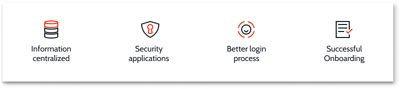

# Manage Users

This article provides an overview of how users set their names and passwords, and how authentication works in OutSystems.

With the OutSystems identity service:

* Information is stored in a centralized location
* Apps are more secure because the identify service manages all background identity
* One user - one identity - one login streamlining the login process
* Onboarding new users is easier:
    * Users receive an email with login information
    * Users enter their personal information including their name, their email, and a password
    * Users manage their own profiles
  

OutSystems users are given permissions to perform tasks like creating and managing users, creating apps, and monitoring or troubleshooting applications.

Currently all users have the same permissions enabling access and use of all the available functionality. This means you can perform tasks that are usually restricted to only those with the proper permissions. For example, like adding users to your OutSystems or organization account.

## Organization (Technical) user

Once an Organization user logs into the portal, they can:

* Access all developer or administrative users
* Invite other users by sending them an email
    * When the user receives email, they click on the link
    * Users set their name and password and complete their profile
    * Users are logged into the portal and see a list of available apps

Email addresses sometimes referred to as user names cannot be changed.

## Deactivating users

For security purposes or if a user is on an extended leave, you might want deactivate their account. When you deactivate a user, they cannot login and their permissions are suspended.

To deactivate a user, from the Users & Access portal, select the user, and then click **Deactivate user**. You can verify the user is deactivated, by selecting **Inactive** from the **Status** drop down. A list of all Inactive users displays.

## Resetting passwords

For security, only users can change their passwords. To initiate the change password process, from the Users & Access portal, select the user whose password needs to be set, and click **Reset password**. An email is generated and sent to the user for them to create a new password.

## Password Requirements

The following list shows the minimum password rules when defining a password.

* The password must be at least 10 characters long
* The password must contain at least:
    * One upper case letter
    * One lower case letter
    * One numeric digit
    * One special character from this set ("!", "\"", "#", "$", "%", "&", "'", "(", ")", "*", "+", ",", "-", ".", "/", ":", ";", "<", "=", ">", "?", "@", "[", ")

The best password is one that is hard for other people to figure out. As a best practice, consider creating a phrase that only you know, like MyFamilyHas2PeopleBornOnThe13!

## Authentication

Authentication is the process of identifying and validating users who want access to OutSystems tool and apps. OutSystems uses a keycloak, a tool that allows single sign-on with identity and access management. A keycloak verifies that users have access to the apps and files they are requesting by checking the database to verify what a particular user can access and maintain.

Users are associated with and authenticated against the organization to which they are a member.  When users authenticate, their credentials are verified. Once authenticated, users continue on their journey and if they switch apps, they don't need to re-authenticate.
