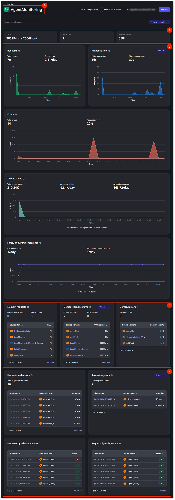

# Agent monitoring in ODC

Agent monitoring is in Beta. For more information about Beta features, refer to [OutSystems product releases](https://success.outsystems.com/support/release_notes/outsystems_product_releases/#beta). If you want to try this new capability contact your OutSystems account team.

Agent monitoring gives visibility into how agents behave. What's their consumption, how fast they respond, what they were actually prompted with, and whether their responses are relevant and safe.

Monitoring is divided into three groups:

* **Consumption analytics** answer "how much is this agent consuming"?.
* **Quality scores** answer "were the agent's responses actually good and safe?"
* **Performance analytics** answer "is it fast enough, and is it performing consistently without errors"?.

For both quality scores and performance analytics, you also have the option to drill down into **detailed execution traces**, which answer "what exactly happened during this specific execution?".

Agent monitoring data is shown in four layers, with a progressive disclosure of information:

| Layer Number | Layer | What it shows | Format | Retention period |
| --- | --- | --- | --- | --- |
| 1 | Aggregated analytics | In and Out token consumption, Safety score and Answer relevance | Aggregated result for the selected period | 30 days |
| 2 | Time bounded analytics | Information about Requests, Response times for each percentile, Errors, Tokens consumed, Safety score and Answer relevance | Per day for the selected period | 30 days |
| 3 | Element detailed analytics | Detailed information per element on Requests, Response times, Errors | Tables organized by element | 30 days |
| 4 | Request detailed analytics | Detailed information on Errors, Speed, Relevance, and Safety | Tables organized by requests | 30 days |

## Where to start

In the ODC Portal, go to the Analytics console and select the agent you want to monitor. From there:

* If you want to see an agent consumption and performance, go straight to [agent performance analytics](agent-cost-performance-analytics.md).
* If you want to access the agent's answers relevance or safety, see [quality analytics](quality-signals.md).
* If you need to diagnose a specific unexpected response see [View an agent trace](view-a-production-trace.md) for the details on what you can see on the detailed execution traces.
* If you want to see detailed information for a specific element, select the element from the Search for elements drop-down (5). This shows you the detailed analytics captured for that element.

## Permissions

**Access asset logs and traces** stage permissions govern agent monitoring. So, if you have access to monitoring and troubleshooting for other assets, you also have access to agent monitoring.

For detailed execution traces you'll need [detailed execution traces](detailed-execution-traces.md) turned on first for each agent you want to monitor.
