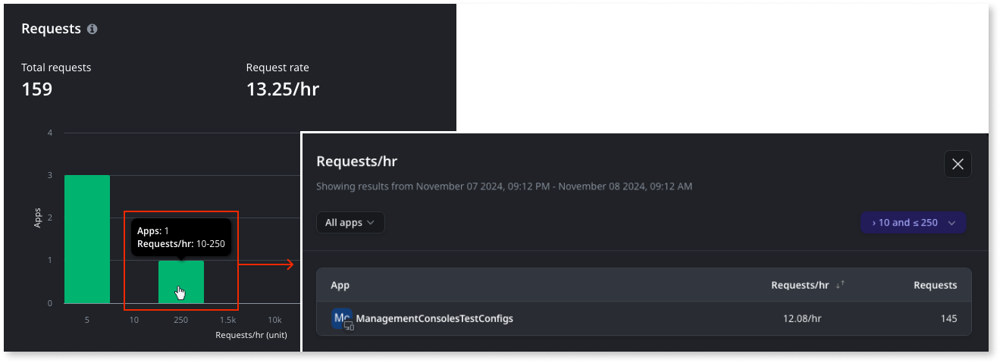

# Monitor app analytics in ODC Portal

OutSystems Developer Cloud (ODC) provides an app analytics dashboard that monitors apps based on performance, usage, and errors.

The dashboard shows the following key metrics:

- Health score: How your apps perform, considering response times, successful requests, errors, and etc.
- Top apps by usage: A list of apps with the most users and requests per day.
- Requests: The total usage of your apps in the number of requests and their rates.
- Errors: The amount of errors and the error rate for all requests.
- Response time: The time the server takes to handle a request. 

Based on the health score, the dashboard organizes the apps into **Critical**, **Moderate**, and **Good** categories, allowing you to focus on the poorly performing apps. You can identify and debug potential issues from the dashboard by drilling down into the app's historical trend of key metrics.

The analytics dashboard provides an overview of the apps of a selected stage for up to 30 days. You can click the graphs for metrics such as errors, response time, and requests to view detailed information.

    

## App analytics

You can drill down into specific apps to get more information about how the app behaves.

For each app, the analytics dashboard provides insights such as:

- Health score
- Active users
- User geolocation with performance and error data by region
- Browser information
- Error and response time
- Element requests, response time, errors
- Request, request with errors, and slowest requests

Geolocation information can take up to 20 minutes to synchronize with active user data.

Some of the benefits of these analytics dashboard insights are:

- Identify how many users experience issues and analyze their locations and browsers.
- Monitor app usage and assess performance trends across regions.
- Compare metrics to evaluate app performance in different locations.

You can drill further down into an element and view the historical trends of the metrics. After identifying the elements causing issues in the app, reviewing the logs and traces from the error period can further help pinpoint the problem. The trace details include browser and user location.

You can click the request with errors and the slowest request to display a trace of that element to debug it. For more information about logs and traces, refer to[ Monitor and troubleshoot apps](monitor-apps.md)

Apps published before November 11, 2024, might not send data geography metrics correctly for some traces.

## Metrics

App analytics helps you understand how your apps are performing. It summarizes the following metrics.

### Health score

An app's health score is expressed as a numerical score from 1 to 100 and is based on the app's response time and errors during the selected period of time (minimum 5 minutes, maximum 30 days). There are three health score categories:

- Critical (0-70)
- Moderate (70-85)
- Good (85-100)

An app's health score calculation follows the Application Performance Index (Apdex) industry standard.

The score is calculated by taking the number of successful requests to the app's elements and dividing it by the total number of requests over the selected period. A request is successful if it's completed without errors and the response time is less than a defined threshold.

### Active users 

The number of unique users visiting the app helps you understand its usage over time.

### Geography

Geographical distribution of users, errors, and overall end-user response time for this app. You can sort the data by unique users, errors, and user response time. There are three categories:

- Countries with users
- Countries with errors
- Response time by country

### Browser

Distribution of browser usage among end-users accessing this app. It categorizes browsers into Chrome, Safari, Edge, Firefox, and Opera. Any other browsers are grouped under **Other** in the data.

### Errors 

Errors are the issues that occur when requests are made to an app, which causes it to malfunction or crash. There are three error metrics:

- Total errors: The total number of errors that occur when requests are made to an app.
- Error rate: The rate at which errors occur when requests are made to an app.
- Error percentage: The percentage of requests that resulted in errors.

### Response time 

Response time is the amount of time taken to complete a request. The nth percentile response time is the duration under which n% of requests are completed. There are three response time metrics:

- P90:  90th percentile response time
- P95: 95th percentile response time
- P99: 99th percentile response time

### Requests 

Requests are the number of app interactions done using screens, APIs, or timers. There are two request metrics:

- Total requests: The total number of requests made to an app.
- Request rate: The rate at which the requests are sent to an app.

## Element metrics

### Element requests

A list of elements by type and their daily amount of requests. There are two element metrics:

- Elements
- Elements types

### Element response time

A list of elements with the highest response times. There are two element metrics:

- Others
- Timers

### Element errors

A list of elements with the highest error percent.

### Request with errors

A list of requests from elements in this app that failed.

### Slowest errors

A list of requests from elements in this app that took 2 seconds or longer to execute.
