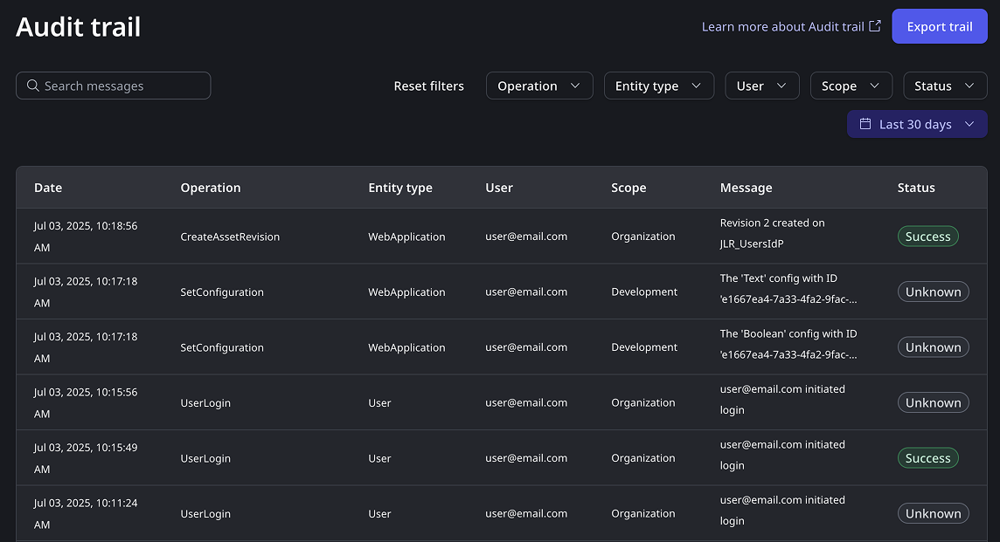

# Audit trail

This functionality uses the Data platform, which may process data outside your ODC organization region to provide its capabilities. For more information, refer to [Data platform](../manage-platform-app-lifecycle/platform-architecture/intro.md#data-platform).

Within the OutSystems ODC platform, an **audit trail** is a critical, chronological record of actions that have affected specific platform operations. This evidence is crucial for fulfilling compliance initiatives and organizational policies, as most forms of auditing are subject to industry standards such as HIPAA and SOX, or country-specific legal regulations.

Essentially, an audit trail offers a simple yet highly effective way to track temporal information. Every significant action creates a record detailing what happened and when. For effective analysis, these records must be collected in a central place where they can be searched, correlated, and analyzed – for ODC, this central place is the **ODC portal** > **Manage** > **Audit trail**.

ODC's audit trail provides you with a comprehensive, immutable record of significant actions and changes within your environment. It helps you monitor security, maintain compliance, and troubleshoot operational issues by clearly showing who did what, where, and when across your platform. Audit trails offer significant advantages:

* **Compliance**: Verifiable documentary evidence to meet regulatory standards and internal policies.

* **Troubleshooting**: Help diagnose operational issues by revealing who made changes, where, and when.

* **Incident response**: Crucial for reconstructing events, tracing malicious activity, and understanding the scope of any breach.

## Prerequisities

Before you can view or export audit logs, you must have the **Audit Trail View** role.

## View audit trail in the ODC Portal

From the **Audit trail** interface, you can:

* **View logs from the last 30 days**: You can access a rolling 30-day log history directly in the Portal. Audit logs up to 3 months old [can be exported to CSV](#export-csv).
* **Search and filter log attributes**: Easily find what you're looking for by searching and filtering on core log attributes.

The logs display the most important information about **platform operations**. You can understand:

* **What action happened**: See the specific operation performed.

* **What entity it happened to**: Identify the resource affected.

* **Where it happened**: Pinpoint the environment or scope.

* **When it happened**: Get the exact timestamp.

* **Who did it**: Know which user performed the action.

    

### Exporting logs to CSV { #export-csv }

You can export your logs to a CSV file. This gives you even more flexibility:

* **Access three months of data**: When you export, you can retrieve logs up to 3 months old.

* **Export advanced log attributes**: Get detailed information by exporting advanced log attributes that aren't visible in the ODC Portal.

* **Upload into your SIEM tool**: Upload your Audit Trail data to your Security Information and Event Management (SIEM) tool of choice for further analysis.

To download your logs, click the **Export trail** button. This downloads a CSV file directly to your local machine.

#### Export limitations

Keep the following in mind when exporting:

* **Export up to 50,000 log rows**: If your selected date range contains more than 50,000 log rows, an error is displayed, and the download will be blocked. To resolve this, select a smaller date range.

* **Export 20 files per day**: You can export a maximum of 20 files per day. To re-download the previously generated files from the last 24 hours, click **Export Trail**.

## Track auditable events

ODC's Audit Trail helps you oversee operations critical to data security and operational integrity. ODC tracks the following types of auditable operations. These operations relate to user actions and configurations made in the ODC Portal, ODC Studio, and through OutSystems Public APIs.

Audit trail logs do not track actions made within your app's runtime.

### User Login

 Track detailed records of successful logins in your tenant to monitor and analyze access activity.

* User Login

### User Management

Track changes made to user accounts, providing transparency and accountability for administrative actions within your system. This includes actions such as:

* Invite User

* Accept Invite

* Password Reset

* Create User

* Delete User

* Grant Org Role to User

* Revoke Org Role from User

* Grant End User Role to User

* Revoke End User Role from User

### Role Management

Track how you grant and revoke access within your organization. This includes both internal and end-user roles.

* Create org role

* Delete org role

* Update org role

* Create end user group

* Delete end user group

* Update end user group roles

* Assign users to  end user group

* Unassign users from  end user group

### Asset management

Get a detailed record of actions on your core app development resources, including web app, mobile app, workflows, libraries, external libraries, widget libraries, external connections, search connections, extension libraries, AI agents, and AI models.

* Create asset

* Create asset revision

* Delete asset

* Publish asset

* Deploy asset

* Undeploy asset

* Apply configuration

* Set configuration

* Update configuration

* CreateExternalConnection  
  
* CreateSearchServiceConnection  

* CreateMCPConnection

* DeleteExternalConnection

* DeleteSearchServiceConnection

* DeleteMCPConnection

## Understanding log attributes

There are two types of log attributes: **Foundational** (visible in the ODC Portal) and **Advanced** (visible in CSV exports).

### Foundational attributes

Foundational attributes help you understand key details about each action directly in the ODC Portal interface.

| **Attribute name** |              **Definition**                             |
| ------------------ | --------------------------------------------------------|
| **Date**  |The timestamp of when the audit event was recorded. |
| **Operation** | The specific action you performed.  |
| **Entity type**|The type of entity affected by the action. |
| **User** |The human-readable username of the user who performed the action (often an email address). |
| **Scope**  |The human-readable name for the development stage. If not applicable to a stage, this displays ``Organizational``. |
| **Message** | A descriptive message detailing the effect of the action you took.   **Note:**  The message in the ODC Portal **describes the difference** between the previous and updated configuration values. When you export your logs, the **EntityOldValue** and **EntityNewValue** fields show a **complete view of the changed values**.|
| **Status** |The outcome of the operation:<li>**Success**: The operation completed as expected. </li> <li>**Failed**: The operation started but didn't complete.</li><li> **Unknown**: The operation started, but its completion status isn't confirmed (often indicates a system issue).</li> |

### Advanced attributes

When you export your audit data to a CSV file, additional, more detailed attributes are provided.

| **Attribute name**              |                 **Definition**                |     **Data type**       |
| ------------------------------- | --------------------------------------------- | ----------------------- |
| **Event_EventId**| A unique identifier for the audit event. |  String (unique alphanumeric ID)  |
| **Event_TenantId** | The unique identifier for your tenant (organization or customer account). | String (UUID) |
| **Event_EnvironmentId**| The unique identifier of the development stage where the event took place. | String (UUID) |
| **Event_EnvironmentName** |The human-readable name of the development stage (for example, `Production`, `Staging`, or `NonProduction1`). | String |
| **Event_DateTime**| The timestamp when the audit event was recorded. | ISO 8601 Date-Time String (for example, `2025-02-13T14:35:20Z`)  |
| **Event_Request_SourceIp**|The IP address of the user or system that initiated the request. |String (IPv4 or IPv6 address)  |
| **Event_Request_TraceId** | A unique identifier used to trace the request across distributed systems.  |  String (UUID)  |
| **Event_Request_UserId** | The unique identifier of the user who performed the action. | String (UUID) |
| **Event_Request_UserName**| The human-readable username of the user who performed the action (for example, `john.doe\@example.com`). | String|
| **Event_Request_EntityType** | The type of entity affected by the action.  |  String (for example, `User`, `OrgRole`, or `Application`) |
| **Event_Request_EntityId**  | The unique identifier of the affected entity. | String (UUID) |
| **Event_Request_EntityName** |The human-readable name of the affected entity (for example, `Developer`, `Team A`, `HR Mgmt App`, `john.doe\@example.com`). | String |
| **Event_Request_EntityOldValue** | The previous value of the affected entity before the action occurred. | JSON (for example, { `role: user` })|
| **Event_Request_EntityNewValue** | The updated value of the affected entity after the action occurred. |  JSON (for example, { `role: user` }) |
|**Event_Request_Action** | The specific action that was performed.| String `(for example, EndUserRoleGrant, OrgRoleUpdate, AppDeploy)` |
|**Event_Effect_Message**| A descriptive message detailing the effect of the action taken. |String (for example, `User permissions updated successfully`) |
|**Event_Response_Status**| The outcome of the operation. |<li>**Success**: The operation completed as expected.</li><li> **Failed**: The operation started but didn't complete. </li><li>**Unknown**: The operation started, but its completion status isn't confirmed (often indicates a system issue).</li> |

* **Secret configurations** such as an external database password or an API key, display \*\*\*\*\*\*\* instead of the actual value.

* **Binary configurations** such as uploaded files used for building your app, display \*\*\*\*\*\*\* instead of the binary value. A binary can contain secret data.

* When you add or remove users from end user groups, the logs show the **difference** between the old value and the new value. All other logs show the old value and the new value. End user groups can contain thousands of user values. To ensure high performance, Audit trail prioritizes showing the smaller `diff` rather than the full list of end users.

* If an OutSystems support agent needs to access your ODC tenant as part of a support ticket, audit trail logs the time of access. Access is automatically revoked when no longer needed, and always expires after a maximum of four hours.

