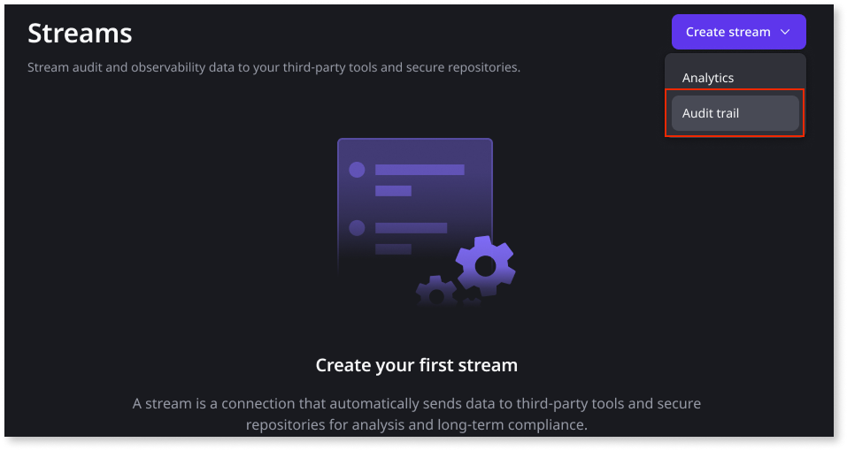
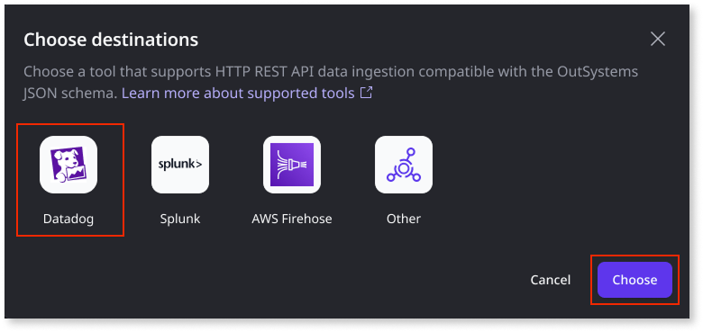
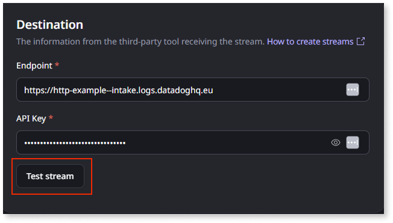
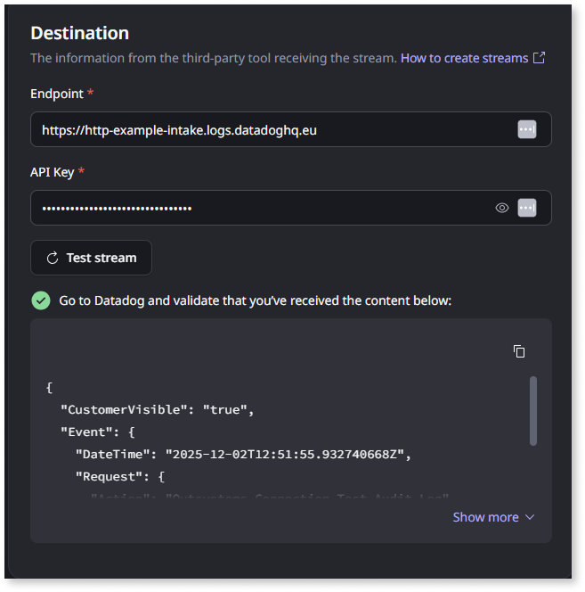
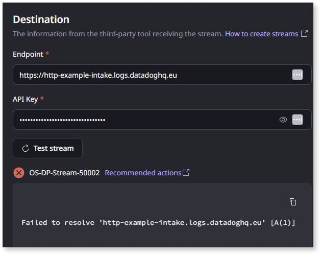
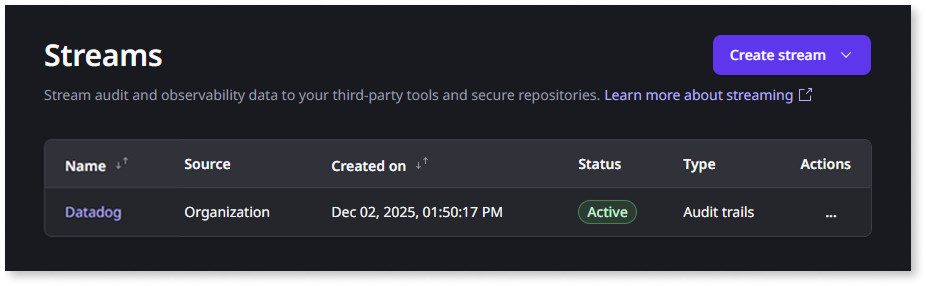

# Stream audit trail logs

With ODC's **audit trail streaming**, you can securely stream platform audit logs directly to your preferred security information and event management (SIEM) solutions or other security monitoring repositories. This enables continuous threat detection and anomaly analysis by integrating ODC with your existing monitoring tools, eliminating the need to manually export and upload audit logs.

## Benefits of audit trail streaming

Streaming audit trail logs to your SIEM tool provides several key advantages:

* **Real-time threat detection and alerting**: Detect and respond to security threats as they occur. Configure custom alerts to notify security teams immediately when suspicious activities or policy violations are detected.

* **Centralized security operations**: Integrate ODC audit logs with your existing security infrastructure and use advanced analytics to identify patterns, anomalies, and potential security incidents across all your systems.

* **Extended log retention**: Store audit logs beyond the 3-month retention period available in the ODC Portal, ensuring compliance with regulatory requirements that mandate longer retention periods.

* **Compliance reporting**: Generate comprehensive compliance reports by correlating ODC audit logs with data from other systems in your organization.

## Prerequisites

Before you start streaming audit trail logs, ensure you have:

* Subscription to Sentry. Contact your account manager for provisioning.

* **Manage audit trail streaming** permission in the ODC Portal.

* Tool-specific requirements for your chosen SIEM destination. For more information, refer to [Requirements for streaming audit trail logs](audit-trail-requirements.md).

## Create an audit trail stream

This example demonstrates the process of creating an audit trail stream. The steps might vary slightly depending on the SIEM tool you select.

1. In the ODC Portal, go to **Configure** > **Streams**.

1. Click **Create Stream** and select **Audit trail**.

    

    For any custom or 3rd-party tool, select **Other** as the destination tool

    

   

1. Select the destination SIEM tool and click **Choose**.

   

1. Enter the destination details and click **Test stream**.

   

    ODC attempts to establish a connection with the specified SIEM server.

    * **Successful connection:** If the connection is established successfully, a success message is displayed. The system also sends test data to your destination tool. You must validate that this test data has arrived and is visible in the SIEM tool.

        

    * **Unsuccessful connection:** If the connection fails, an error message is displayed.

        

        In this case:

        * Review the destination information you entered to ensure its accuracy.
        * Verify that your SIEM tool is configured to accept incoming connections.
        * Check that any required firewall rules or network configurations are in place.
        * If the issue persists, consult the relevant troubleshooting documentation for the recommended action.

1. Click **Save**.

Your new audit trail stream is created, and audit logs can now be sent to the configured SIEM tool.

## Stream status

A stream can have one of the following statuses:

* **Active:** The stream is currently running and successfully sending audit trail logs to the configured SIEM tool.

* **Active with errors:** The stream is currently running and attempting to send data, but encountering some errors. You should investigate these errors to ensure all logs are being delivered correctly. Check the stream details or logs for more information on the specific errors.

* **Inactive:** When you manually deactivate a stream, it transitions to an inactive state, and no audit logs are sent to the SIEM tool. You can reactivate an inactive stream. Once the stream is successfully reactivated, its status will change to **Active**.

## Related resources

* [Audit trail](audit-trail.md)

* [Requirements for streaming audit trail logs](audit-trail-requirements.md)

* [Allowlisting ODC public IP addresses](../../manage-platform-app-lifecycle/odc-public-ips.md)
