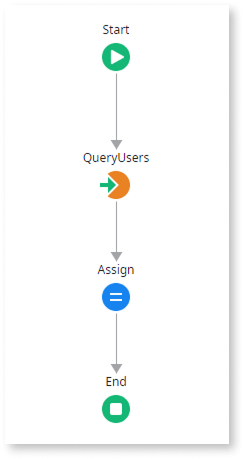

# App consuming REST APIs directly

An ODC app consumes a REST API directly without an ODC library encapsulation.

## Impact

Consuming a REST API directly can increase maintainability efforts when the REST API interface changes. The lack of encapsulation means you need to replicate the changes in the multiple locations where your app is calling REST methods.

Library encapsulation facilitates reusing the REST integration in multiple ODC apps, as you only have to handle authentication mechanisms, data mappings, and error processing once.

Using library encapsulation also helps mitigate breaking changes. A breaking change can generate a new library version, allowing consumer apps and teams to adapt at different paces by consuming different versions.

## Why is this happening?

Your app is calling REST API methods directly without a library encapsulation.

## How to fix

Create an ODC library that implements the communication with the REST API:

* Expose server actions that encapsulate the calls to the REST API methods.

* Create public structures to serve as parameters for these server actions instead of reusing the ones created by the Consume REST API references. This way, any internal changes to the REST API will not require changes in the consuming apps.

When there are breaking changes, create a new library version and start consuming the latest version. This allows other apps and teams to keep consuming previous versions without having to adjust immediately, easing maintainability.
