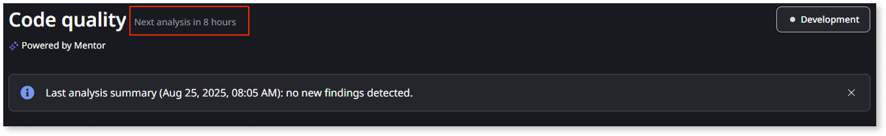

# Getting started with Code quality as a developer

As a developer, **Code quality** automates your code reviews. **Code quality** identifies specific parts of the code that may need changes to improve performance, reduce technical debt, and mitigate security issues.

## Prerequisites

Before you can start using **Code quality**, ensure that:

* You've activated **Code quality** in your organization. For more information, refer to [Setting up Code quality](how-does-aims-works.md).
* You have the relevant permissions:
    * To edit a finding: **Edit/Change Code Quality findings**
    * To view a finding: **View Code Quality findings**. You only have permissions to view findings for the apps you have permission to view.

## What Code quality offers you as a developer

As a developer working on OutSystems apps, **Code quality** provides you with three key capabilities:

* A clear understanding of where you need to make improvements and how many issues you need to address.
* A way to track what you have addressed and what's still pending.
* Learning opportunities about findings and how to correct or prevent them.

## Solve findings in your apps

To solve a finding in your app, select the app to expand the list of findings.

The first app in the findings list is expanded by default.

To see where in the app the finding occurs, in the **Source element** column, hover over the path icon.

To start fixing the finding, select **Open in ODC Studio**. This opens ODC Studio and navigates to the finding in your app.

Once you've resolved the issue, publish your app. When a code analysis runs, it checks the latest version of apps that have changed since the previous analysis. Since the code analysis runs twice a day, you need to wait until the next analysis occurs to confirm if your finding was fixed. If you successfully resolved it, the finding won't appear in the next report.

**Code quality** shows you when the next code analysis occurs at the top of the screen.

## Change the status of your findings

Addressing your findings is the most important part of your role as a developer, but reporting on the findings status is also important. This ensures that you, your colleagues, and your technical lead have an up-to-date view of the **Code quality** findings status.

You have the following possible statuses for your findings:

* **Open** - The finding still exists and hasn't been resolved.
* **Resolved** - You successfully fixed the finding.
* **Dismissed** - You or your technical lead accepts that the finding will remain but no action will be taken to resolve it.
* **Snoozed** - You acknowledge the finding but aren't addressing it at the moment, so you snooze it.

To change the status of a finding, click on the status dropdown and select your desired status for the finding:

If you select **Dismissed**, a dialog appears for you to provide a reason for the dismissal. Select your reason and optionally write a comment. Click **Dismiss finding**.

If you select **Snoozed**, a dialog also appears so you can select how long you want to snooze the finding. Select your desired time frame, optionally write a comment, and confirm by clicking **Snooze finding**.

## Related resources

For detailed information about specific code patterns and best practices, refer to:

* [Performance findings](performance/performance.md)
* [Maintainability findings](maintainability/maintainability.md)
* [Security findings](security/security.md)
