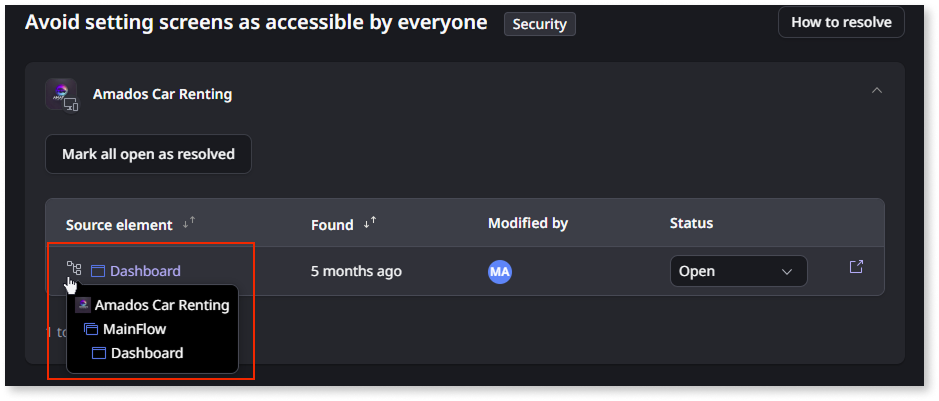

# Getting started in Code Quality as a developer

As a developer, Code Quality, powered by AI Mentor System (AIMS), automates your code reviews. Code Quality identifies specific parts of the code that may need changes to improve performance, reduce technical debt, and mitigate security issues.

To start using it, make sure you've checked [How ODC Code quality works](how-does-aims-works.md).

## What Code quality offers you as a developer

For you that are a developer in a team that's developing OutSystems applications, Code Quality, via AIMS, offers you three very important inputs:

* A quick understanding of where do you need to make improvements and how many you have to address.
* A way to track what you have addressed and what's still to address.
* A good opportunity to learn about the findings and how to correct or prevent them.

## Solve findings in your applications

To solve a finding on your app, select the app, to expand the list of findings.

The first app in the findings list is expanded by default.

To see where in the app the finding occurs, in the **Source element** column, hover the path icon.

To start fixing the finding, select **Open in ODC Studio**. This opens ODC Studio and navigates to the finding in your app.

Once you feel confident you solved the issue, publish your app.
When a code analysis runs, it checks the latest version of apps that changed since the previous analysis.\
Since the code analysis runs twice a day, you need to wait until the next analysis occurs to know if your finding got fixed. If you successfully fixed it, the finding won't appear in the next report.

AIMS lets you know when the next code analysis occurs at the top of the screen.

## Change the status of your findings

Addressing your findings is the most important part of your role as a developer, but reporting on the findings status is also important, so that you, your colleagues and your tech lead, can have an always up to date view of the state of the Code Quality findings.

You have four different possible status for your findings:

* **Open**. The finding is still existing and wasn't solved so far.
* **Resolved**. When you successfully closed the finding.
* **Dismissed.** When you, or your tech lead, accepts that the finding will happen but no action will be taken to resolve it.
* **Snoozed.** You acknowledge the finding but you aren't addressing it at the moment, so you snooze it.

### Changing the status of your findings

To change the status of a finding click on the status dropdown and select your desired status for the finding:

If you are selecting **Dismissed**, a dialog comes up for you to give a reason for the dismissal. Select your reason, optionally write a comment and commit it by clicking **Dismiss finding**:

If you are selecting **Snoozed**, a dialog also pops-up so that you can select for how long you are snoozing the finding. Select your desired time frame from snooze, optionally write a comment, and commit by clicking **Snooze finding**:

## Learn about the findings and what most likely is causing it

Whenever you are addressing a finding, besides the **How to resolve** feature in Code Quality, you should check the [Performance findings](performance/performance.md), [Maintainability findings](maintainability/maintainability.md) and [Security findings](security/security.md) documentation pages, as they give extended insight on impacts, reasons for the findings and ways to solve your findings.
