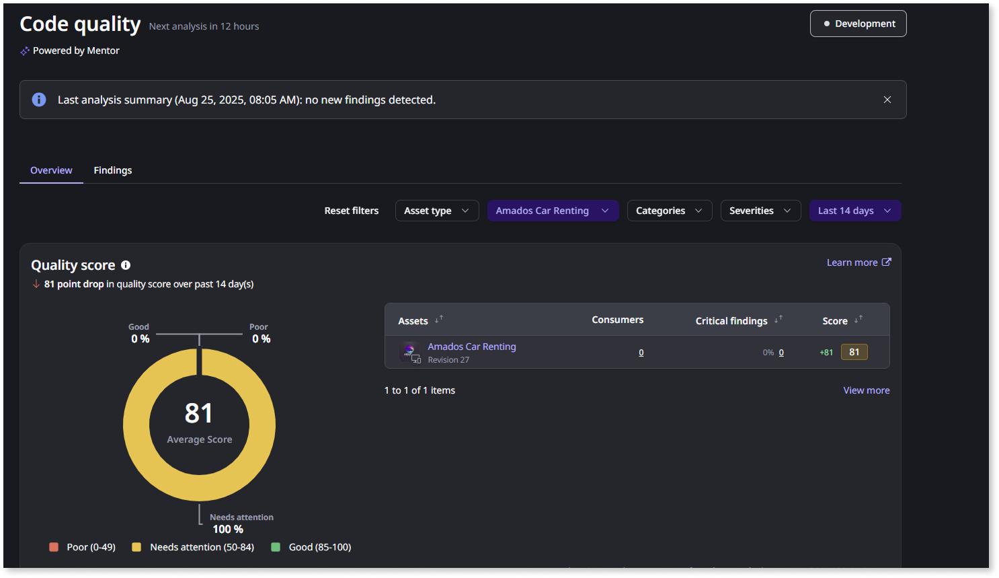
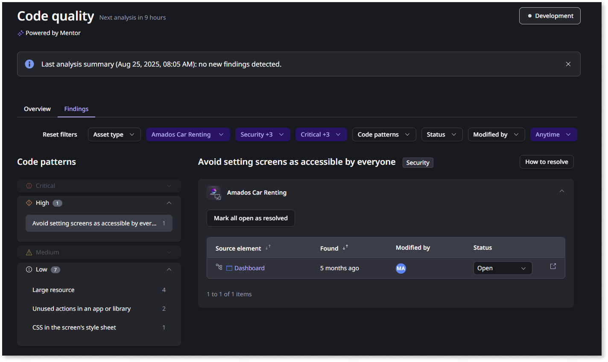

# Getting started with Code quality as a technical lead

As a technical lead or team lead, **Code quality** provides you with an overview of the code quality of your team's apps. This helps you manage technical debt, understand if your team's code is following best practices, and identify possible security risks.

## Prerequisites

Before you can start using **Code Quality**, ensure that:

* You've activated **Code Quality** in your organization. For more information, refer to [Setting up Code quality](how-does-aims-works.md).
* You have the relevant permissions:
  * To edit a finding: **Edit/Change Code Quality findings**
  * To view a finding: **View Code Quality findings**. You only have permissions to view findings for the apps you have permission to view.

## What Code quality offers a technical lead

As a technical lead of a team that's developing OutSystems apps, **Code quality** offers you three key capabilities:

* A bird's-eye view of your team's technical debt.
* A way to prioritize your improvements.
* Insights into how you can help your team grow.

## Checking your team's technical debt

Whenever a code analysis runs, you get an immediate view of your organization's technical debt. This includes:

* When the next analysis will run
* When the last analysis ran, its timestamp, and how many new findings were detected
* An overview of the total quality score

This allows you to quickly understand whether your team is introducing technical debt or reducing it. It also gives you a quick way to report the current state of your team's technical debt, if needed.

The severity and occurrence information allow you to quickly understand:

* What are the most common and severe issues in your apps
* Which apps are most affected by technical debt
* What coding areas your team needs to improve most

With this information, you can plan and prioritize your team's maintenance and improvement backlog and implement code review processes that prevent new findings.

## Going from reactive to proactive

**Code quality** always gives you an up-to-date view of your team's and organization's technical debt, but it's also a powerful tool that helps you understand which common code patterns your team keeps introducing. By identifying these patterns, you can promote best practices that prevent frequent issues rather than just solving them after they occur, moving your team from reactive to proactive development.

## Related resources

For detailed information about specific code patterns and best practices, refer to:

* [Performance findings](performance/performance.md)
* [Maintainability findings](maintainability/maintainability.md)
* [Security findings](security/security.md)
