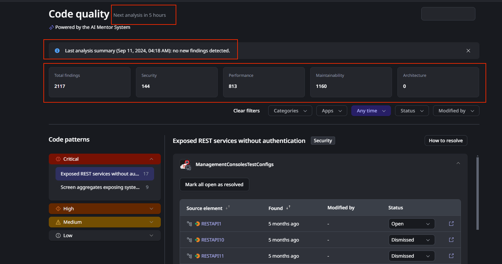
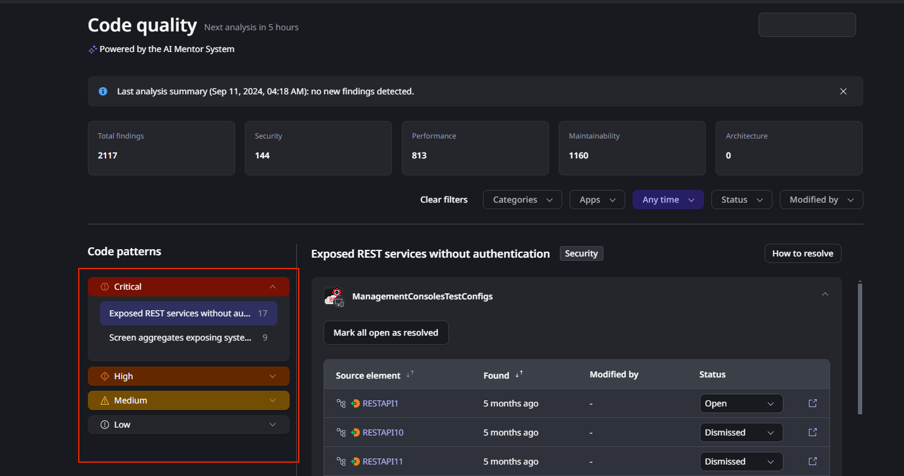

# Getting started in Code quality as a tech lead

As a technical lead or team lead, with the AI Mentor System (AIMS) you can quickly get an overview of the code quality of your team's apps. This helps you manage technical debt, understand if your team's code is following best practices, and identify possible security risks.

To start using it, make sure you've checked [How ODC Code quality works](how-does-aims-works.md).

## What Code quality offers a tech lead

For you as tech lead of a team that's developing OutSystems applications, Code Quality, via AIMS, offers you three very important inputs:

* A birdseye view of your team technical debt.
* A way to prioritize your improvement.
* A good way for you know how you can help your team grow.

## Checking your team technical debt

Whenever a code analysis run, you get an immediate view of your portfolio of applications technical debt. This includes:

* When is the next analysis.
* When did the last analysis run, it's time stamp and how many new findings were detected.
* Counters that display you a summary by area and total of the findings.

This by itself allows you to quickly understand if your team is introducing technical debt or actually reducing it. It also gives you a quick way to report up, if needed, the current state of affairs in your teams regarding technical debt.

## Severity and frequency as prioritization factors

The Severity and occurrence area allows you to very quickly understand:

* Which are the most common and more severe issues on your apps
* Which apps are most affected by technical debt
* What are the areas of coding your team needs to improve more

With this information you can plan and prioritize your teams maintenance and improvement backlog and work to introduce code revision processes that prevent more findings.

## Going from reactive to proactive

Code quality gives you an always up to date state of your teams and app portfolio technical debt, but it's also a powerful tool that enables you to understand which are the common code patterns that your team keep introducing, and through the [Performance findings](performance/performance.md), [Maintainability findings](maintainability/maintainability.md) and [Security findings](security/security.md) documentation you can promote best practices that instead of solving the more frequent issues, you can move to a stage where your team is able to prevent them.