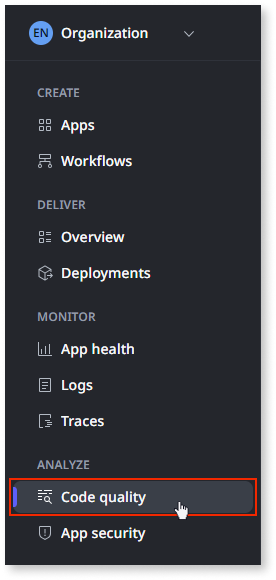
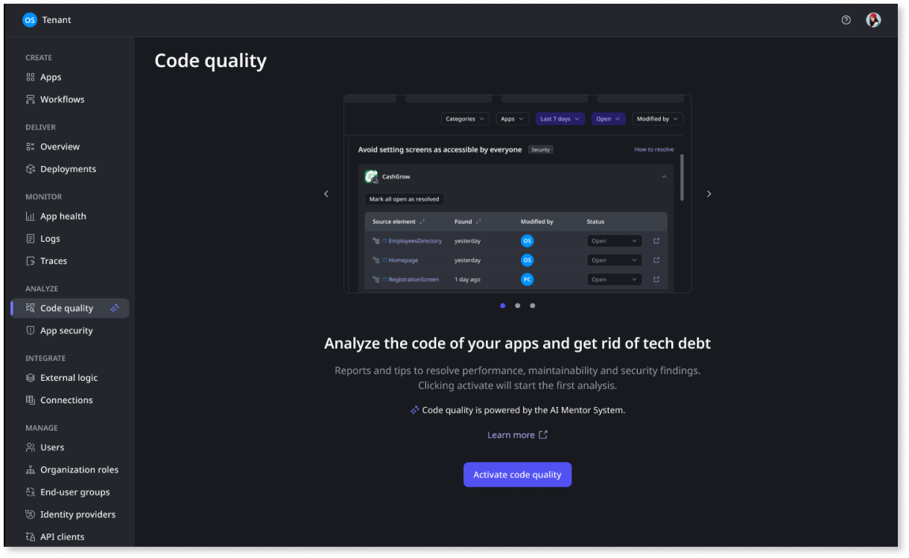
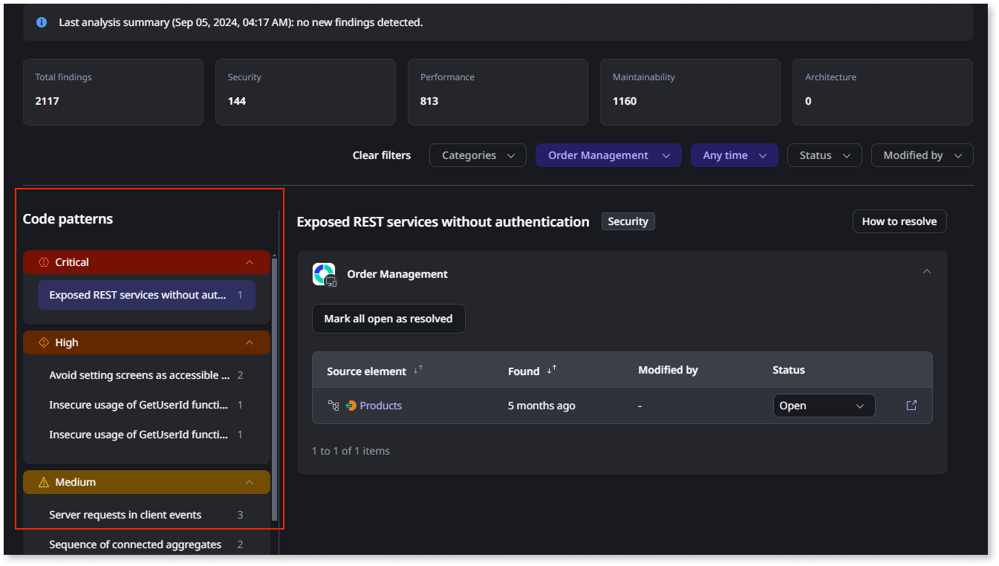
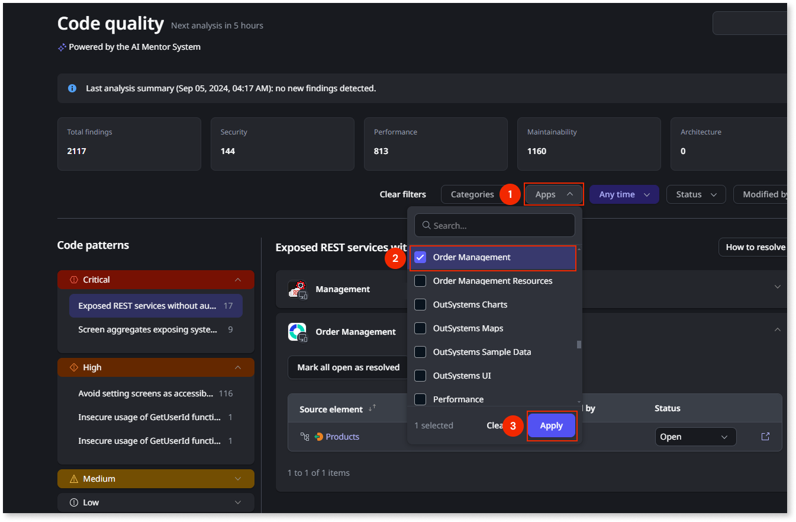
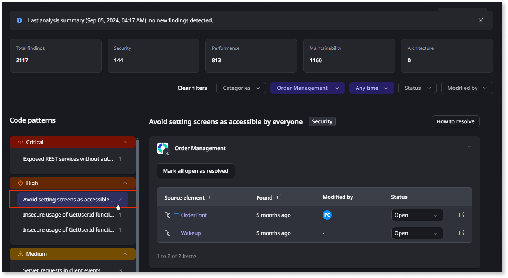
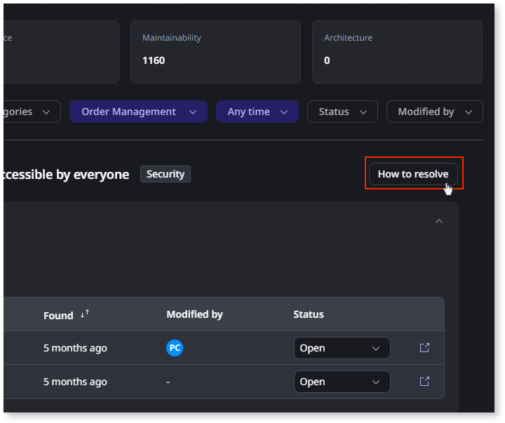
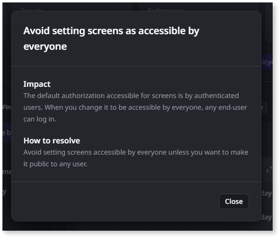

# How ODC Code quality works

Code quality, powered by AI Mentor System (AIMS) works by analyzing your applications code against a set of best practices and code patterns and it provides you a detailed report of your applications code quality findings.

These findings are grouped by:

* Severity
* Code pattern having issues
* Number of occurrences.

From there you can see each one of the findings individually, you can see a **How to resolve** guidance, and you can access directly to them on ODC Studio, so that you can learn more about them or address them.

To have access to these capabilities, you first need to activate AIMS on your Organization ODC Portal.

## Activating AIMS on your Organization

To activate AIMS in your Portal, do the following:

1. In the Portal, go to **Analyze** > **Code quality**.

    

1. Click on the Activate code quality button:
    
    

1. The first Code check runs and you'll get your first results.

## Check the code analysis

In the Portal, go to **Analyze** > **Code quality**.

This screen shows you the result of the code analysis of the apps in the Development stage.
The analysis looks for **code patterns** in different categories: performance, architecture, maintenance, and security.

After the analysis, you get a code quality report showing you **findings**. A finding is an instance of a code pattern present in your code.

On your first visit, you see the results for all the apps from your organization.
At the top, you get counters for the total number of findings, and for the finding count for each category. Also, all the findings are ordered by severity from the most severe to the least.

## Check findings in an app

As a developer, you want to be able to see the results of the code analysis for the apps you are working on.

Let's filter the analysis, by selecting one or more of your apps. Click the **Apps** filter (1), select one or more apps (2), then select **Apply** (3).

If AI Mentor Studio identified any findings in the selected apps, you see a list of the related code patterns.

If the code patterns list is empty, it means that there are findings on your code and you can feel more confident that you delivered quality code. If your code patterns list is empty, and to continue this tutorial, try clearing the filters to see if you can get some code patterns to show up. Select **Clear filters**.

Select one of the code patterns, to see the list of apps with findings of that code pattern.

To learn more about the selected code pattern, select **How to resolve**. The **How to resolve** gives you guidance on how to address the finding, and can help you understand the effort involved in fixing a code pattern.

The **Impact** explains the possible negative impacts of the pattern, and helps you understand if this is something that needs to be fixed or not.

## Known limitations

* **Application analysis frequency.** Application analysis runs every 12 hours. After performing a 1CP (1-Click Publish), you must wait until the next scheduled analysis to view the updated findings in the AIMS Code Quality Console.
* **Availability of resolved findings.** Resolved findings are retained in the Code Quality Console for up to 90 days. After this period, they are no longer be available.
* **Detection of new code patterns**. Newly introduced code patterns aren't detected retroactively for existing applications. To detect these patterns, do a 1-Click Publish on the respective app.

## Known issues:

* **Flowviz Visualization Rendering**. Flowviz visualization may fail to render findings that are older than 90 days on the console. To resolve this issue, do a 1-Click Publish on the affected applications.

## Next steps

Depending if you are a Technical Lead or a Developer, Code Quality, can give you different paths to help your team succeed and manage your technical debt. To learn more about what you can do see, [Getting started in AIMS as a tech lead](getting-started-aims-tl.md) or [Getting started in AIMS as a developer](getting-started-aims-dev.md), depending on your role.
