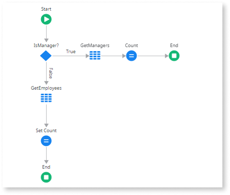

# Hard-coded statements

## Impact

Some parts of your logic never run due to hard-coded True/False conditions. This can result in dead code, forgotten feature flags, or incorrect/unexpected behavior in your actions. Unreachable logic can also take the team's time to test, maintain, and document code that's never used.

## Why is this happening?

The code uses hard-coded True/False conditions, causing certain branches of the logic to be permanently bypassed and never executed

In this example, the flow has a condition that's always **True**. The **False** branch never executes because the condition doesn't allow it to be reached.

## How to fix

Revise the affected True/False conditions and consider removing/changing the unreachable logic.

For more information, refer to the [logic best practice for avoiding hard-coded values](../../../building-apps/logic/best-practices-logic.md#hard-coded-values).
