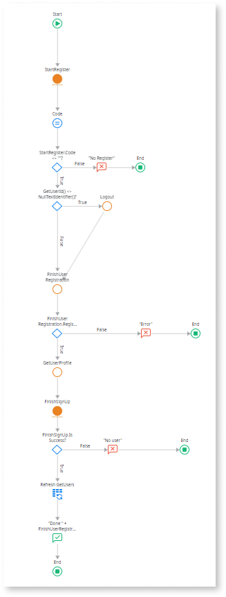
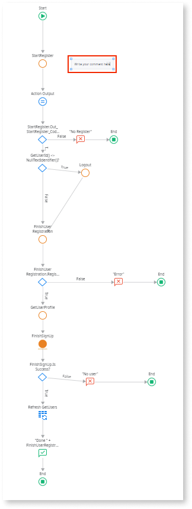
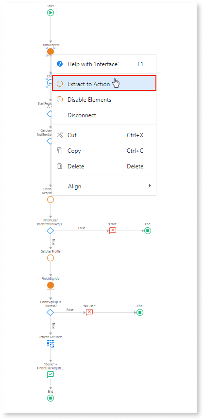

# Long undocumented flow

Action with a long and undocumented flow.

## Impact

A client action with more than 20 nodes or an action with more than 40 nodes is hard to maintain, especially if it has no comments to explain the logic.

## Why is this happening?

A client action within a flow contains more than 20 nodes or any action that surpasses 40 nodes. This high node count makes the flow difficult to understand and maintain, especially in the absence of comments that explain the underlying logic.

## How to fix

Break flow logic into smaller and potentially reusable actions and/or place comments to explain portions of your flow.

**Note**: Explore the **Extract to Action** feature.

To select the **Extract to Action** feature:

1. Right-click on the selected portion of the flow.

1. Select **Extract to Action**.

