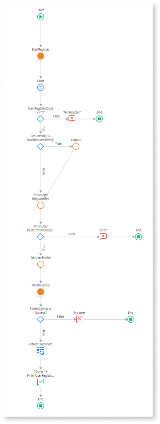
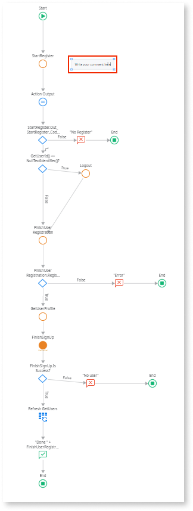
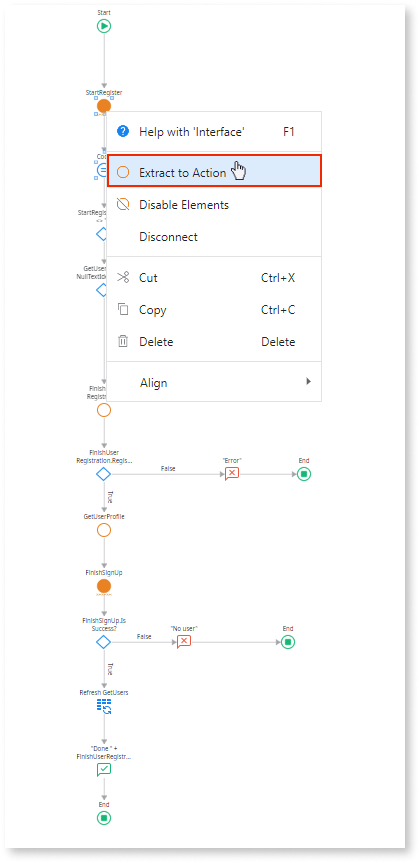

# Long undocumented flow

Action with a very long flow, or a long flow without comments.

## Impact

A long flow is hard to understand and maintain. It's harder still when no comments explain the logic.

## Why is this happening?

The flow has too many nodes. This happens in one of the following cases:

* **Very long flow**: The flow has more than 50 nodes, even if it has comments.

* **Medium flow without comments**: The flow has 20 to 50 nodes and no comments.

The node count excludes comments. The same rule applies to every action type and to screen actions.

## How to fix

Break the flow logic into smaller, reusable actions. For a medium flow, adding comments that explain portions of the logic also resolves the finding. For a very long flow, comments don't resolve the finding, so split the flow.

**Note**: Explore the **Extract to Action** feature.

To select the **Extract to Action** feature:

1. Right-click on the selected portion of the flow.

1. Select **Extract to Action**.

