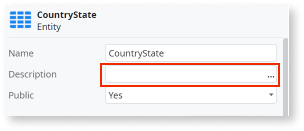

# Missing descriptions on public element or parameter

Required descriptions of modules, modules' public elements, and their related input/output parameters.

## Impact

Meaningful descriptions in modules, public elements, entities, and input/output parameters clarify their purpose and expected behavior. This is crucial when consuming closed modules because the implemented logic isn't visible.

## Why is this happening?

The element or parameter is **Public**, but the **Description** input field is empty.

## How to fix

Add a description to the module that explains its purpose and identifies the concepts it contains. To solve the finding, add meaningful descriptions to all modules' public elements, related entities, and parameters. The only exceptions are Entities and Structures attributes whose descriptions are optional. Parameters whose names follow well-established naming conventions (e.g., Id, Name, Label, Description, CreatedBy, UpdatedBy, CreatedOn, UpdatedOn) are also exceptions.
