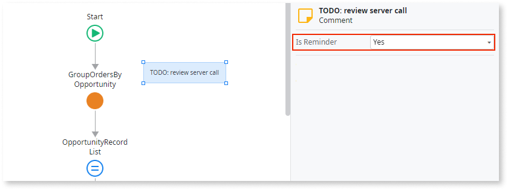

# Reminder comments

A comment is set as a reminder. 

## Impact

Reminder comments are remarks or reminders for yourself or your team members. Comments marked as **Is Reminder** may indicate important technical debt or unresolved issues.

## Why is this happening?

The comment has the **Is Reminder** property set to Yes. ODC Studio automatically sets the comments as reminders when you use the following keywords in upper case: TODO, TBD, REMINDER.

## How to fix

Resolve the issue or finish the task related to the reminder comment. When completed, remove the comment or change **Is Reminder** to No. 

**Note:** Removing the keywords (TODO, TBD, REMINDER) from the comment doesn't automatically set the **Is Reminder** property to No.
